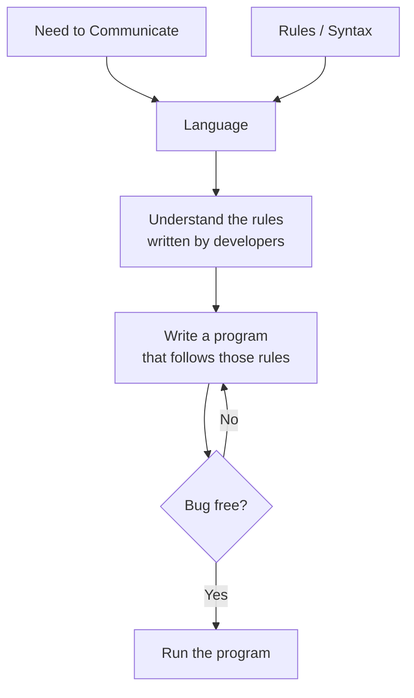
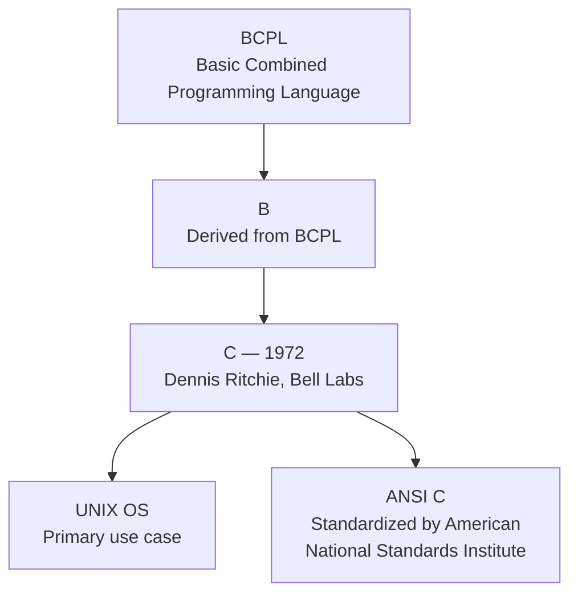
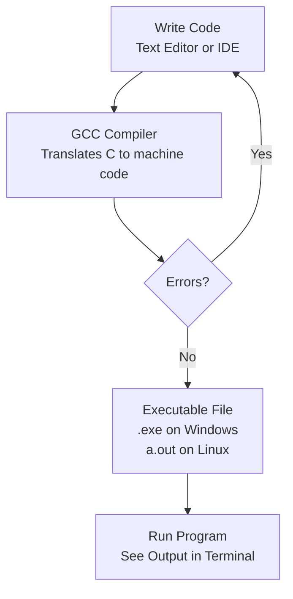
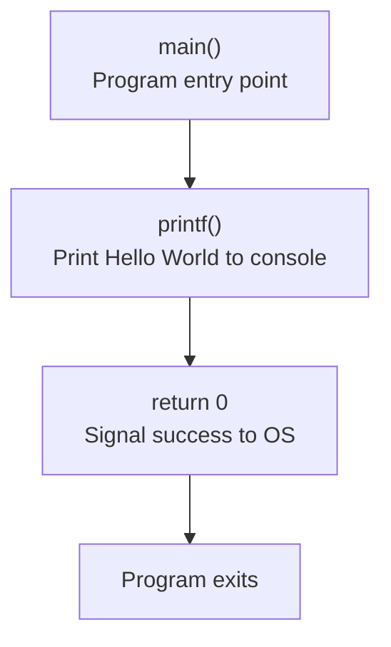

---
---
---

## tags: [c-programming, lecture] lecture: 1 topic: Introduction to C — Language Basics, History, and Setup prerequisites: None

## Agenda

1. What is a language?
2. Introduction and history of C
3. Who uses C?
4. Exploring, installing and testing software needed to run C programs
5. Writing a sample program

---

## What is a Language?

A **language** is built on two things: a need to communicate, and a set of rules that defines how that communication must happen. Together, need and rules form the foundation of any language — natural or programming.

> [!info] Language = Need + Rules Every language exists because there is something that needs to be expressed, and a syntax that defines how to express it correctly. Break the syntax → the message doesn't get through.



---

## Introduction & History of C

[[#^c-lang|C]] was developed by [[#^dennis-ritchie|Dennis Ritchie]] in 1972 at [[#^bell-labs|Bell Laboratories]], USA. It was built primarily to develop the [[#^unix|UNIX]] operating system, and was designed to solve the limitations of the languages that preceded it — [[#^bcpl|BCPL]] (Basic Combined Programming Language) and [[#^b-lang|B]], which was itself derived from BCPL.

> [!quote] Why C was created BCPL and B lacked the power and expressiveness needed to build a full operating system. C was Dennis Ritchie's direct answer to those limitations — purpose-built for systems programming.



After Ritchie's original release, the [[#^ansi|ANSI]] (American National Standards Institute) team worked on the language and published the standardized **[[#^ansi-c|ANSI C]]** version, which became the universal reference for all C compilers.

> [!success] Why C is still relevant today C is used for building operating systems, application packages, and customized software. Its longevity comes from a combination of raw performance and close-to-hardware control that higher-level languages simply cannot match.

---

## Who Uses C?

C is actively used across a range of professional roles:

- Software developers
- Senior programmers
- QA folks
- Programming architects
- Chip software programmers

> [!question] Why do chip programmers rely on C? Embedded systems and firmware require direct control over memory and CPU instructions with minimal overhead — exactly what C provides that languages like Python or Java cannot.

---

## Exploring, Installing & Testing Software to Run C Programs

> [!warning] Live Demo — Check Video This section was a live demonstration and was not captured in the slides. Refer back to the lecture video for the installation walkthrough.

To write and run C programs you need two things: a **[[#^text-editor|text editor]]** or **[[#^ide|IDE]]** to write code, and a **[[#^compiler|compiler]]** to translate that code into machine-executable instructions. The most common compiler used for learning C is [[#^gcc|GCC]] (GNU Compiler Collection).



> [!tip] Recommended Setup for Beginners Install **GCC** and use **VS Code** with the C/C++ extension. On Windows, install GCC via MinGW. On Linux/macOS it is already available via the terminal.

---

## Writing a Sample C Program

> [!warning] Live Demo — Check Video This section was a live demonstration and was not captured in the slides. Refer back to the lecture video for the live coding walkthrough.

Here is the standard first program written in C:

```c
#include <stdio.h>

int main() {
    printf("Hello, World!\n");
    return 0;
}
```

> [!tip] Including Standard Libraries
> - `#include <stdio.h>` is a preprocessor directive that imports the Standard Input/Output header file
> - It gives the program access to `printf` for printing text and `scanf` for reading keyboard input
> - Without this line, the compiler has no knowledge of `printf` and will refuse to compile the program

> [!tip] Program Entry Point
> - `int main()` is the function the operating system calls first when the program launches
> - Every C program must have exactly one `main` function — execution always starts here, nowhere else
> - The `int` return type signals that this function must end with a `return` statement followed by an integer

> [!tip] Printing to the Console
> - `printf("Hello, World!\n")` sends the text `Hello, World!` to the terminal output
> - `\n` is an escape sequence — it represents a newline character and moves the cursor to the next line
> - The text inside double quotes is printed exactly as written, character by character

> [!tip] Exiting the Program
> - `return 0;` sends exit code `0` back to the operating system when `main` finishes
> - By convention, `0` means the program completed successfully with no errors
> - Because `main` is declared as `int`, this return statement is required — omitting it is undefined behaviour in older C standards

|Line|Code|Explanation|
|---|---|---|
|1|`#include <stdio.h>`|Includes the standard input/output library, giving access to `printf` and `scanf`|
|3|`int main()`|Entry point of every C program. Execution always begins here. `int` means it returns an integer|
|4|`printf("Hello, World!\n");`|Prints text to the console. `\n` moves the cursor to the next line|
|5|`return 0;`|Returns 0 to the OS, signaling the program finished successfully|



> [!bug] Missing Semicolons Every statement in C ends with a semicolon `;`. Forgetting it is the most common beginner mistake and will stop the program from compiling entirely.

> [!example] What the output looks like When you run this program in your terminal, you will see exactly:
> 
> ```
> Hello, World!
> ```

---

## Key Terms

| Term              | Definition                                                                                   |                 |
| ----------------- | -------------------------------------------------------------------------------------------- | --------------- |
| C                 | A general-purpose, compiled programming language developed in 1972 by Dennis Ritchie         | ^c-lang         |
| Dennis Ritchie    | Creator of the C language, worked at Bell Laboratories, USA                                  | ^dennis-ritchie |
| Bell Laboratories | US research facility where C and UNIX were developed                                         | ^bell-labs      |
| UNIX              | Operating system that C was originally built to develop                                      | ^unix           |
| BCPL              | Basic Combined Programming Language — earliest ancestor of C                                 | ^bcpl           |
| B                 | Predecessor to C, derived from BCPL                                                          | ^b-lang         |
| ANSI              | American National Standards Institute — body that standardized the C language                | ^ansi           |
| ANSI C            | The standardized, cross-platform version of C released after Ritchie's original              | ^ansi-c         |
| compiler          | A program that translates C source code into machine-executable instructions                 | ^compiler       |
| GCC               | GNU Compiler Collection — the most widely used C compiler for learning and development       | ^gcc            |
| IDE               | Integrated Development Environment — editor with built-in tools for writing and running code | ^ide            |
| text editor       | A program used to write code, such as VS Code or Notepad++                                   | ^text-editor    |

---

> [!example]- Try It Yourself **Exercise 1 — Change the Message** Modify the Hello World program to print your own name instead of "Hello, World!". Compile and run it.
> 
> **Exercise 2 — Multiple Lines** Write a program that prints three separate lines of text using three `printf` statements. Observe how `\n` controls the line breaks.
> 
> **Exercise 3 — C History in Code** Write a program that prints the C language lineage as output:
> 
> ```
> BCPL --> B --> C (1972) --> ANSI C
> ```

---

**Lecture 1 Recap**

- A language = need + rules. Use it by learning the rules, writing conforming code, and running a bug-free program.
- C was created in 1972 by Dennis Ritchie at Bell Labs, evolving from BCPL → B → C to build UNIX.
- ANSI standardized C as the cross-platform baseline.
- C is used by developers, architects, QA engineers, and chip programmers.
- To run C you need GCC (compiler) + a text editor. See the lecture video for the full setup demo.
- Every C program starts at `main()`, every statement ends with `;`, and inline comments use `//`.