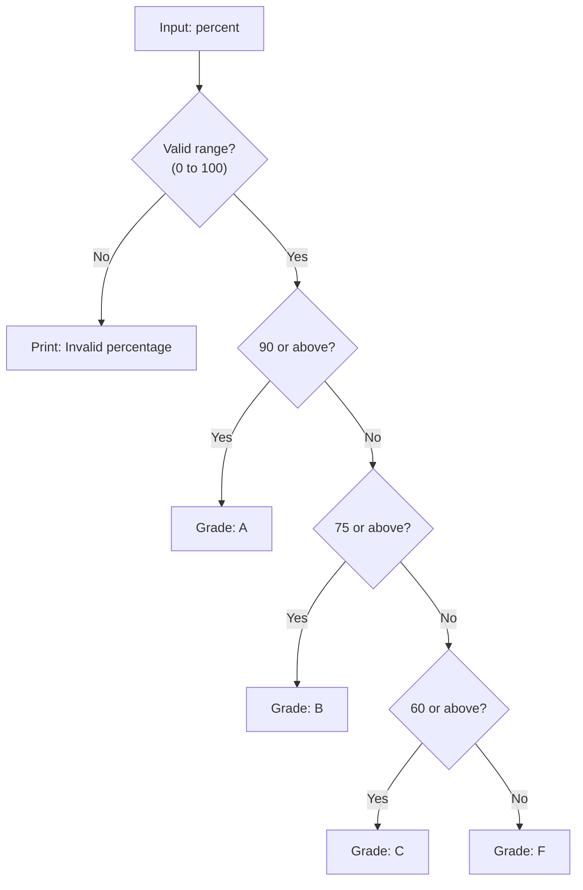
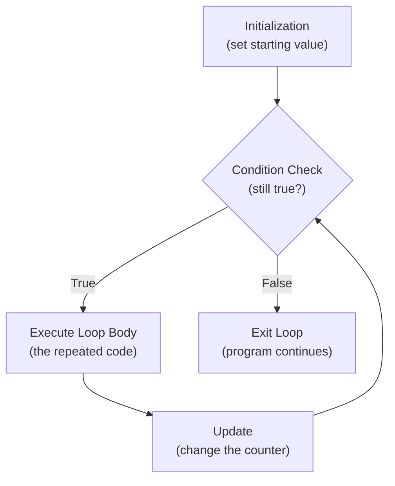
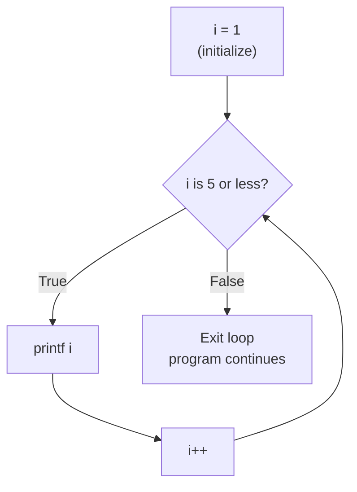
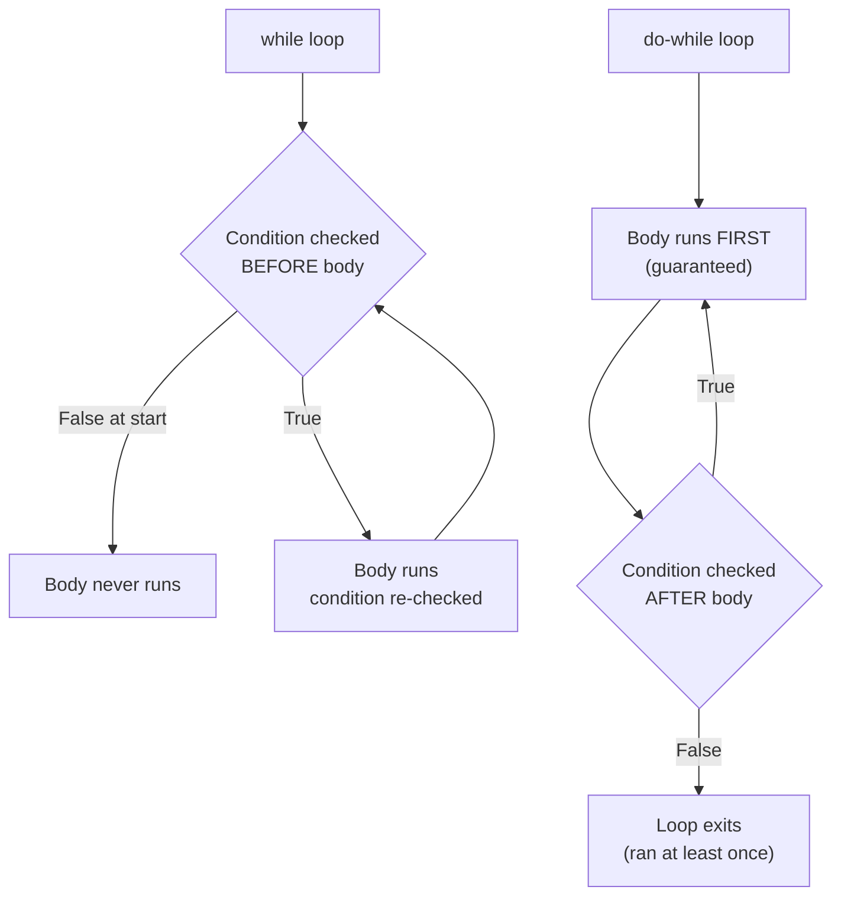

--

## tags: [c-programming, lecture] lecture: 10 topic: Nested If-Else and Loops prerequisites: Conditional Statements (if-else)

# Lecture 10 — Nested If-Else and Loops

## Agenda

- Understanding nested if-else blocks
- Understanding Loop
- Understanding while loop with example
- Understanding do-while loop with example

---

## Understanding Nested If-Else Blocks

> [!warning] Live Demo — Check Video This section was a live demonstration and was not captured in the slides. Refer back to the lecture video for the walkthrough.

A [[#^nested-if-else|nested if-else]] structure places one [[Lecture 9#^if-else-statement|if-else]] decision inside another, enabling multi-level branching. The inner check only runs after the outer [[Lecture 9#^condition|condition]] has already been settled, allowing a program to reach several distinct outcomes from a single entry point.

The general structure looks like this:

```c
if (outerCondition) {
    if (innerCondition) {
        // outer true AND inner true
    } else {
        // outer true, inner false
    }
} else {
    // outer false — inner is never reached
}
```

> [!tip] The Structure of Nested If-Else
> - The outer `if` tests a broad condition first — only if it passes does the inner `if` get evaluated
> - The outer `else` catches the case where the broad condition failed — the inner checks are never reached
> - This pattern creates a decision tree: each level narrows the possibilities further

> [!info] When to Use Nesting Nest conditions when a decision has tiers — first verify a broad requirement, then refine within it. Validating that input falls in range before classifying it is a classic pattern.

The program below uses nested if-else to classify a student's percentage into a letter grade:

```c
#include <stdio.h>

int main() {
    int percent;

    printf("Enter percentage: ");
    scanf("%d", &percent);

    if (percent >= 0 && percent <= 100) {
        if (percent >= 90) {
            printf("Grade: A\n");
        } else if (percent >= 75) {
            printf("Grade: B\n");
        } else if (percent >= 60) {
            printf("Grade: C\n");
        } else {
            printf("Grade: F\n");
        }
    } else {
        printf("Invalid percentage.\n");
    }

    return 0;
}
```

> [!tip] Validating Input Before Processing
> - The outer `if (percent >= 0 && percent <= 100)` validates the input range before any classification
> - Only valid percentages (0–100) reach the inner [[Lecture 9#^if-else-ladder|if-else if-else ladder]]
> - Invalid inputs like -5 or 150 are caught by the outer `else` and produce an error message

> [!tip] Multi-Tier Classification
> - The inner ladder checks grades from highest to lowest: 90+ → A, 75+ → B, 60+ → C, else → F
> - Evaluation stops at the first true condition — a score of 85 matches `>= 75` and skips all remaining checks
> - The final inner `else` catches everything below 60 as a failing mark

|Line|Code|Explanation|
|---|---|---|
|1|`#include <stdio.h>`|Includes the standard I/O library for [[Lecture 2#^printf|printf]] and [[Lecture 2#^scanf|scanf]]|
|3|`int main()`|Entry point; every C program begins execution here|
|4|`int percent;`|Declares the integer variable that will hold the user's input|
|6|`printf("Enter percentage: ");`|Displays the prompt|
|7|`scanf("%d", &percent);`|Reads one integer from standard input and stores it in percent|
|9|`if (percent >= 0 && percent <= 100)`|Outer condition: only proceeds if the value is a valid percentage|
|10|`if (percent >= 90)`|First nested check: 90 or above earns an A|
|12|`else if (percent >= 75)`|Second nested check: 75–89 earns a B|
|14|`else if (percent >= 60)`|Third nested check: 60–74 earns a C|
|16|`else`|Catches 0–59, which is a failing mark|
|19|`else`|Outer else: fires only when the input was outside 0–100|
|22|`return 0;`|Signals successful program completion|



> [!tip] Avoid Deep Nesting When nesting grows beyond two levels it becomes difficult to read and maintain. Consider validating inputs early and returning, or breaking sub-decisions into separate functions.

---

## Understanding Loop

A [[#^loop|loop]] is a control structure that causes a block of code to execute repeatedly for as long as a specified condition remains true. Rather than writing the same statement multiple times, you express the repeated action once inside the loop and let the computer handle the repetitions.

### What Is a Loop?

Every loop is built from three cooperating parts:



- **Initialization** — A [[#^counter-variable|counter variable]] is assigned its starting value before the loop begins.
- **Condition** — Evaluated before (or after, depending on loop type) each [[#^iteration|iteration]]. When it becomes false the loop ends.
- **Update** — Modifies the counter inside the [[#^loop-body|loop body]] so the condition can eventually become false.

### Why Is a Loop Needed?

Printing the numbers 1 through 100 with individual [[Lecture 2#^printf|printf]] calls would take one hundred lines of code. A loop does it in four. Any time you face one of the following situations, a loop is the right tool:

- Repeating an action a known number of times (printing a multiplication table, running a countdown timer).
- Processing every element in a sequence (reading ten exam scores, averaging a list of temperatures).
- Repeating until the user provides valid input.
- Building a running result step by step (computing a sum, a factorial, or a Fibonacci sequence).

> [!danger] The Infinite Loop Trap Forgetting the update step means the condition can never become false and the program runs forever — this is an [[#^infinite-loop|infinite loop]]. Always ensure that something inside the loop body drives the state toward the exit condition.

C provides three loop constructs. This lecture covers the [[#^while-loop|while loop]] and the [[#^do-while-loop|do-while loop]]; the `for` loop is introduced in a later lecture.

---

## Understanding While Loop

> [!warning] Live Demo — Check Video This section was a live demonstration and was not captured in the slides. Refer back to the lecture video for the walkthrough.

The while loop tests its condition **before** executing the body. If the condition is already false when the loop is first reached, the body is skipped entirely and execution moves past the loop. This behaviour classifies it as an [[#^entry-controlled|entry-controlled]] loop.

**Syntax:**

```c
while (condition) {
    // body — runs only when condition is true
}
```

> [!info] Entry-Controlled Behaviour Because the condition is checked at entry, a while loop body may execute zero times if the condition is false from the very beginning. This is correct, expected behaviour — not a bug.

The program below uses a while loop to print the integers from 1 to 5:

```c
#include <stdio.h>

int main() {
    int i = 1;

    while (i <= 5) {
        printf("%d\n", i);
        i++;
    }

    return 0;
}
```

> [!tip] Initialising the Counter
> - `int i = 1` sets the starting value before the loop begins — this is the **initialisation** step
> - The counter must be declared and assigned before the `while` line; otherwise the condition has nothing to test
> - Starting at 1 means the output will be 1, 2, 3, 4, 5

> [!tip] Condition and Loop Body
> - `while (i <= 5)` checks the condition before each iteration — the body runs only when `i` is 5 or less
> - `printf("%d\n", i)` prints the current value; `i++` increments it by 1 — this is the **update** step
> - When `i` becomes 6, the condition is false and the loop exits

|Line|Code|Explanation|
|---|---|---|
|1|`#include <stdio.h>`|Includes standard I/O for printf|
|3|`int main()`|Program entry point|
|4|`int i = 1;`|Counter initialized to 1 before the loop begins|
|6|`while (i <= 5)`|Condition tested before each iteration; loop exits once i becomes 6|
|7|`printf("%d\n", i);`|Prints the value of i followed by a newline|
|8|`i++;`|Increments i by 1 each iteration (shorthand for i = i + 1)|
|11|`return 0;`|Returns 0 to indicate the program ended without error|

**Execution trace:**

|Iteration|i before check|Condition true?|Printed|i after `i++`|
|---|---|---|---|---|
|1|1|Yes|1|2|
|2|2|Yes|2|3|
|3|3|Yes|3|4|
|4|4|Yes|4|5|
|5|5|Yes|5|6|
|—|6|No|—|loop exits|



> [!tip] When to Choose While Prefer a while loop when you do not know in advance how many iterations are needed — for example, reading until end-of-file or repeating until the user types a specific sentinel value.

---

## Understanding Do-While Loop

> [!warning] Live Demo — Check Video This section was a live demonstration and was not captured in the slides. Refer back to the lecture video for the walkthrough.

The do-while loop executes its body first and checks the condition **afterward**. This guarantees at least one execution regardless of whether the condition is true or false at the start, making it an [[#^exit-controlled|exit-controlled]] loop.

**Syntax:**

```c
do {
    // body — always executes at least once
} while (condition);
```

> [!tip] Do-While Syntax
> - The semicolon after `} while (condition)` is mandatory — it is part of the do-while syntax
> - Omitting it is a compile error that trips up beginners because `if` and `while` blocks do not end with semicolons
> - The body always runs at least once before the condition is checked

> [!danger] Required Semicolon The semicolon after `} while (condition)` is not optional — it is part of the do-while syntax. Omitting it is a compile error. This trips up beginners because `if` and `while` blocks do not end with semicolons, but do-while does.

The program below uses a do-while loop to keep prompting the user until a positive number is entered:

```c
#include <stdio.h>

int main() {
    int number;

    do {
        printf("Enter a positive number: ");
        scanf("%d", &number);
    } while (number <= 0);

    printf("You entered: %d\n", number);

    return 0;
}
```

> [!tip] Guaranteed First Execution
> - The `do` block runs unconditionally on the first pass — the prompt is always shown at least once
> - `scanf` reads the user's input, then the `while (number <= 0)` condition is checked afterward
> - If the input is zero or negative, the loop repeats; once a positive number is entered, the loop exits

> [!tip] Perfect for Input Validation
> - Input validation is the canonical use case for do-while — you always need to prompt at least once
> - The loop keeps running until the user provides input that meets the required criteria
> - This pattern avoids the awkward "prime the read" workaround needed with a regular while loop

|Line|Code|Explanation|
|---|---|---|
|1|`#include <stdio.h>`|Includes the standard I/O library|
|3|`int main()`|Entry point|
|4|`int number;`|Declares the variable to hold input|
|6|`do {`|Marks the start of the do-while block; body always runs first|
|7|`printf("Enter a positive number: ");`|Prompt shown unconditionally on every pass|
|8|`scanf("%d", &number);`|Reads an integer from the keyboard|
|9|`} while (number <= 0);`|Condition checked after body; loops back if number is not positive|
|11|`printf("You entered: %d\n", number);`|Prints the confirmed valid value|
|13|`return 0;`|Signals successful program termination|

> [!success] Perfect for Input Validation Input validation is the canonical use case for do-while. You always need to show the prompt at least once, and you keep looping back until the user's input meets the required criteria.

### While vs Do-While: The Core Difference

Both loops repeat a body based on a condition — the only distinction is the moment of evaluation:



> [!example] Seeing the Difference in Action
> 
> ```c
> int x = 10;
> 
> while (x < 5) {
>     printf("while: %d\n", x);
> }
> 
> do {
>     printf("do-while: %d\n", x);
> } while (x < 5);
> ```
> 
> With `x = 10`, the while loop body is skipped entirely. The do-while body prints `do-while: 10` once, then the condition `x < 5` is checked and found false, ending the loop.

---

## Key Terms

|Term|Definition|
|---|---|
| Nested If-Else | An if or else block that contains another if-else structure inside it, enabling multi-level branching decisions | ^nested-if-else
| Loop | A control structure that executes a block of code repeatedly as long as a specified condition remains true | ^loop
| Condition | A boolean expression evaluated to true or false that controls whether a loop continues or a branch executes |
| Iteration | One complete execution of a loop body; each pass through the loop is a single iteration | ^iteration
| Loop Body | The set of statements enclosed within a loop that executes on every iteration | ^loop-body
| Counter Variable | A variable used to track how many iterations have occurred; initialized before the loop and updated inside the body | ^counter-variable
| While Loop | An entry-controlled loop that evaluates its condition before the body runs; the body may be skipped entirely if the condition is initially false | ^while-loop
| Do-While Loop | An exit-controlled loop that runs its body first and then evaluates the condition; the body always executes at least once | ^do-while-loop
| Infinite Loop | A loop whose condition never becomes false, causing the program to execute indefinitely | ^infinite-loop
| Entry-Controlled Loop | A loop that tests its condition before executing the body; the while loop is the primary example in C | ^entry-controlled
| Exit-Controlled Loop | A loop that tests its condition after executing the body; the do-while loop is the primary example in C | ^exit-controlled

> [!example]- Try It Yourself **Exercise 1 — Nested Classification** Write a C program that reads an integer and uses nested if-else to print whether it is "Large positive" (greater than 100), "Small positive" (1 to 100), "Zero", "Small negative" (-100 to -1), or "Large negative" (less than -100).
> 
> **Exercise 2 — While Loop Sum** Write a program that reads a positive integer n and uses a while loop to compute and print the sum of all integers from 1 to n. For example, entering 5 should output 15.
> 
> **Exercise 3 — Do-While Menu** Write a program with a do-while loop that displays a simple menu (Add, Subtract, Exit). After performing the chosen operation on two user-supplied numbers, the menu reappears. The loop exits only when the user picks Exit.
> 
> **Exercise 4 — Spot the Bug** The following snippet intends to print 1 through 10 but runs forever. Identify what is missing and fix it:
> 
> ```c
> int i = 1;
> while (i <= 10) {
>     printf("%d\n", i);
> }
> ```

---

**Lecture 10 Recap**

- A nested if-else places one decision structure inside another, allowing programs to handle multi-tiered conditions cleanly without rewriting the outer check.
- Loops eliminate repetitive code by executing the same block repeatedly as long as a condition holds true.
- Every loop requires three elements: initialization of a counter, a condition to test, and an update step — a missing update step creates an infinite loop.
- The while loop is entry-controlled: it tests the condition before the body runs, so the body can be skipped entirely if the condition is false from the very beginning.
- The do-while loop is exit-controlled: it runs the body first and checks the condition afterward, guaranteeing at least one execution — this makes it the natural choice for input validation.
- The closing `} while (condition);` line of a do-while loop must end with a semicolon — omitting it is a compile error and a common beginner mistake.