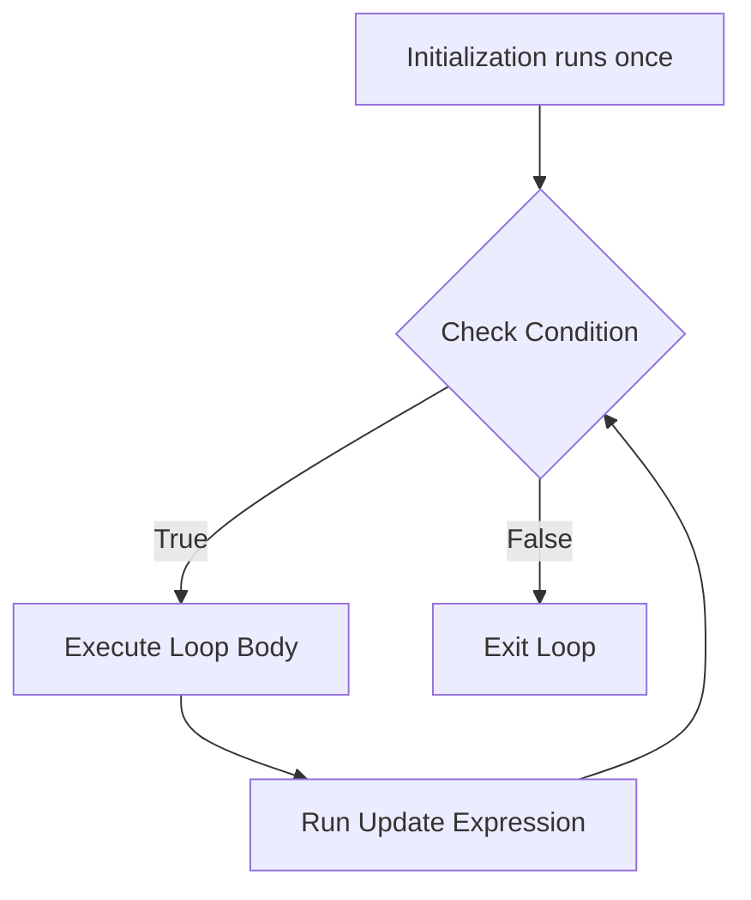
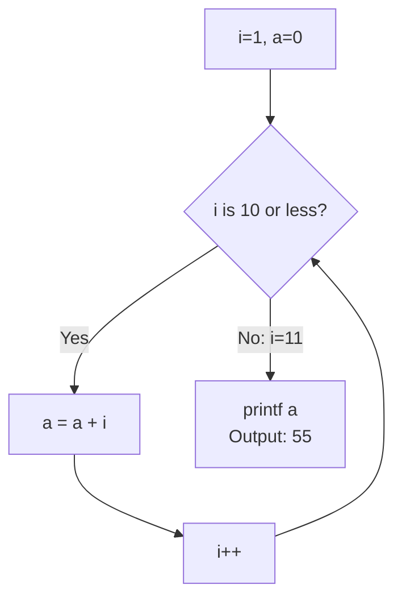
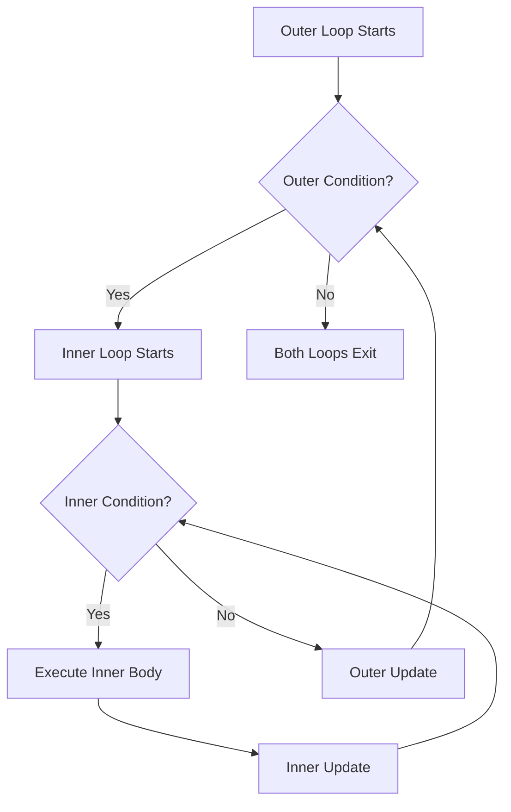
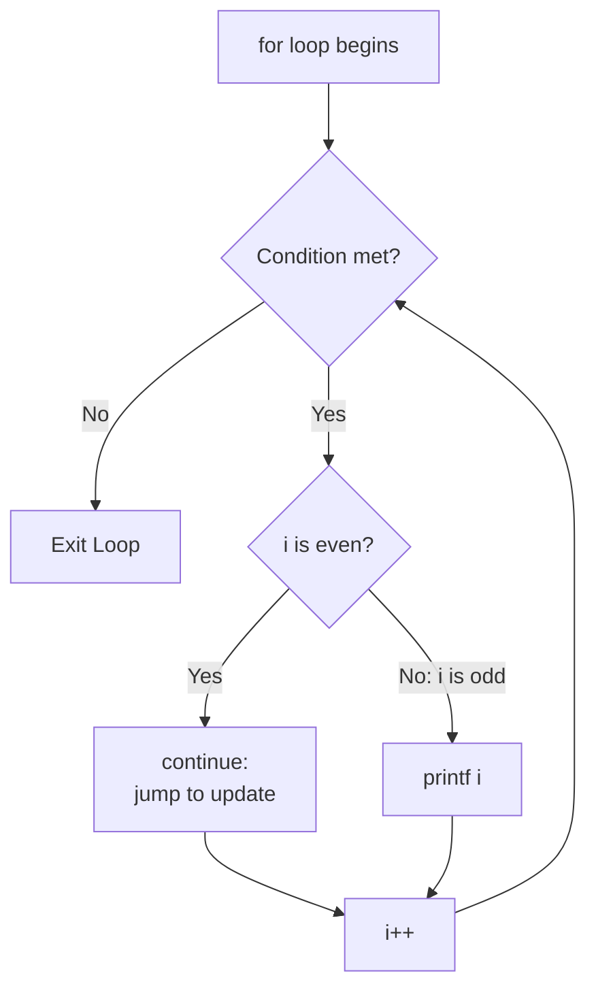

--

## tags: [c-programming, lecture] lecture: 11 topic: For Loops, Nested Loops, and Loop Control Statements prerequisites: While Loop, Variables, Data Types

# Lecture 11 — For Loops, Nested Loops, and Loop Control Statements

## Understanding the for Loop

The [[#^for-loop|for loop]] is one of the most concise loop constructs in C. Where a [[Lecture 10#^while-loop|while loop]] scatters three loop-control duties — setting up a counter, testing a condition, and advancing the counter — across different parts of the code, the for loop combines all three into a single compact header. This makes it the natural choice whenever the number of [[Lecture 10#^iteration|iterations]] is known or determinable before the loop begins.

### Syntax

```c
for (initialize; condition; update)
{
    // body — executes repeatedly while condition is true
}
```

> [!tip] The Three-Part Header
> - **Initialization** runs exactly once before the loop starts, usually setting a counter variable
> - **Condition** is evaluated before every iteration — when true, the body executes; when false, the loop ends
> - **Update** runs immediately after each completed iteration, typically incrementing or decrementing the counter

The three semicolon-separated expressions inside the parentheses each serve a distinct role. The [[#^initialization|initialization]] expression runs exactly once before the loop starts, usually declaring and setting a [[Lecture 10#^counter-variable|counter variable]]. The [[Lecture 9#^condition|condition]] is evaluated before every iteration — when true, the body executes; when false, the loop ends immediately. The [[#^update|update]] expression runs immediately after each completed iteration of the body, typically incrementing or decrementing the counter.



### Example 1 — Printing 1 to 5

The simplest for loop use case: printing the integers from 1 through 5.

```c
#include <stdio.h>

int main() {
    int i;

    for (i = 1; i <= 5; i++)
    {
        printf("%d ", i);
    }

    return 0;
}
```

> [!tip] Initialisation, Condition, and Update
> - `i = 1` initialises the counter to 1 before the loop begins
> - `i <= 5` is tested before each iteration — the body runs only while `i` is 5 or less
> - `i++` increments `i` by 1 after each completed iteration, driving toward the exit condition

> [!tip] Loop Termination
> - When `i` reaches 6, the condition `i <= 5` evaluates to false and the loop terminates
> - The counter progresses through the values 1 → 2 → 3 → 4 → 5 → 6 (exit)
> - `i++` modifies `i` in memory permanently — writing `i + 1` alone would leave `i` unchanged, causing an [[Lecture 10#^infinite-loop|infinite loop]]

|Line|Code|Explanation|
|---|---|---|
|1|`#include <stdio.h>`|Pulls in the standard I/O library so [[Lecture 2#^printf|printf]] is available|
|3|`int main()`|Program entry point|
|4|`int i;`|Declares the loop counter|
|6|`for (i = 1; i <= 5; i++)`|Initializes i to 1; loops while i is 5 or less; increments i after each pass|
|8|`printf("%d ", i);`|Prints the current value of i|
|11|`return 0;`|Returns exit code 0 to the operating system|

**Output:** `1 2 3 4 5`

> [!tip] i++ vs i+1 `i++` is the [[Lecture 6#^post-increment|post-increment]] operator — it modifies `i` in memory, adding 1 permanently. Writing `i + 1` alone in the update position computes a value but never stores it back, leaving `i` unchanged and causing an infinite loop.

### Example 2 — Summing 1 to 10

This program introduces the [[#^accumulator|accumulator]] pattern — a variable initialized to zero that collects a running total across loop iterations.

The following code is shown as written on the lecture slide:

```c
void main()
{
    int i, a = 0;

    for (i = 1; i <= 10; i++)
    {
        a = a + i;
    }

    printf("%d", a);
}
```

> [!warning] Non-Standard Code The slide uses `void main()` which is not standard C. The correct return type for `main` is `int`, as required by the C89, C99, and C11 standards. The corrected version below adds `int main()`, `#include <stdio.h>`, and `return 0;`.

Corrected and fully annotated version:

```c
#include <stdio.h>

int main() {
    int i, a = 0;

    for (i = 1; i <= 10; i++)
    {
        a = a + i;
    }

    printf("%d", a);
    return 0;
}
```

> [!tip] The Accumulator Pattern
> - `int a = 0` initialises the accumulator before the loop — starting at zero ensures the sum is correct
> - `a = a + i` adds the current value of `i` to the running total on each iteration
> - After the loop completes, `a` holds the final sum of all values from 1 to 10

> [!tip] Verifying the Result
> - The sum of the first N natural numbers equals N × (N+1) ÷ 2 — for N = 10: 10 × 11 ÷ 2 = **55**
> - The program output matches this formula exactly, confirming the loop logic is correct
> - The accumulator pattern appears throughout C programming — in averages, factorials, and running products

|Line|Code|Explanation|
|---|---|---|
|1|`#include <stdio.h>`|Required for `printf`|
|3|`int main()`|Correct standard main signature|
|4|`int i, a = 0;`|Declares loop counter `i` and accumulator `a` set to 0|
|6|`for (i = 1; i <= 10; i++)`|Loops i from 1 to 10 inclusive|
|8|`a = a + i;`|Each pass, the current value of i is added to the running total|
|11|`printf("%d", a);`|Displays the final accumulated sum|
|12|`return 0;`|Signals a successful exit|

**Output:** `55`



> [!success] Mathematical Verification The sum of the first N natural numbers equals N × (N+1) ÷ 2. For N = 10: 10 × 11 ÷ 2 = 55. The program output matches exactly.

### Example 3 — Summing 1 to N (User Input)

The upper bound does not have to be a hardcoded number. Reading it from the user with [[Lecture 2#^scanf|scanf]] makes the program flexible at runtime:

```c
#include <stdio.h>

int main() {
    int i, n, a = 0;

    printf("Enter N: ");
    scanf("%d", &n);

    for (i = 1; i <= n; i++)
    {
        a = a + i;
    }

    printf("Sum = %d\n", a);
    return 0;
}
```

> [!tip] User-Determined Loop Bounds
> - `scanf("%d", &n)` reads the upper limit from the user at runtime
> - `for (i = 1; i <= n; i++)` uses the user's value as the loop ceiling — the number of iterations is flexible
> - The accumulator pattern works identically regardless of whether `n` is 5, 100, or 1000

|Line|Code|Explanation|
|---|---|---|
|4|`int i, n, a = 0;`|Three variables: counter, user-supplied limit, and running total|
|6|`printf("Enter N: ");`|Prompts the user before reading|
|7|`scanf("%d", &n);`|Reads an integer from the keyboard and stores it in `n`|
|9|`for (i = 1; i <= n; i++)`|The loop ceiling is determined at runtime by the user's input|
|11|`a = a + i;`|Adds each value of i to the total|
|14|`printf("Sum = %d\n", a);`|Prints the final answer|

**Sample run:** Enter `5` → Output: `Sum = 15` (computed as 1 + 2 + 3 + 4 + 5).

---

## Concept of Nested Loops

A [[#^nested-loop|nested loop]] is a loop placed entirely inside the body of another loop. The [[#^outer-loop|outer loop]] governs the major cycle — typically thought of as rows — while the [[#^inner-loop|inner loop]] runs completely from start to finish on every single pass of the outer loop, typically filling columns.

> [!info] When Are Nested Loops Needed? Any time output or data has a two-dimensional structure — grids, tables, matrices, or printed patterns — nested loops are the right tool. A single loop sweeps through one dimension; two nested loops sweep through two. If you need to repeat something for every element within something that is itself repeating, you need a nested loop.

The general structure:

```c
for (/* outer header */)
{
    for (/* inner header */)
    {
        // innermost body — runs for every row-column combination
    }
}
```

> [!tip] Understanding Nested Loop Execution
> - If the outer loop runs M times and the inner loop runs N times, the innermost body executes M × N times
> - The inner loop restarts from its initial value on every pass of the outer loop
> - Think of the outer loop as controlling rows and the inner loop as filling each row with columns



If the outer loop runs M times and the inner loop runs N times, the innermost body executes M × N times in total.

### Pattern 1 — Rectangular Grid

This program prints a 6-row, 5-column grid of the letter `a`. The outer loop controls the row count; the inner loop fills each row with columns.

```c
#include <stdio.h>

int main() {
    int i, j;

    for (i = 0; i <= 5; i++)
    {
        for (j = 0; j <= 4; j++)
        {
            printf("a");
        }
        printf("\n");
    }

    return 0;
}
```

> [!tip] Building a Grid Row by Row
> - The outer loop `for (i = 0; i <= 5; i++)` runs 6 times — one for each row
> - The inner loop `for (j = 0; j <= 4; j++)` runs 5 times per outer pass — printing 5 characters per row
> - `printf("a")` has no newline, so characters accumulate on the same line; `printf("\n")` ends each row

|Line|Code|Explanation|
|---|---|---|
|4|`int i, j;`|Separate counters for row and column|
|6|`for (i = 0; i <= 5; i++)`|Outer loop — 6 iterations, one per row|
|8|`for (j = 0; j <= 4; j++)`|Inner loop — 5 iterations per outer pass, one per column|
|10|`printf("a");`|Prints a single character without a newline, building across the row|
|12|`printf("\n");`|Ends the current row by moving to the next line|

**Output:**

```
aaaaa
aaaaa
aaaaa
aaaaa
aaaaa
aaaaa
```

> [!example] How the Two Loops Interleave When i = 0, the inner loop runs five times (j = 0, 1, 2, 3, 4), printing five 'a' characters. Then `\n` ends that row. The outer loop moves to i = 1 and the inner loop restarts from j = 0. This repeats for i = 2, 3, 4, 5 — six rows in total, each with five columns.

### Pattern 2 — Right-Angled Triangle

Here, the inner loop's stopping condition is tied directly to the outer counter `i`, so each row prints one more star than the previous. The column count grows as the outer loop advances.

```c
#include <stdio.h>

int main() {
    int i, j;

    for (i = 0; i <= 4; i++)
    {
        for (j = 0; j <= i; j++)
        {
            printf("*");
        }
        printf("\n");
    }

    return 0;
}
```

> [!tip] The Variable Upper Bound
> - The condition `j <= i` ties the inner loop's ceiling to the outer counter
> - On row 0 the inner loop runs once (j = 0); on row 4 it runs five times (j = 0 to 4)
> - This idiom is the basis for triangle, pyramid, and staircase patterns in nested loop programming

|Line|Code|Explanation|
|---|---|---|
|6|`for (i = 0; i <= 4; i++)`|Outer loop — 5 rows|
|8|`for (j = 0; j <= i; j++)`|Inner loop — upper bound is i, not a fixed number; grows each row|
|10|`printf("*");`|Prints one star per inner iteration|
|12|`printf("\n");`|Terminates the current row|

**Output:**

```
*
**
***
****
*****
```

Execution trace by row:

|Row (i)|Inner loop range|Stars printed|
|---|---|---|
|0|j = 0 only|1|
|1|j = 0 to 1|2|
|2|j = 0 to 2|3|
|3|j = 0 to 3|4|
|4|j = 0 to 4|5|

---

## Understanding break and continue Statements

> [!warning] Live Demo — Check Video This section was a live demonstration and was not captured in the slides. Refer back to the lecture video for the walkthrough.

The [[#^break-statement|break statement]] and [[#^continue-statement|continue statement]] provide mid-loop control flow. Instead of waiting for the [[Lecture 10#^loop|loop]] condition to naturally turn false, these two keywords let you alter loop progression on the fly — exiting early or skipping ahead as needed.

### The break Statement

`break` causes the program to immediately exit the innermost loop or `switch` block that contains it. Execution jumps to the first statement after the closing brace of that loop, skipping all remaining iterations.

```c
#include <stdio.h>

int main() {
    int i;

    for (i = 1; i <= 10; i++)
    {
        if (i == 5)
        {
            break;
        }
        printf("%d\n", i);
    }

    printf("Loop ended.\n");
    return 0;
}
```

> [!tip] How break Works
> - The loop is set to run from 1 to 10, but `break` forces an early exit when `i` reaches 5
> - `printf("%d\n", i)` only executes for i = 1, 2, 3, and 4 — the `break` fires before it can print 5
> - Execution jumps immediately to the first statement after the loop: `printf("Loop ended.\n")`

|Line|Code|Explanation|
|---|---|---|
|5|`int i;`|Loop counter|
|7|`for (i = 1; i <= 10; i++)`|Set to loop up to 10, but may exit early|
|9|`if (i == 5)`|Tests whether the counter has hit the target value|
|11|`break;`|Terminates the entire for loop immediately|
|13|`printf("%d\n", i);`|Only reached for i = 1, 2, 3, 4|
|16|`printf("Loop ended.\n");`|Runs regardless of how the loop ended|

**Output:**

```
1
2
3
4
Loop ended.
```

> [!bug] break in Nested Loops `break` exits only the **innermost** loop containing it. If placed inside an inner loop within nested loops, the outer loop continues running unaffected. To exit multiple levels of nesting simultaneously, use a flag variable or restructure the logic.

### The continue Statement

`continue` does not exit the loop. Instead it skips the remaining statements in the current iteration and jumps directly to the update expression of the for loop, resuming the very next cycle.

```c
#include <stdio.h>

int main() {
    int i;

    for (i = 1; i <= 10; i++)
    {
        if (i % 2 == 0)
        {
            continue;
        }
        printf("%d\n", i);
    }

    return 0;
}
```

> [!tip] How continue Works
> - `if (i % 2 == 0)` checks whether `i` is even — if so, `continue` skips the rest of the [[Lecture 10#^loop-body|loop body]]
> - `printf` is never reached for even values; the loop jumps directly to `i++` and re-checks the condition
> - The result is that only odd numbers (1, 3, 5, 7, 9) are printed

> [!tip] break vs continue
> - `break` terminates the entire loop — no further iterations occur
> - `continue` ends only the current iteration — the loop continues with the next cycle
> - Confusing these two produces logic bugs that are easy to write and surprisingly hard to spot

|Line|Code|Explanation|
|---|---|---|
|7|`for (i = 1; i <= 10; i++)`|Covers the full range 1 to 10|
|9|`if (i % 2 == 0)`|`%` is the [[Lecture 6#^modulo-operator|modulo operator]] — a remainder of 0 means the number is even|
|11|`continue;`|Skips to i++ for even numbers; `printf` below is never reached for them|
|13|`printf("%d\n", i);`|Executes only when the continue was not triggered (odd i)|

**Output:**

```
1
3
5
7
9
```



> [!danger] break vs continue — A Critical Distinction `break` **terminates the loop entirely** — execution moves past the closing brace and no further iterations occur. `continue` **ends only the current iteration** — the loop condition is re-tested and further iterations still happen. Confusing these two produces logic bugs that are easy to write and surprisingly hard to spot.

---

## Key Terms

|Term|Definition|
|---|---|
| for loop | A loop that consolidates initialization, condition, and update into one header line; preferred when the number of iterations is known in advance | ^for-loop
| initialization | The expression in a for loop header that executes exactly once before the first iteration, typically setting a counter to its starting value | ^initialization-loop
| condition | The boolean expression evaluated before every iteration; the loop body executes only while this is true |
| update | The expression in a for loop header that runs after each completed iteration, typically incrementing or decrementing the counter | ^update
| accumulator | A variable initialized to zero and used inside a loop to build up a running total, one addition per iteration | ^accumulator
| nested loop | A loop placed entirely inside the body of another loop; the inner loop completes all its iterations for every single pass of the outer loop | ^nested-loop
| outer loop | The enclosing loop in a nested loop structure; governs the primary dimension, typically rows | ^outer-loop
| inner loop | The enclosed loop in a nested loop structure; runs to completion on each pass of the outer loop, typically filling columns | ^inner-loop
| break statement | A control-flow keyword that immediately exits the innermost loop or switch block containing it | ^break-statement
| continue statement | A control-flow keyword that skips the remaining statements in the current iteration and jumps to the loop's update expression | ^continue-statement
| scanf | A standard library function that reads formatted input from the keyboard using a format string and stores values through pointer arguments |
| iteration | A single complete execution of a loop body from start to end |

> [!example]- Try It Yourself **Exercise 1 — Multiplication Table** Write a program that reads an integer N from the user and prints its full multiplication table from 1 to 10 using a for loop. For example, entering 5 should print `5 x 1 = 5`, `5 x 2 = 10`, … `5 x 10 = 50`.
> 
> **Exercise 2 — Countdown** Write a for loop that counts down from 10 to 1 and then prints "Launch!". Hint: set the initial value high, change the update expression from `i++` to `i--`, and adjust the condition so the loop continues while i is greater than or equal to 1.
> 
> **Exercise 3 — Inverted Triangle** Using nested loops, print an inverted right-angled triangle of stars with 5 rows — the first row has 5 stars, the second has 4, and so on down to 1 star on the last row. This is the homework pattern shown at the end of the lecture.
> 
> **Exercise 4 — Skip Multiples of 3** Print all integers from 1 to 30, but use `continue` to skip any number that is a multiple of 3. Verify that 3, 6, 9, 12 … do not appear in the output.
> 
> **Exercise 5 — First Multiple of 7 Beyond 50** Use a for loop with `break` to find and print the first multiple of 7 that is strictly greater than 50. Once found, exit the loop immediately rather than continuing to check further values.

---

**Lecture 11 Recap**

- The `for` loop packages initialization, condition, and update into one header, making it ideal when the number of iterations is known before the loop starts.
- Execution order: initialization runs once → condition is tested → body executes → update runs → condition tested again, repeating until the condition is false.
- An accumulator (`a = a + i`) is a standard pattern for computing a running sum across loop iterations; always initialize it to zero before the loop.
- A nested loop places an inner loop entirely within an outer loop's body; the inner loop runs to full completion on every single pass of the outer loop.
- When the inner loop's upper bound uses the outer counter (`j <= i`), each row has a different column count — this is the basis for triangle and staircase patterns.
- `break` immediately exits the entire innermost loop; execution continues at the first statement after that loop's closing brace.
- `continue` skips only the current iteration; the loop keeps running and the update expression fires before the next condition check.
- Both `break` and `continue` affect only the innermost loop directly containing them — they have no effect on any outer loops.