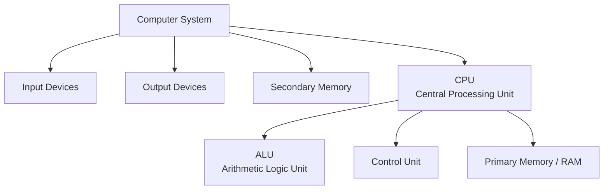
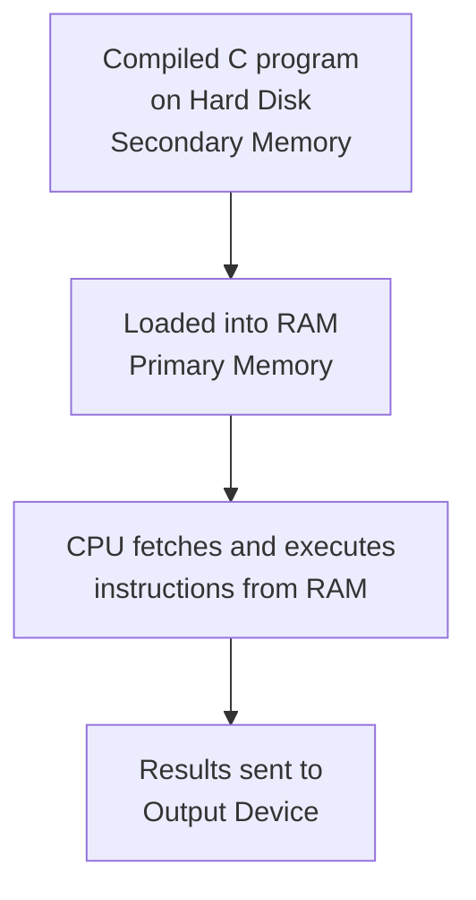
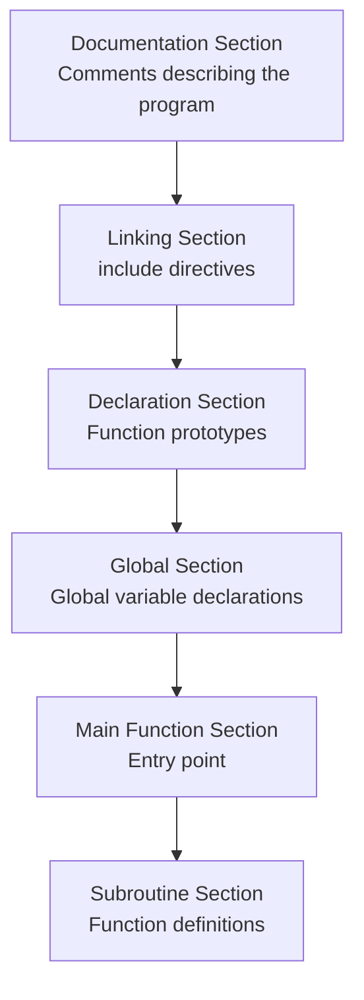
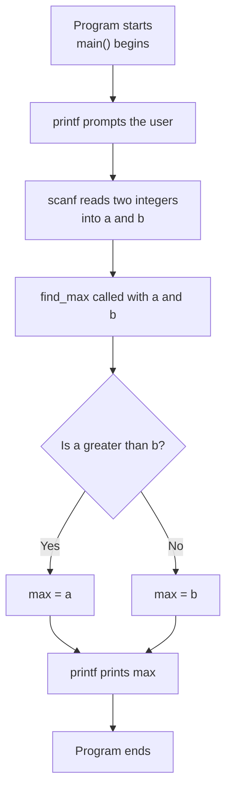

---
cssclasses:
---
---

## tags: [c-programming, lecture] lecture: 2 topic: Computer System Components and C Program Structure prerequisites: Introduction to C, history of C, basic concepts of programming

## Agenda

1. The hardware components of a computer system on which C programs run
2. The six-section structure of a C program, illustrated through a complete working example

---

## Components of a Computer System

To write meaningful C programs, you need a working mental model of the machine your code runs on. A computer system is composed of several cooperating components, each with a specific responsibility.



### Input Devices

An [[#^input-device|Input Device]] is any hardware component through which a human feeds data into the computer. A running C program can receive values through input devices at runtime.

Examples include the mouse, keyboard, touchscreen, and joystick.

### Output Devices

An [[#^output-device|Output Device]] takes the results produced by the computer and presents them in a format that humans can read or use. When your C program calls [[#^printf|printf]], it is ultimately sending data to an output device.

Examples include the monitor, printer, and plotter.

### Central Processing Unit (CPU)

The [[#^cpu|CPU]] is the brain of the computer. It carries out all computation with high efficiency and is composed of three sub-components: the [[#^alu|ALU]], the [[#^control-unit|Control Unit]], and [[#^primary-memory|Primary Memory]].

> [!info] Inside the CPU The CPU is not one monolithic chip — it is organized into three specialized units. Each handles a distinct job, and they work together to execute every instruction in a C program.

#### Arithmetic Logic Unit (ALU)

The ALU performs every arithmetic operation a program needs — addition, subtraction, multiplication, and division — as well as logical comparisons like greater-than or equal-to. It can also communicate with memory to retrieve operands and store results.

#### Control Unit (CU)

The Control Unit acts as the manager of the entire system. It coordinates all units within the computer and oversees every read and write operation to and from memory. No data moves through the system without the Control Unit directing it.

#### Primary Memory (RAM)

Primary Memory, better known as [[#^ram|RAM]] (Random Access Memory), is where every actively running program lives. The CPU can access it directly and at very high speed. When you run a C program, it is loaded from storage into RAM before the CPU begins executing it.

> [!warning] Volatile Memory RAM is **volatile** — its entire contents are erased the moment power is cut. Anything a program needs to preserve across sessions must be written to secondary memory before shutdown.

### Secondary Memory

[[#^secondary-memory|Secondary Memory]], also called external or auxiliary memory, is where data is stored permanently. Unlike RAM, it is non-volatile — data survives a power loss. It also holds far greater amounts of data than primary memory.

Examples include hard disks, floppy disks, CDs, DVDs, and USB pen drives.

> [!success] Primary vs Secondary — The Key Distinction Primary memory is fast but temporary; secondary memory is slow but permanent. Your compiled C program sits on secondary memory and is loaded into primary memory only when it runs.



---

## C Language Program Structure

Every C program is organized into six well-defined sections. Understanding these sections tells you exactly where each type of code belongs — and why it belongs there.



The lecture illustrates all six sections using a single cohesive example: a program that finds the maximum of two numbers.

> [!warning] Non-Standard Code in Slides The lecture uses `void main()`. This is non-standard C — the correct form per the C standard is `int main()`, which returns an integer exit code to the operating system. The slide version is shown faithfully below, but use `int main()` in your own programs.

```c
#include <stdio.h>

void find_max(int a, int b);

int max = 0;

void main() {
    int a, b;
    printf("Enter a and b");
    scanf("%d%d", &a, &b);
    find_max(a, b);
    printf("Max is: %d", max);
}

void find_max(int a, int b) {
    max = a > b ? a : b;
}
```

> [!tip] Including Standard Libraries
> - `#include <stdio.h>` imports the Standard Input/Output header, giving access to `printf` and `scanf`
> - This directive belongs in the Linking Section — the very first functional line after documentation comments
> - Without it, the [[Lecture 1#^compiler|compiler]] will not recognise any I/O function calls and will refuse to compile

> [!tip] Forward-Declaring the Subroutine
> - `void find_max(int a, int b);` is a function prototype placed in the Declaration Section
> - It tells the compiler the function's name, return type, and parameter types before the full definition appears later
> - This allows `main()` to call `find_max` even though its full body is written further down in the file

> [!tip] Setting Up Global State
> - `int max = 0;` is declared outside all functions, making it a global variable in the Global Section
> - Both `main()` and `find_max()` can read and modify `max` because it exists at file scope
> - Global variables persist for the entire lifetime of the program

> [!tip] Program Entry Point and User Interaction
> - `void main()` is the entry point where execution begins — though `int main()` is the standard form
> - `printf("Enter a and b")` prompts the user, then `scanf("%d%d", &a, &b)` reads two integers from the keyboard
> - The `&` before each variable gives [[#^scanf|scanf]] the memory address where it should store the input value

> [!tip] Defining the Helper Function
> - `void find_max(int a, int b)` in the Subroutine Section provides the full implementation of the forward-declared function
> - The ternary expression `a > b ? a : b` evaluates the condition and assigns the larger value to the global `max`
> - Splitting logic into subroutines keeps `main()` readable and makes pieces of logic reusable

|Line|Code|Explanation|
|---|---|---|
|1|`// WAP to find maximum of two numbers`|Documentation comment — describes intent; ignored by the compiler|
|3|`#include <stdio.h>`|Linking section — imports the standard I/O library so `printf` and `scanf` are available|
|5|`void find_max(int a, int b);`|Declaration section — forward-declares `find_max` so `main()` can call it before its definition|
|7|`int max = 0;`|Global section — declares `max` outside all functions so both `main()` and `find_max()` share it|
|9|`void main()`|Main function section — entry point (note: non-standard; prefer `int main()`)|
|10|`int a, b;`|Local variables scoped to `main()` to hold the user's input|
|11|`printf("Enter a and b");`|Prompts the user to provide two numbers|
|12|`scanf("%d%d", &a, &b);`|Reads two integers from standard input into `a` and `b`|
|13|`find_max(a, b);`|Calls the subroutine, passing the two numbers as arguments|
|14|`printf("Max is: %d", max);`|Prints the global `max` that was set inside `find_max()`|
|17|`void find_max(int a, int b)`|Subroutine section — full definition of the helper function|
|18|`max = a > b ? a : b;`|Ternary expression: assigns the larger value to the global `max`|



### The Six Sections in Detail

The **[[#^doc-section|Documentation Section]]** consists entirely of comments — lines beginning with `//` or wrapped in `/* */`. The compiler ignores these completely, but they are essential for any human reading the code later.

The **[[#^linking-section|Linking Section]]** uses `#include` directives to import header files. Writing `#include <stdio.h>` gives the program access to [[#^printf|printf]] and [[#^scanf|scanf]], among other I/O utilities.

> [!tip] Always Link What You Use If your program uses `printf` or `scanf`, the linking section must contain `#include <stdio.h>`. Omitting it is one of the most frequent beginner mistakes and produces a compiler error.

The **[[#^declaration-section|Declaration Section]]** holds function prototypes — abbreviated signatures that tell the compiler a function's name, return type, and parameter types before the full definition appears.

The **[[#^global-section|Global Section]]** declares variables outside of any function. These variables exist for the entire lifetime of the program and can be read or modified by every function.

> [!bug] Globals Are a Double-Edged Sword Since any function can change a global variable, an unexpected modification deep inside a subroutine can silently corrupt results elsewhere. Use globals only when sharing state between functions is genuinely necessary.

The **[[#^main-section|Main Function Section]]** contains the `main()` function — the single mandatory entry point that the OS calls when your program launches. Every C program must have exactly one `main`.

The **[[#^subroutine-section|Subroutine Section]]** holds the complete definitions of helper functions that were forward-declared earlier. Splitting logic into subroutines keeps `main()` readable and makes pieces of logic reusable.

> [!question] Why Forward-Declare at All? C compilers process files top to bottom. If `main()` calls `find_max` before the compiler has seen its definition, it cannot verify the call. The Declaration Section resolves this by supplying the signature upfront.

---

## Key Terms

|Term|Definition|
|---|---|
| Input Device | Hardware that allows humans to feed data into a computer (e.g. keyboard, mouse) | ^input-device
| Output Device | Hardware that presents computer results in human-readable form (e.g. monitor, printer) | ^output-device
| CPU | Central Processing Unit — the brain of the computer; carries out all computation | ^cpu
| ALU | Arithmetic Logic Unit — the CPU sub-unit that performs arithmetic and logical operations | ^alu
| Control Unit | CPU sub-unit that coordinates all other units and manages memory read/write operations | ^control-unit
| Primary Memory | Fast, directly CPU-accessible memory where active programs run; also called RAM | ^primary-memory
| RAM | Random Access Memory — volatile primary memory that loses all data when power is removed | ^ram
| Secondary Memory | Non-volatile external storage (hard disk, USB) that retains data permanently | ^secondary-memory
| Documentation Section | The comment-only section at the top of a C program describing its purpose | ^doc-section
| Linking Section | Contains `#include` directives that import library headers into the program | ^linking-section
| Declaration Section | Contains function prototypes informing the compiler of subroutine signatures before their definitions | ^declaration-section
| Global Section | Holds variables declared outside all functions, making them accessible program-wide | ^global-section
| Main Function Section | Contains the `main()` function — the mandatory entry point of every C program | ^main-section
| Subroutine Section | Contains the full definitions of helper functions used by `main()` | ^subroutine-section
| printf | Standard library function that prints formatted text to the console | ^printf
| scanf | Standard library function that reads formatted input from the keyboard | ^scanf

---

> [!example]- Try It Yourself **Exercise 1 — Minimum of Two Numbers** Rewrite the lecture's `find_max` program so that it finds and prints the minimum of two numbers instead. Keep all six structural sections intact and label each one with a comment.
> 
> **Exercise 2 — Sum and Product** Write a complete C program using all six sections that asks the user for two integers and prints both their sum and their product. Implement a subroutine called `calculate` that stores results in two global variables named `sum` and `product`.
> 
> **Exercise 3 — Identify the Sections** Read the program below and label which structural section each part belongs to using inline comments. Then compile and run it:
> 
> ```c
> // Prints a personalized greeting
> #include <stdio.h>
> void greet(void);
> char name[50] = "Student";
> void main() {
>     greet();
> }
> void greet(void) {
>     printf("Hello, %s! Welcome to C programming.\n", name);
> }
> ```

---

**Lecture 2 Recap**

- A computer system consists of Input Devices, Output Devices, the CPU, and Secondary Memory.
- The CPU has three sub-components: ALU (arithmetic and logic), Control Unit (coordination), and Primary Memory / RAM (where active programs run).
- RAM is volatile — loses contents when power is cut. Secondary Memory is non-volatile and permanent.
- Every C program is organized into six sections: Documentation, Linking, Declaration, Global, Main Function, and Subroutine.
- `#include <stdio.h>` in the Linking Section is required for `printf` and `scanf`.
- Forward declarations allow `main()` to call subroutines defined later in the file.
- The slide uses `void main()` — the standard form is `int main()`. Use the standard form in your own code.