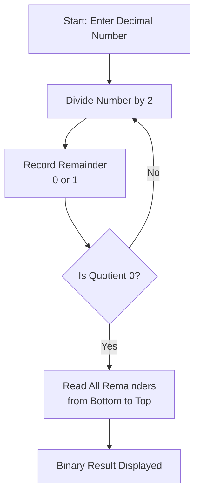
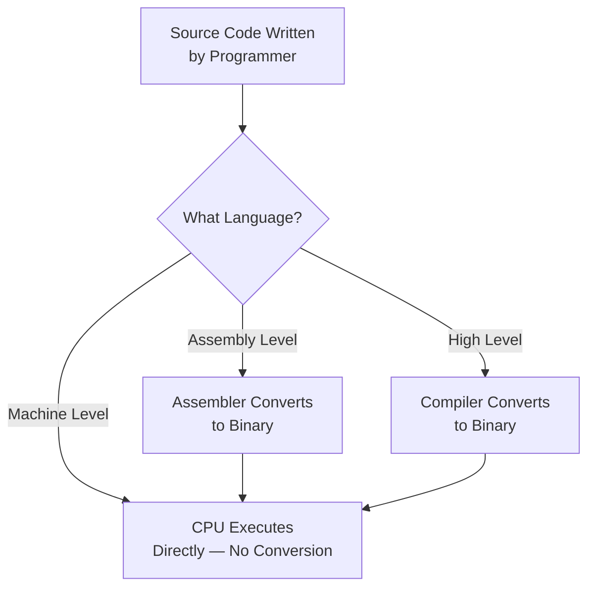
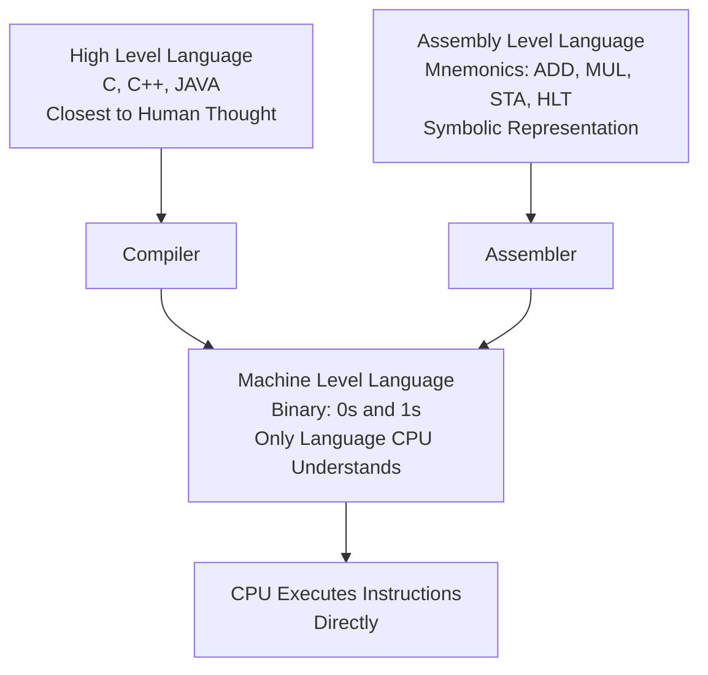

---
This lecture builds the foundation for understanding how computers store and process information at the lowest level. It begins with the three number systems fundamental to computing — binary, octal, and hexadecimal — and then moves up to examine how programming languages are classified by their proximity to hardware:
---
---

## tags: [c-programming, lecture] lecture: 3 topic: Number Systems and Programming Language Levels prerequisites: Introduction to C

# Lecture 3 — Number Systems and Programming Language Levels

## Agenda

This lecture builds the foundation for understanding how computers store and process information at the lowest level. It begins with the three number systems fundamental to computing — binary, octal, and hexadecimal — and then moves up to examine how programming languages are classified by their proximity to hardware: machine level, assembly level, and high level.

---

## Binary Representation of Decimal

> [!warning] Live Demo — Check Video This section was a live demonstration and was not captured in the slides. Refer back to the lecture video for the walkthrough.

The [[#^binary|binary]] number system operates in base 2, which means it recognises only two digits: 0 and 1. Because computers are built from electronic circuits that are either off (0) or on (1), binary is the native language of all digital hardware. Every piece of data — numbers, text, images, instructions — is ultimately stored as a sequence of these two digits.

### Converting Decimal to Binary

To convert a [[#^decimal|decimal]] number to binary, divide the number by 2 repeatedly and record the remainder at each step. When the quotient reaches 0, the binary result is the list of remainders read from bottom to top (last remainder first).

> [!example] Converting 13 to Binary 13 ÷ 2 = 6, remainder **1** 6 ÷ 2 = 3, remainder **0** 3 ÷ 2 = 1, remainder **1** 1 ÷ 2 = 0, remainder **1**
> 
> Reading remainders from bottom to top: **1101** Therefore, 13 in binary is **1101₂**

### Understanding Place Values in Binary

Each position in a binary number represents a power of 2, starting from 2⁰ on the rightmost digit.

|Position|2³|2²|2¹|2⁰|
|---|---|---|---|---|
|Value|8|4|2|1|
|1101₂|1|1|0|1|

Verification: (1×8) + (1×4) + (0×2) + (1×1) = 8 + 4 + 0 + 1 = **13** ✓

> [!tip] Reading Binary Numbers When checking a binary-to-decimal conversion, multiply each bit by its corresponding power of 2 and sum the results. Any bit that is 0 contributes nothing to the total.

### Sample Program: Decimal to Binary Conversion

```c
#include <stdio.h>

int main() {
    int decimal;
    int binary[16];
    int i = 0;

    printf("Enter a decimal number: ");
    scanf("%d", &decimal);

    while (decimal > 0) {
        binary[i] = decimal % 2;
        decimal = decimal / 2;
        i++;
    }

    printf("Binary: ");
    for (int j = i - 1; j >= 0; j--) {
        printf("%d", binary[j]);
    }
    printf("\n");

    return 0;
}
```

> [!tip] Including Standard Libraries
> - `#include <stdio.h>` imports the Standard Input/Output header so [[Lecture 2#^printf|printf]] and [[Lecture 2#^scanf|scanf]] are available
> - Every C program that performs any console input or output must include this header
> - Without it, the [[Lecture 1#^compiler|compiler]] will not recognise any I/O function calls

> [!tip] Declaring Variables
> - `int decimal` stores the user's input number, `int binary[16]` is an [[Lecture 4#^array|array]] to hold up to 16 binary digits, and `int i` tracks how many remainders have been stored
> - The array size of 16 can handle decimal numbers up to 65,535
> - `i` starts at 0 because C arrays are zero-indexed — the first slot is `binary[0]`

> [!tip] Getting User Input
> - `printf` displays a prompt asking the user to enter a decimal number
> - `scanf("%d", &decimal)` reads one integer from the keyboard and stores it at `decimal`'s memory address
> - The `&` (address-of) operator is required because `scanf` needs to know where in memory to write the value

> [!tip] Core Logic — Repeated Division
> - The `while` loop runs as long as the quotient is greater than 0, performing the repeated-division algorithm
> - `decimal % 2` extracts the remainder (always 0 or 1), which is stored in the next array slot
> - `decimal / 2` performs integer division to get the new quotient — the fractional part is discarded

> [!tip] Displaying the Result
> - The `for` loop traverses the array in reverse (from `i - 1` down to 0) so the most significant bit prints first
> - Each digit is printed with `%d` since binary digits are integers (0 or 1)
> - `printf("\n")` moves the cursor to a new line after the result

|Line|Code|Explanation|
|---|---|---|
|1|`#include <stdio.h>`|Includes the standard I/O library so `printf` and `scanf` are available|
|4|`int decimal;`|Stores the decimal number entered by the user|
|5|`int binary[16];`|Array to collect remainders; 16 slots handles numbers up to 65,535|
|6|`int i = 0;`|Counter tracking how many remainders have been stored|
|9|`scanf("%d", &decimal);`|Reads a decimal integer from the user|
|11|`while (decimal > 0)`|Keeps dividing as long as the quotient has not yet reached zero|
|12|`binary[i] = decimal % 2;`|The modulo operator extracts the remainder — always 0 or 1|
|13|`decimal = decimal / 2;`|Integer division discards the fraction; the quotient shrinks each cycle|
|17|`for (int j = i - 1; j >= 0; j--)`|Iterates backwards through the remainders so the most significant bit prints first|



---

## Octal Representation

> [!warning] Live Demo — Check Video This section was a live demonstration and was not captured in the slides. Refer back to the lecture video for the walkthrough.

The [[#^octal|octal]] number system uses base 8, meaning its valid digits are 0 through 7. Octal became significant in computing because every single octal digit maps precisely to a 3-bit binary group, providing a compact shorthand for binary values. It remains in use today in Unix/Linux file permission notation (for example, `chmod 755`).

### Converting Decimal to Octal

The algorithm mirrors binary conversion: repeatedly divide by 8, record the remainder after each step, and read the collected remainders from bottom to top.

> [!example] Converting 83 to Octal 83 ÷ 8 = 10, remainder **3** 10 ÷ 8 = 1, remainder **2** 1 ÷ 8 = 0, remainder **1**
> 
> Reading remainders from bottom to top: **123** Therefore, 83 in octal is **123₈**

### The Octal–Binary Shortcut

Because 8 equals 2³, every octal digit directly corresponds to exactly three binary digits. This relationship makes converting between octal and binary effortless.

|Octal|Binary|
|---|---|
|0|000|
|1|001|
|2|010|
|3|011|
|4|100|
|5|101|
|6|110|
|7|111|

### Sample Program: Decimal to Octal Conversion

```c
#include <stdio.h>

int main() {
    int decimal;
    int octal[16];
    int i = 0;

    printf("Enter a decimal number: ");
    scanf("%d", &decimal);

    while (decimal > 0) {
        octal[i] = decimal % 8;
        decimal = decimal / 8;
        i++;
    }

    printf("Octal: ");
    for (int j = i - 1; j >= 0; j--) {
        printf("%d", octal[j]);
    }
    printf("\n");

    return 0;
}
```

> [!tip] Core Logic — Division by 8
> - The structure is identical to the binary converter — only the divisor changes from 2 to 8
> - `decimal % 8` extracts a remainder guaranteed to fall between 0 and 7
> - `decimal / 8` advances the algorithm by shrinking the quotient toward zero

> [!tip] Displaying the Result
> - The `for` loop reverses the collected remainders so the most significant octal digit prints first
> - The same reverse-printing pattern appears in all three conversion programs in this lecture
> - `return 0` signals to the operating system that the program ended successfully

|Line|Code|Explanation|
|---|---|---|
|5|`int octal[16];`|Stores remainders; the base-8 system needs fewer digits than binary for the same value|
|12|`octal[i] = decimal % 8;`|Modulo 8 extracts a remainder guaranteed to fall between 0 and 7|
|13|`decimal = decimal / 8;`|Advances the algorithm by dividing by the octal base|
|17|`for (int j = i - 1; ...)`|Reverses the collected remainders so the most significant octal digit prints first|

> [!info] Same Flow, Different Base The execution flow for this program is identical to the binary converter — the only change is the divisor. A single flowchart covering all three conversion programs is provided in the Binary section above.

---

## Hexadecimal Representation

> [!warning] Live Demo — Check Video This section was a live demonstration and was not captured in the slides. Refer back to the lecture video for the walkthrough.

The [[#^hexadecimal|hexadecimal]] (hex) number system uses base 16. Since base 16 requires sixteen distinct digit symbols but the standard numeral system only provides ten (0–9), the letters A through F are used to represent the values 10 through 15.

|Decimal|10|11|12|13|14|15|
|---|---|---|---|---|---|---|
|Hex|A|B|C|D|E|F|

### Converting Decimal to Hexadecimal

Divide repeatedly by 16, recording the remainder each time. If a remainder falls between 10 and 15, substitute the corresponding letter before writing it down. Read the collected results from bottom to top.

> [!example] Converting 255 to Hexadecimal 255 ÷ 16 = 15, remainder **15 → F** 15 ÷ 16 = 0, remainder **15 → F**
> 
> Reading from bottom to top: **FF** Therefore, 255 in hexadecimal is **FF₁₆**

> [!success] Why Programmers Prefer Hex A single byte (8 bits) is always represented by exactly two hexadecimal digits. This makes hex the standard notation for memory addresses, colour codes (such as `#FF5733`), and raw data in debuggers. It is far more compact than writing out the equivalent binary string.

### The Hex–Binary Shortcut

Because 16 = 2⁴, every hex digit maps directly to a 4-bit binary group. Converting between hex and binary is as simple as substituting each digit for its 4-bit equivalent.

|Hex|Binary|
|---|---|
|0|0000|
|5|0101|
|A|1010|
|F|1111|

### Sample Program: Decimal to Hexadecimal Conversion

```c
#include <stdio.h>

int main() {
    int decimal;
    int remainder;
    char hex[16];
    int i = 0;

    printf("Enter a decimal number: ");
    scanf("%d", &decimal);

    while (decimal > 0) {
        remainder = decimal % 16;

        if (remainder < 10) {
            hex[i] = remainder + '0';
        } else {
            hex[i] = remainder - 10 + 'A';
        }

        decimal = decimal / 16;
        i++;
    }

    printf("Hexadecimal: ");
    for (int j = i - 1; j >= 0; j--) {
        printf("%c", hex[j]);
    }
    printf("\n");

    return 0;
}
```

> [!tip] Declaring a Character Array for Hex Digits
> - `char hex[16]` uses a character array instead of an integer array because hex digits can be letters (A–F)
> - Each slot stores one character — either a digit character like `'0'` or a letter like `'A'`
> - This is the key difference from the binary and octal programs, which only need integer arrays

> [!tip] Mapping Remainders to Hex Characters
> - When the remainder is 0–9, adding the ASCII value of `'0'` (48) converts the integer to its character equivalent
> - When the remainder is 10–15, subtracting 10 gives an offset 0–5, and adding `'A'` (65) maps it to `'A'`–`'F'`
> - This ASCII arithmetic avoids the need for a lookup table or switch statement

> [!tip] Printing Characters with `%c`
> - The `%c` format specifier in `printf` prints the stored character rather than its numeric ASCII code
> - Using `%d` here would print the ASCII value (e.g., 65) instead of the letter (e.g., A)
> - The reverse loop again ensures the most significant hex digit prints first

|Line|Code|Explanation|
|---|---|---|
|6|`char hex[16];`|A character array is used because some digits are letters (A–F), not numbers|
|12|`remainder = decimal % 16;`|Extracts a remainder in the range 0 to 15|
|14|`remainder + '0'`|Adding the ASCII value of `'0'` (which is 48) converts an integer 0–9 into its character equivalent|
|16|`remainder - 10 + 'A'`|Subtracting 10 gives an offset 0–5; adding the ASCII value of `'A'` (65) maps it to `'A'`–`'F'`|
|22|`printf("%c", hex[j]);`|The `%c` format specifier prints the stored character rather than its numeric code|

---

## Machine Level Language

[[#^machine-level-language|Machine level language]] is the lowest possible level of programming. Every instruction is expressed as a sequence of binary digits — 0s and 1s — which is why it is also referred to as binary language.

The defining characteristic of machine level language is that the processor executes it directly. No translation step is needed between the written code and the hardware; the [[Lecture 2#^cpu|CPU]] reads the binary patterns and acts on them immediately. This stands in contrast to every other programming language, which must first be converted into machine code before any execution can happen.

Despite this advantage of directness, machine level language is extremely difficult for humans to write or read. A simple arithmetic operation might appear as a string like `10110000 01100001`, with no visible structure or meaning to a human reader. Because of this, higher-level languages were developed to spare programmers from writing raw binary.

> [!bug] Every Language Ends Here Regardless of how a program is written — whether in C, assembly, or any other language — the computer can only execute it once it has been translated into binary. Machine level language is the final destination for all code.



---

## Assembly Level Language

[[#^assembly-level-language|Assembly level language]] sits one level above machine language. Rather than writing raw binary, programmers express instructions using special symbolic abbreviations known as [[#^mnemonic|mnemonics]].

Each mnemonic is a short, memorable symbol that stands for a specific CPU operation. For example, `ADD` instructs the processor to perform addition, `MUL` triggers multiplication, `STA` stores a value, and `HLT` halts execution. These symbols correspond one-to-one with machine instructions, meaning there is a direct and unambiguous translation between them.

Writing in assembly is meaningfully easier than working in raw binary, because the mnemonics carry semantic meaning that binary strings do not. However, assembly is still hardware-specific — code written for one CPU architecture will not run on a different one without rewriting.

Because the processor cannot understand mnemonics directly, a translation program called an [[#^assembler|assembler]] is required to convert the symbolic instructions into binary machine code before the program can run.

> [!question] Is Assembly Still Relevant? Assembly language is still actively used in embedded systems programming, device drivers, and performance-critical routines where a programmer needs direct control over CPU registers and memory. Operating system kernels, including the Linux kernel, contain assembly code in their low-level components.

---

## High Level Language

[[#^high-level-language|High level language]] is the most human-readable form of programming. Instructions are written in a syntax that closely resembles plain English, with constructs like loops, functions, and conditions that map to human reasoning rather than hardware behaviour.

Languages such as [[Lecture 1#^c-lang|C]], C++, and JAVA fall into this category. They are designed to be user-friendly, straightforward to learn, and easy to maintain over time. The trade-off is that a computer cannot execute them directly — a [[Lecture 1#^compiler|compiler]] (or interpreter) must translate the source code into machine-level binary before any execution occurs.

> [!info] The Abstraction Principle The further a language is from the hardware, the more abstract it becomes. High level languages hide the details of memory addresses, registers, and binary encoding behind meaningful vocabulary. This abstraction is what makes large, complex programs manageable for human developers.

### The Three Language Levels Compared



> [!tip] C Sits in the Sweet Spot C is classified as a high level language, but it sits unusually close to the hardware compared to languages like JAVA. This gives C programmers both human-readable syntax and fine-grained control over memory — which is why C is the language of choice for operating systems and embedded systems.

---

## Key Terms

|Term|Definition|
|---|---|
| Binary | A base-2 number system using only the digits 0 and 1 to represent all values | ^binary
| Decimal | The standard base-10 number system using digits 0 through 9 | ^decimal
| Octal | A base-8 number system using digits 0 through 7; each octal digit represents exactly 3 binary digits | ^octal
| Hexadecimal | A base-16 number system using digits 0–9 and letters A–F (A=10 through F=15); each hex digit represents exactly 4 binary digits | ^hexadecimal
| Machine Level Language | The lowest-level programming language, consisting entirely of binary (0s and 1s); executed directly by the CPU with no conversion needed | ^machine-level-language
| Mnemonic | A short symbolic abbreviation used in assembly language to represent a specific CPU instruction (e.g., ADD, MUL, HLT) | ^mnemonic
| Assembly Level Language | A low-level language that uses mnemonics to express CPU instructions; requires an assembler to convert to binary machine code | ^assembly-level-language
| Assembler | A program that translates assembly language mnemonics into binary machine code so the CPU can execute them | ^assembler
| High Level Language | A human-readable programming language (C, C++, JAVA) that abstracts hardware details; requires a compiler or interpreter before execution | ^high-level-language
| Compiler | A program that translates high-level language source code into binary machine code |
| C | A general-purpose high-level compiled programming language that sits close to the hardware; examples like C programs from this course |

---

> [!example]- Try It Yourself **Exercise 1 — Manual Conversion Practice** Convert the following decimal numbers to binary, octal, and hexadecimal by hand using the repeated-division method: 45, 128, and 200. Verify each binary result by summing the place values.
> 
> **Exercise 2 — Spot the Hex Letter** Which of the following decimal values produce a hexadecimal result that contains at least one letter digit (A–F)? Work each one out: 16, 26, 161, 255.
> 
> **Exercise 3 — Language Level Classification** Classify each of the following as machine level, assembly level, or high level language, and explain your reasoning: `int x = 5 + 3;`, `10110001 00000101`, `ADD 05H`.
> 
> **Exercise 4 — Extend the Hex Converter** Modify the hexadecimal conversion program from this lecture so that it prints lowercase hex digits (a–f) instead of uppercase (A–F). Hint: only one character in the source code needs to change.
> 
> **Exercise 5 — Reverse the Process** Write a C program that reads a binary number as a string input from the user and converts it back to its decimal equivalent. For example, entering `1101` should output `13`.

---

**Lecture 3 Recap**

- The **binary** number system (base 2) uses only 0 and 1; decimal-to-binary conversion is performed by repeatedly dividing by 2 and reading remainders from bottom to top.
- The **octal** number system (base 8) uses digits 0–7; each octal digit maps exactly to 3 binary digits, making octal a convenient shorthand for binary.
- The **hexadecimal** number system (base 16) uses digits 0–9 and letters A–F; each hex digit maps to 4 binary digits, making it the standard notation for memory addresses and byte-level data.
- **Machine level language** is pure binary, executed directly by the CPU with no conversion step; it is the only language the hardware truly understands.
- **Assembly level language** uses symbolic mnemonics (ADD, MUL, HLT) for readability; an assembler translates them into binary before execution.
- **High level languages** like C, C++, and JAVA are the most human-friendly; a compiler converts them into machine code.
- Every program, regardless of the language it is written in, must ultimately be represented in binary before the CPU can execute it.