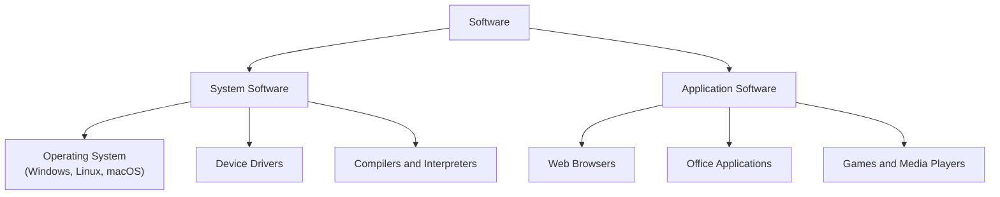
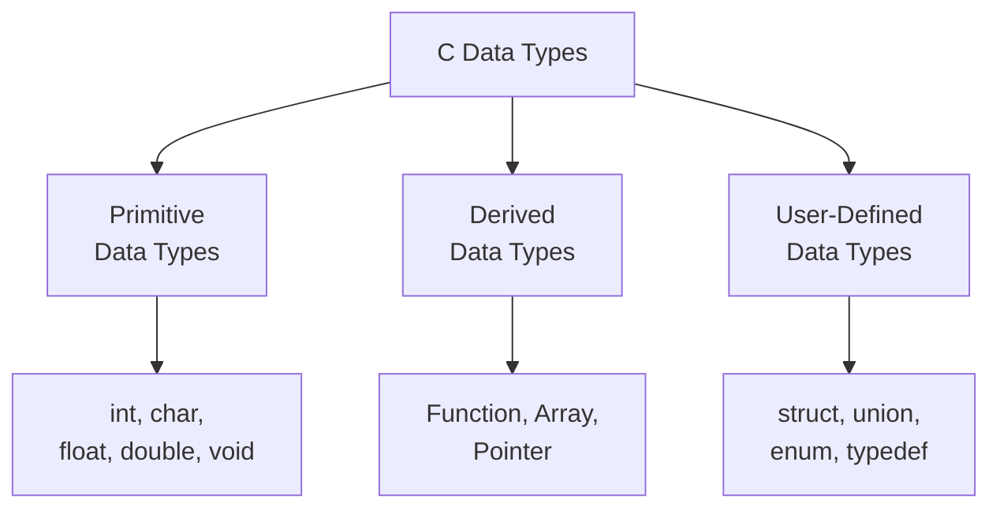
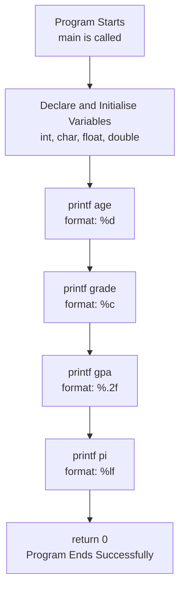

---

## tags: [c-programming, lecture] lecture: 4 topic: Hardware, Software, and Data Types prerequisites: Basic C Program Structure

# Lecture 4 — Hardware, Software, and Data Types

## Agenda

This lecture builds the conceptual foundation for writing and understanding C programs running on real machines:

- Concept of hardware and software
- Understanding data types
- Sample program

---

## Concept of Hardware & Software

### Hardware

[[#^hardware|Hardware]] refers to all the physical, tangible components that constitute a computer system — the parts you can see, touch, and physically interact with. Without hardware, there is no machine for any [[#^software|software]] to run on.

Common examples of hardware components include:

- The **[[Lecture 2#^cpu|CPU]]** (Central Processing Unit) — executes instructions and performs all computations
- **[[Lecture 2#^ram|RAM]]** (Random Access Memory) — temporarily holds active data and code while the computer is on
- The **hard disk or SSD** — permanently stores files, programs, and the operating system
- **Input devices** such as a keyboard and mouse
- **Output devices** such as a monitor and printer
- The **motherboard** — the main circuit board that interconnects all components

> [!info] Hardware Alone Cannot Function Hardware without software is like a fully assembled car with no driver and no road. The machine has capability, but it cannot do anything on its own. Software provides the instructions that give hardware purpose.

### Software

To understand software properly, it helps to build the concept from its most atomic unit.

An [[#^instruction|instruction]] is a single command issued to a computer processor directing it to perform exactly one specific operation — for example, "add these two numbers" or "store this value in memory."

A [[#^program|program]] is a sequence of such instructions arranged in logical order to carry out a meaningful task. The key word is _logical_ — instructions must follow a coherent plan to produce a useful result.

Software is a broader collection: a group of programs bundled together under one name to provide a cohesive set of capabilities. Microsoft Excel, for instance, is software comprising many individual programs working together to deliver a full spreadsheet environment.

> [!tip] The Three-Level Progression Commit this to memory: a single **instruction** does one thing; an ordered set of instructions forms a **program**; a collection of programs makes **software**. This progression maps directly onto how C code is compiled and executed on a machine.

Software falls into two fundamental categories.

**[[#^system-software|System software]]** manages and operates the computer hardware directly. It serves as an intermediary between application programs and the physical machine, so that applications do not need to know the internal details of every hardware component. Examples include:

- Operating systems (Windows, Linux, macOS)
- Device drivers that translate OS commands into hardware-specific signals
- Utility programs such as disk management and antivirus tools
- Compilers and interpreters — the tools that process your C programs

**[[#^application-software|Application software]]** runs on top of the OS and is designed for end-users to perform specific real-world tasks. It relies entirely on system software to access hardware. Examples include:

- Web browsers (Chrome, Firefox)
- Office suites (Microsoft Word, Excel)
- Media players and games



> [!success] The Core Distinction System software runs the machine; application software serves the user. Every time you open a browser, the browser (application software) depends on the OS (system software) to access the network, display pixels on screen, and handle keyboard events.

---

## Understanding Data Types

A [[#^data-type|data type]] tells the [[Lecture 1#^compiler|compiler]] two essential things about a variable: what kind of value it holds, and how many bytes of memory to reserve for it. A whole number like `42` is stored very differently in memory from a decimal like `3.14` or a character like `'A'`.

Without data types, the compiler would have no way of interpreting the raw bytes at a memory address — the [[Lecture 3#^binary|binary]] pattern for the integer 65 and the character `'A'` are identical. The type is what assigns meaning to those bytes.

> [!question] Why Does the Compiler Need Type Information? Memory is just a flat sequence of bytes. The same bit pattern can represent entirely different things depending on how it is interpreted. Data types are the contract between you and the compiler specifying exactly what a group of bytes represents — and what operations make sense on it.

C organises all its types into three major categories:



### Primitive Data Types

[[#^primitive-data-type|Primitive data types]] are C's built-in, fundamental types — they represent simple values and map directly to a fixed region of memory. Every other type in C is ultimately constructed from these.

**[[#^int|int]]** stores whole numbers: positive, negative, or zero. On most modern systems, `int` occupies 4 bytes, giving a range of approximately −2.1 billion to +2.1 billion.

**[[#^char|char]]** stores a single character. Internally, it stores the character's **ASCII** code as a 1-byte integer. Writing `'A'` is equivalent to storing the integer 65 — a duality that will matter when we explore character arithmetic later in the course.

**[[#^float|float]]** (floating point) stores decimal numbers with single precision. It occupies 4 bytes and provides approximately 6–7 significant decimal digits of accuracy.

**[[#^double|double]]** also stores decimal numbers, but at twice the precision of `float`. It uses 8 bytes and provides approximately 15–16 significant decimal digits. The name comes from _double-precision floating point_.

**[[#^void|void]]** represents the explicit absence of a value. It appears in two main roles: marking a [[#^function|function]] that returns nothing (`void greet()`), and defining generic pointers (`void *ptr`) that can hold the address of any type.

> [!info] Choosing float vs double Prefer `double` for general-purpose decimal arithmetic — its extra precision prevents rounding errors from accumulating across many operations. Reserve `float` for constrained environments like embedded systems or large graphics buffers where the trade-off in precision is deliberate and justified.

### Derived Data Types

[[#^derived-data-type|Derived data types]] are constructed on top of primitive types, extending them with new structure or behaviour. The term "derived" reflects their dependence on the foundational types.

A **function** is a named, reusable block of code that accepts input parameters, performs a defined task, and optionally returns a result. Functions are a derived type because their parameter types and return type are always defined in terms of existing types.

An **[[#^array|array]]** is a fixed-size, ordered collection of elements all sharing the same data type, stored in consecutive memory locations. Declaring `int scores[5]` reserves exactly five adjacent integers in memory, each accessible by a zero-based index.

A **[[#^pointer|pointer]]** is a variable that stores a memory address rather than a conventional data value. Pointers enable direct manipulation of memory, dynamic allocation, and efficient passing of large data structures between functions.

> [!warning] Pointers Warrant Dedicated Study Pointers are mentioned here as a data type category, but they will receive a full dedicated lecture of their own. They are among the most powerful — and most dangerous — features in C. Consider this introduction a preview only; do not attempt to use pointers without first understanding memory addressing.

### User-Defined Data Types

[[#^user-defined-data-type|User-defined data types]] let programmers design custom types suited to the specific problem at hand. C provides four tools for this purpose.

A **[[#^structure|structure]]** (`struct`) groups multiple variables of potentially different types under a single name. A `Student` struct, for example, might bundle a name (`char` array), age (`int`), and GPA (`float`) into one coherent unit that travels through the program as a single entity.

A **[[#^union|union]]** resembles a `struct` in syntax, but all its members share the same memory location. Only one member holds a valid value at any given time, making unions useful when a variable might take one of several possible forms but never more than one simultaneously.

An **[[#^enum|enum]]** (enumeration) defines a set of named integer constants. Rather than representing weekdays as `0`, `1`, `2`, an enum lets you write `MON`, `TUE`, `WED` — code that is self-documenting and far less prone to accidental misuse.

**[[#^typedef|Typedef]]** creates an alias for an existing type name. After writing `typedef unsigned int uint;`, you can use `uint` anywhere you would normally write `unsigned int`, producing shorter and more expressive declarations throughout the codebase.

> [!tip] Choosing the Right User-Defined Type Reach for `struct` when a concept naturally groups several pieces of data together (a student record, a 2D point, a calendar date). Use `enum` when a variable represents a choice from a small, fixed, named set. Defer `union` until you have a solid grasp of memory layout.

---

## Sample Program

> [!warning] Live Demo — Check Video This section was a live demonstration and was not captured in the slides. Refer back to the lecture video for the walkthrough.

The following program puts all four main primitive types to work. It declares one variable of each type, assigns a value, then prints every variable to the console using [[Lecture 2#^printf|printf]] with the type-appropriate format specifier.

```c
#include <stdio.h>

int main() {

    int    age   = 20;
    char   grade = 'A';
    float  gpa   = 9.5f;
    double pi    = 3.14159265358979;

    printf("Age   : %d\n",   age);
    printf("Grade : %c\n",   grade);
    printf("GPA   : %.2f\n", gpa);
    printf("Pi    : %lf\n",  pi);

    return 0;
}
```

> [!tip] Including Standard Libraries
> - `#include <stdio.h>` imports the Standard Input/Output header file, making `printf` available
> - Every C program that prints output or reads input must include this directive
> - Without it, the compiler will not recognise `printf` and will refuse to compile

> [!tip] Declaring Variables of Each Primitive Type
> - `int age = 20` reserves 4 bytes for a whole number; `char grade = 'A'` reserves 1 byte for a character
> - `float gpa = 9.5f` reserves 4 bytes for a single-precision decimal — the `f` suffix prevents the compiler from treating the literal as a `double`
> - `double pi = 3.14159265358979` reserves 8 bytes for a high-precision decimal value

> [!tip] Printing with Format Specifiers
> - Each `printf` call uses the format specifier matching its variable's type: `%d` for `int`, `%c` for `char`, `%.2f` for `float`, `%lf` for `double`
> - `%.2f` rounds the output to exactly 2 decimal places — the `.2` is a precision modifier
> - Mismatching a specifier with the wrong type produces garbage output or undefined behaviour

> [!tip] Exiting the Program
> - `return 0;` sends exit code `0` back to the operating system when `main` finishes
> - By convention, `0` means the program completed successfully with no errors
> - Because `main` is declared as `int`, this return statement is required

|Line|Code|Explanation|
|---|---|---|
|1|`#include <stdio.h>`|Includes the standard I/O header so `printf` is available|
|3|`int main()`|Entry point — the OS calls `main` to begin program execution|
|5|`int age = 20;`|Declares and initialises an integer variable named `age`|
|6|`char grade = 'A';`|Single quotes denote a character literal; stores ASCII code 65 internally|
|7|`float gpa = 9.5f;`|The `f` suffix prevents the compiler from treating the literal `9.5` as a `double`|
|8|`double pi = 3.14159265358979;`|Uses `double` to preserve the full precision of the value|
|10|`printf("Age : %d\n", age);`|`%d` formats an integer; `\n` moves the cursor to the next line|
|11|`printf("Grade : %c\n", grade);`|`%c` formats a single character|
|12|`printf("GPA : %.2f\n", gpa);`|`%.2f` rounds the float to exactly 2 decimal places in the output|
|13|`printf("Pi : %lf\n", pi);`|`%lf` stands for _long float_ and formats a `double` value|
|15|`return 0;`|Returns exit code 0 to the OS, indicating the program finished without error|



> [!bug] Wrong Format Specifier = Garbage Output Using `%d` to print a `float` or `double` produces completely unpredictable output. Always pair each format specifier with its matching type: `%d` for `int`, `%c` for `char`, `%f` or `%.Nf` for `float`, and `%lf` for `double`. This is one of the most common mistakes beginners make in C.

---

## Key Terms

|Term|Definition|
|---|---|
| Hardware | The physical, tangible components of a computer — CPU, RAM, storage, and I/O devices | ^hardware
| Software | A collection of programs bundled together under one name to provide a cohesive set of capabilities | ^software
| Instruction | A single command given to a processor directing it to carry out exactly one specific operation | ^instruction
| Program | An ordered sequence of instructions that together carry out a meaningful task | ^program
| System Software | Software that manages and operates hardware, acting as a bridge between applications and the physical machine | ^system-software
| Application Software | End-user software designed to perform specific real-world tasks, running on top of the operating system | ^application-software
| Data Type | A classification that tells the compiler what kind of value a variable holds and how many bytes of memory to allocate for it | ^data-type
| Primitive Data Type | A built-in C type that directly represents a simple value — includes int, char, float, double, and void | ^primitive-data-type
| Derived Data Type | A type constructed from primitive types — includes functions, arrays, and pointers | ^derived-data-type
| User-Defined Data Type | A custom type invented by the programmer using struct, union, enum, or typedef | ^user-defined-data-type
| int | Primitive type for whole numbers; typically 4 bytes with a range of approximately −2.1 billion to +2.1 billion | ^int
| char | Primitive type for a single character, stored internally as a 1-byte ASCII integer | ^char
| float | Primitive type for single-precision decimal numbers; 4 bytes, approximately 6–7 significant digits | ^float
| double | Primitive type for double-precision decimal numbers; 8 bytes, approximately 15–16 significant digits | ^double
| void | Primitive type representing the absence of a value; used for functions that return nothing and for generic pointers | ^void
| Function | A named, reusable block of code that accepts parameters, performs a defined task, and optionally returns a value | ^function
| Array | A fixed-size collection of same-type elements stored in consecutive memory, accessible by zero-based index | ^array
| Pointer | A variable whose value is a memory address rather than a conventional data value | ^pointer
| Structure | A user-defined type (struct) that groups multiple variables of different types under one name | ^structure
| Union | A user-defined type where all members share the same memory location; only one member holds a valid value at a time | ^union
| Enum | A user-defined type that defines a set of named integer constants to improve code readability and safety | ^enum
| Typedef | A C mechanism for creating an alias for an existing type name to simplify and clarify declarations | ^typedef

> [!example]- Try It Yourself **Exercise 1 — Declare and Print All Primitive Types** Write a C program that declares one variable of each primitive type (`int`, `char`, `float`, `double`), assigns values of your choice, and prints each one with `printf` using the correct format specifier. Verify the output is exactly what you expected.
> 
> **Exercise 2 — Investigate Memory Sizes** Use the `sizeof` operator to find and print the byte size of each data type on your system. For example: `printf("int = %zu bytes\n", sizeof(int));`. Compare `float` vs `double` and `char` vs `int`. Note whether the sizes match what was described in the lecture.
> 
> **Exercise 3 — Classify What You Use** Without looking at your notes, list four programs currently installed on your computer and classify each as system software or application software. Write one sentence for each justifying your classification.

---

**Lecture 4 Recap**

- Hardware is the physical machinery of a computer (CPU, RAM, storage, I/O devices); software provides the instructions that make it useful.
- An instruction is a single command to the processor; a program is an ordered sequence of instructions; software is a collection of programs.
- System software (OS, drivers, compilers) manages the hardware; application software (browsers, editors, games) serves the user.
- A data type tells the compiler what kind of value a variable holds and how many bytes to allocate — getting this wrong causes silent, hard-to-trace bugs.
- C's three type categories are primitive (int, char, float, double, void), derived (function, array, pointer), and user-defined (struct, union, enum, typedef).
- Primitive types map to fixed memory sizes: `int` 4 bytes, `char` 1 byte, `float` 4 bytes, `double` 8 bytes.
- Always pair the correct format specifier with its type in `printf`: `%d` for `int`, `%c` for `char`, `%.Nf` for `float`, `%lf` for `double`.