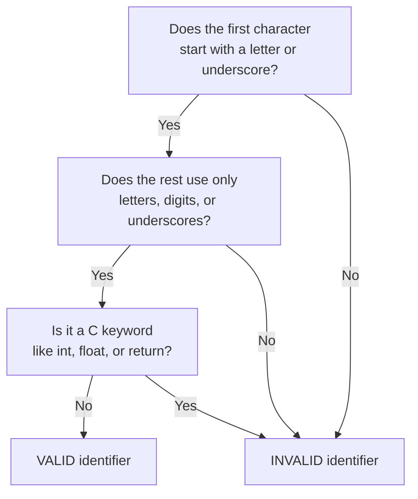
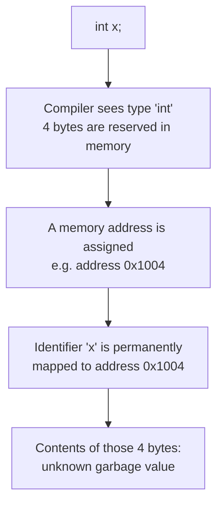
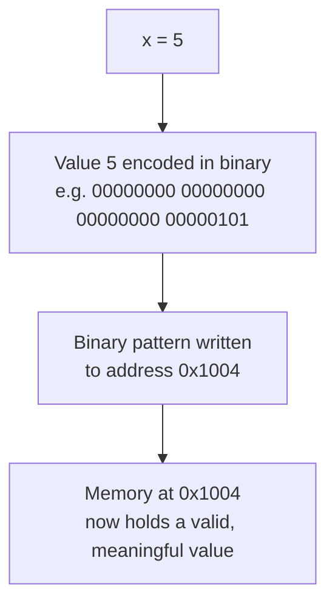
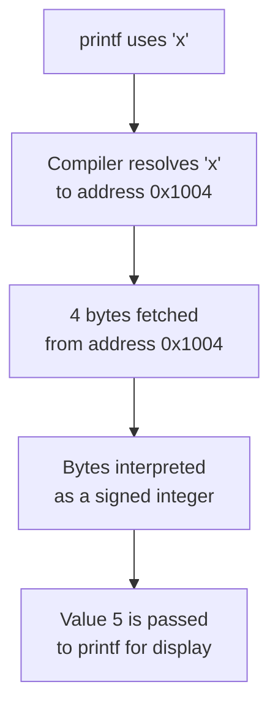

## tags: [c-programming, lecture] lecture: 5 topic: Identifiers, Format Specifiers, Constants, and Variable Memory Model prerequisites: Variables and Data Types

# Lecture 5 — Identifiers, Format Specifiers, Constants, and Variable Memory Model

## Agenda

1. Understanding identifiers with program
2. Understanding basic format specifiers with program
3. Understanding constants with program
4. Understanding the back-side process of declaring, initialising, and accessing data elements of any defined data type

---

## Understanding Identifiers

An [[#^identifier|identifier]] is any name a programmer assigns to a program element — a variable, a [[Lecture 4#^function|function]], an [[Lecture 4#^array|array]], or a user-defined type. Whenever the [[Lecture 1#^compiler|compiler]] encounters an identifier, it uses that name to locate the memory address or code block associated with it. Without identifiers, there would be no way to refer to stored values by a meaningful label.

### Rules for Constructing Valid Identifiers

C enforces a strict and unambiguous set of rules for what constitutes a legal identifier:

- The very first character must be a letter (A–Z or a–z) or an underscore (`_`). A digit or any special character in the leading position makes the identifier illegal.
- After the first character, any combination of letters, digits, and underscores is permitted.
- C [[#^keyword|keywords]] — reserved words such as `int`, `float`, `if`, `return`, or `const` — have predefined meanings and cannot be repurposed as identifiers.
- Identifiers are strictly **case-sensitive**: `score`, `Score`, and `SCORE` are three entirely different names as far as the compiler is concerned.
- Names should be concise but descriptive. `studentAge` communicates intent far better than either the opaque `sa` or the unwieldy `theAgeOfTheCurrentStudent`.

> [!info] Why Case Sensitivity Matters C treats the case of every letter as part of the identifier's identity. This means `Temperature` and `temperature` can coexist as two completely separate variables in the same function. Accidentally mixing cases is one of the most common beginner bugs — the compiler will not flag it as an error, it will silently treat them as different names.



### Examples of Valid and Invalid Identifiers

> [!warning] Live Demo — Check Video This section was a live demonstration and was not captured in the slides. Refer back to the lecture video for the walkthrough.

The table below covers the most commonly tested cases:

|Identifier|Valid?|Reason|
|---|---|---|
|`studentAge`|✅ Valid|Starts with a letter; contains only letters|
|`_count`|✅ Valid|Leading underscore is permitted|
|`total1`|✅ Valid|Letter first, then digit — allowed|
|`2count`|❌ Invalid|Cannot start with a digit|
|`total-marks`|❌ Invalid|Hyphen is a special character, not permitted|
|`int`|❌ Invalid|Reserved C keyword|
|`my score`|❌ Invalid|Spaces are not allowed inside identifiers|
|`MARKS` vs `marks`|Both valid, distinct|Case-sensitivity makes these two different identifiers|

> [!tip] Naming Convention Prefer **camelCase** (`studentAge`) or **snake_case** (`student_age`) for multi-word identifiers. Whichever convention you choose, apply it consistently — mixed conventions within a single codebase make code noticeably harder to read.

### Program Demonstrating Identifiers

```c
#include <stdio.h>

int main() {
    int   studentAge = 20;
    float cgpa       = 8.5;
    char  grade      = 'A';

    printf("Age  : %d\n", studentAge);
    printf("CGPA : %f\n", cgpa);
    printf("Grade: %c\n", grade);

    return 0;
}
```

> [!tip] Including Standard Libraries
> - `#include <stdio.h>` imports the Standard Input/Output header so [[Lecture 2#^printf|printf]] is available
> - Every C program that prints output must include this directive in the [[Lecture 2#^linking-section|Linking Section]]
> - Without it, the compiler will not recognise `printf` and will refuse to compile

> [!tip] Declaring Variables with Meaningful Identifiers
> - `studentAge`, `cgpa`, and `grade` are all valid identifiers — each starts with a letter and uses only letters
> - Each variable is declared with a [[Lecture 4#^data-type|data type]] that matches the kind of value it holds: `int` for a whole number, `float` for a decimal, `char` for a single character
> - Choosing descriptive names makes the code self-documenting — anyone reading it understands what each variable represents

> [!tip] Printing with Format Specifiers
> - `%d` prints an integer, `%f` prints a float, and `%c` prints a character — each [[#^format-specifier|format specifier]] must match its variable's type
> - `\n` is an escape sequence that moves the cursor to a new line after printing
> - Mismatching a specifier with the wrong type produces garbage output or [[#^undefined-behaviour|undefined behaviour]]

|Line|Code|Explanation|
|---|---|---|
|1|`#include <stdio.h>`|Includes the standard I/O library so printf is available|
|4|`int studentAge = 20;`|Declares an integer variable; `studentAge` is its identifier|
|5|`float cgpa = 8.5;`|Declares a float variable; `cgpa` is its identifier|
|6|`char grade = 'A';`|Declares a character variable; `grade` is its identifier|
|8–10|`printf(...)` calls|Each identifier is used to retrieve and print the value it names|
|12|`return 0;`|Returns 0 to the operating system, signalling successful exit|

---

## Understanding Basic Format Specifiers

A format specifier is a special placeholder token embedded inside a format string that tells printf (or [[Lecture 2#^scanf|scanf]]) what data type is being passed and how to represent it as text. Without a matching specifier, neither function has any way to know whether the bytes it receives should be interpreted as a whole number, a decimal, a letter, or a word.

> [!success] The Four Core Format Specifiers These four cover the overwhelming majority of everyday C programming needs:

|Specifier|Data Type|What It Represents|
|---|---|---|
|[[#^percent-d|`%d`]]|`int`|
|[[#^percent-f|`%f`]]|`float`|
|[[#^percent-c|`%c`]]|`char`|
|[[#^percent-s|`%s`]]|char array|

> [!info] How a Format Specifier Works When `printf` encounters `%d` in its format string, it reaches into the argument list, picks the next value, interprets those bytes as a signed integer, and converts the result into a printable sequence of digit characters. The specifier acts as a contract — it tells `printf` exactly how to decode the [[Lecture 3#^binary|binary]] data it receives.

### Program Demonstrating Format Specifiers

```c
#include <stdio.h>

int main() {
    int   age     = 21;
    float height  = 5.9;
    char  initial = 'K';
    char  name[]  = "Kavan";

    printf("Age    : %d\n", age);
    printf("Height : %f\n", height);
    printf("Initial: %c\n", initial);
    printf("Name   : %s\n", name);

    return 0;
}
```

> [!tip] Declaring Variables of Different Types
> - Each variable uses a different primitive type: `int` for a whole number, `float` for a decimal, `char` for a single character, and `char[]` for a string
> - The string `"Kavan"` is stored as a character array — C has no dedicated string type, so char arrays serve this purpose
> - Each variable must be printed with the format specifier that matches its declared type

> [!tip] Matching Specifiers to Types
> - `%d` matches `int`, `%f` matches `float`, `%c` matches `char`, and `%s` matches a char array (string)
> - Using the wrong specifier for a type produces undefined behaviour — the output is garbage or the program may crash
> - The compiler may warn about mismatches, but will still compile and produce an incorrect result

|Line|Code|Explanation|
|---|---|---|
|1|`#include <stdio.h>`|Makes `printf` available|
|4|`int age = 21;`|Integer variable — must use `%d` when printing|
|5|`float height = 5.9;`|Float variable — must use `%f` when printing|
|6|`char initial = 'K';`|Single character — must use `%c` when printing|
|7|`char name[] = "Kavan";`|String stored in a char array — must use `%s` when printing|
|9–12|`printf(...)` calls|Each specifier matches its corresponding variable's declared type|
|14|`return 0;`|Signals successful exit to the operating system|

> [!bug] Mismatched Format Specifier Printing a `float` with `%d`, or an `int` with `%f`, produces **undefined behaviour** — the output is garbage, or the program may crash entirely. The compiler may warn about the mismatch, but it will still compile and produce an incorrect result. Always match the specifier precisely to the variable's declared type.

---

## Understanding Constants

A [[#^constant|constant]] is a named value that is fixed at compile time and cannot be modified at any point during program execution. As soon as the compiler sees an assignment to a constant, it raises an error and refuses to produce a binary — the immutability is enforced before the program ever runs.

### When to Use Constants

Use a constant whenever a value must stay the same throughout the life of the program — the mathematical value of π, a maximum array size, a tax rate, or the number of days in a week. Giving a raw number a name achieves two things at once: the code becomes self-documenting (anyone reading `DAYS_IN_WEEK` immediately understands what `7` means in context), and any future change to the value only needs to be made in exactly one place.

### Declaring Constants with `const`

The [[#^const-keyword|`const`]] keyword is placed directly before the type in a variable [[#^declaration|declaration]]:

```c
const float PI = 3.14159;
```

> [!tip] Declaring a Constant
> - The `const` keyword before the type makes the variable permanently immutable after its initial value is set
> - `PI` is locked in — no assignment statement later in the program can ever change it
> - By convention, constant identifiers are written in ALL_CAPS to visually distinguish them from regular variables

> [!danger] Must Initialise at Declaration A `const` variable must receive its value at the exact point of declaration. Because the compiler permanently forbids any later assignment, a `const` declared without an initial value is stuck uninitialised forever — it can never hold a meaningful value and is completely useless. Always initialise a constant on the same line you declare it.

```c
const int DAYS = 7;
const int SIZE;
```

> [!tip] Valid vs Invalid Constant Declarations
> - `const int DAYS = 7;` is correct — declared and [[#^initialisation|initialised]] together on the same line
> - `const int SIZE;` is wrong — declared without a value, and since `const` forbids later assignment, `SIZE` can never be set
> - The compiler may allow the second form but the variable will contain a garbage value forever

> [!warning] Live Demo — Check Video This section was a live demonstration and was not captured in the slides. Refer back to the lecture video for the walkthrough.

### Program Demonstrating Constants

```c
#include <stdio.h>

int main() {
    const float PI    = 3.14159;
    const int   SIDES = 3;
    float       radius = 7.0;
    float       area;

    area = PI * radius * radius;

    printf("Area of circle : %f\n", area);
    printf("Sides of shape : %d\n", SIDES);

    // PI = 3.0;

    return 0;
}
```

> [!tip] Declaring Constants and Variables
> - `const float PI` and `const int SIDES` are immutable — their values are locked in at declaration
> - `float radius` and `float area` are regular mutable variables that can be changed at any time
> - Constants and variables can be mixed freely in expressions: `PI * radius * radius` reads the constant without modifying it

> [!tip] Core Logic — Using Constants in Computation
> - `area = PI * radius * radius` computes the area of a circle using the constant value of PI
> - Reading a constant in an expression is always legal — only writing to it is forbidden
> - This demonstrates the primary use of constants: providing named, fixed values for calculations

> [!tip] Compile-Time Enforcement of Immutability
> - The commented-out line `// PI = 3.0;` would cause a compile-time error if uncommented
> - The compiler rejects any attempt to assign a new value to a `const` variable
> - This enforcement happens before the program ever runs, making constants a compile-time safety mechanism

|Line|Code|Explanation|
|---|---|---|
|1|`#include <stdio.h>`|Includes the standard I/O library|
|4|`const float PI = 3.14159;`|Immutable float constant — declared and initialised together|
|5|`const int SIDES = 3;`|Immutable integer constant|
|6|`float radius = 7.0;`|Regular mutable float variable|
|7|`float area;`|Declared here; will be assigned in the next statement|
|9|`area = PI * radius * radius;`|Reading a constant in an expression is perfectly legal|
|11–12|`printf(...)` calls|Display the computed area and the constant `SIDES`|
|14|`// PI = 3.0;`|If uncommented, the compiler rejects the program with an error|
|16|`return 0;`|Signals success to the OS|

> [!tip] Naming Constants By convention, constant identifiers are written in ALL_CAPS with underscores between words — `MAX_SIZE`, `SPEED_OF_LIGHT`, `DAYS_IN_WEEK`. This visual distinction immediately signals to any reader that the value is immutable and should not be treated like a regular variable.

---

## Understanding the Back-Side Process of Variable Declaration, Initialisation, and Access

> [!warning] Live Demo — Check Video This section was a live demonstration and was not captured in the slides. Refer back to the lecture video for the walkthrough.

Writing `int x = 5;` in a C program looks like a single action, but it actually sets three distinct mechanisms in motion: declaration, initialisation, and eventually [[#^access|access]]. Understanding what each stage means at the memory level is what separates a programmer who can write code from one who truly understands what the machine is doing.

### Stage 1 — Declaration

Declaration is the compiler step where memory is reserved. The compiler sees the data type, determines how many bytes that type requires, allocates a region of that size in memory, and permanently binds the identifier (the variable name) to the starting address of that region. At this point, the bytes in the allocated region contain whatever random data was left there from a previous use — commonly called a **garbage value**.



### Stage 2 — Initialisation

Initialisation is the act of writing a meaningful value into the already-allocated memory. This can happen on the same line as declaration (`int x = 5;`) or in a separate assignment statement (`x = 5;`). Either way, the compiler converts the value to the appropriate binary representation for the declared type and writes those bytes into the reserved memory block.



### Stage 3 — Access

Access is what happens when the program reads the variable — for example, when `printf` is given `x` as an argument. The compiler resolves the identifier to its associated memory address, fetches the bytes stored there, interprets them according to the variable's declared type, and passes the resulting value to whatever operation requested it.



### Program Demonstrating All Three Stages

```c
#include <stdio.h>

int main() {
    int   marks;
    float temperature;

    marks       = 95;
    temperature = 36.6;

    printf("Marks      : %d\n", marks);
    printf("Temperature: %f\n", temperature);

    return 0;
}
```

> [!tip] Stage 1 — Declaration
> - `int marks;` and `float temperature;` reserve memory without assigning a value
> - The compiler allocates 4 bytes for each and binds the identifier to its starting address
> - At this point, the bytes contain whatever random data was left from a previous use — a garbage value

> [!tip] Stage 2 — Initialisation
> - `marks = 95;` writes the integer value 95 into the 4 bytes reserved for `marks`
> - `temperature = 36.6;` encodes 36.6 in IEEE 754 float format and stores it in `temperature`'s bytes
> - After initialisation, the memory holds a valid, meaningful value instead of garbage

> [!tip] Stage 3 — Access
> - `printf("Marks : %d\n", marks)` fetches the bytes at `marks`' address and interprets them as a signed integer
> - `printf("Temperature: %f\n", temperature)` fetches `temperature`'s bytes and interprets them as a float
> - The format specifier determines how the raw bytes are decoded and displayed on screen

|Line|Code|Explanation|
|---|---|---|
|5|`int marks;`|**Declaration** — 4 bytes reserved; identifier `marks` bound to their address|
|6|`float temperature;`|**Declaration** — 4 bytes reserved; identifier `temperature` bound to their address|
|9|`marks = 95;`|**Initialisation** — the integer value 95 is written into `marks`' reserved bytes|
|10|`temperature = 36.6;`|**Initialisation** — 36.6 stored in IEEE 754 format in `temperature`'s bytes|
|13|`printf("Marks ...", marks);`|**Access** — bytes at `marks`' address read and displayed as `%d`|
|14|`printf("Temperature ...", temperature);`|**Access** — bytes at `temperature`'s address read and displayed as `%f`|
|16|`return 0;`|Returns 0 to the OS|

> [!question] What Happens If You Read Before Initialising? Reading a declared-but-uninitialised variable is [[#^undefined-behaviour|undefined behaviour]] in C. The program might print a garbage number, silently produce incorrect results, or crash. The C standard imposes no rules on what happens — meaning the behaviour can differ between compilers, machines, and even between separate runs of the same program on the same machine.

---

## Key Terms

|Term|Definition|
|---|---|
| identifier | A programmer-defined name for any program element — a variable, function, or type — used by the compiler to locate that element's associated memory or code | ^identifier
| keyword | A reserved word in C with a fixed predefined meaning that cannot be repurposed as an identifier (e.g. `int`, `return`, `if`, `const`) | ^keyword
| format specifier | A placeholder token such as `%d` or `%f` used inside a `printf` or `scanf` format string to specify the type and text representation of a value | ^format-specifier
| `%d` | Format specifier for printing or reading a signed decimal integer (`int`) | ^percent-d
| `%f` | Format specifier for printing or reading a floating-point number (`float`) | ^percent-f
| `%c` | Format specifier for printing or reading a single character (`char`) | ^percent-c
| `%s` | Format specifier for printing or reading a null-terminated string (char array) | ^percent-s
| constant | A named value declared with `const` that is fixed at compile time and cannot be reassigned at any point during execution | ^constant
| `const` | A C keyword placed before a type declaration to make the variable permanently immutable after its initial value is set | ^const-keyword
| declaration | The compiler step that reserves memory of the correct size for a variable and binds the identifier name to that memory address | ^declaration
| initialisation | The act of writing a meaningful value into a variable's reserved memory for the first time, via either an initialiser at declaration or a subsequent assignment | ^initialisation
| access | The operation of reading the bytes stored at a variable's memory address and interpreting them according to the variable's declared type | ^access
| undefined behaviour | Any program behaviour not defined by the C standard; common causes include reading uninitialised variables and mismatched format specifiers; consequences range from garbage output to crashes | ^undefined-behaviour

> [!example]- Try It Yourself **Exercise 1 — Identifier Audit** Write a short program that declares one `int`, one `float`, and one `char`, using identifiers of your own choosing. Before running it, deliberately name one variable starting with a digit (e.g. `1score`), try to compile, and read the error message carefully. Fix it to a valid identifier, recompile, and observe the difference.
> 
> **Exercise 2 — Format Specifier Mismatch** Declare a `float` variable and intentionally print it using `%d` instead of `%f`. Compile and run — record the garbage output. Then switch to `%f` and observe the correct result. This exercise makes the consequences of a mismatched specifier viscerally memorable.
> 
> **Exercise 3 — Constant Enforcement** Declare a `const int` for the number of hours in a day (24). Use it to calculate and print the number of hours in a week and in a 30-day month. Then attempt to reassign the constant and observe the exact compiler error. Finally, try declaring a second constant without a value and observe what the compiler reports.

---

**Lecture 5 Recap**

- An identifier is a programmer-defined name; it must begin with a letter or underscore, may only contain letters, digits, and underscores thereafter, must not collide with a C keyword, and is case-sensitive — `value` and `Value` are two different identifiers.
- The four essential format specifiers are `%d` for integers, `%f` for floats, `%c` for characters, and `%s` for strings; using the wrong specifier for a type results in undefined behaviour.
- The `const` keyword makes a variable permanently immutable; it must always be given its value at the point of declaration — there is no way to assign a value to it later.
- Every variable in C passes through three conceptual stages: **declaration** (memory reserved and identifier bound), **initialisation** (a value written into that memory), and **access** (the stored bytes read and interpreted).
- Reading a variable that has been declared but never initialised is undefined behaviour — the result is unpredictable and can differ across compilers, machines, and program runs.