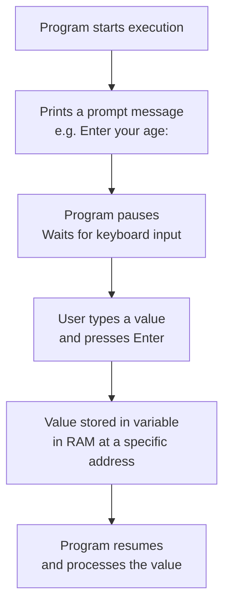
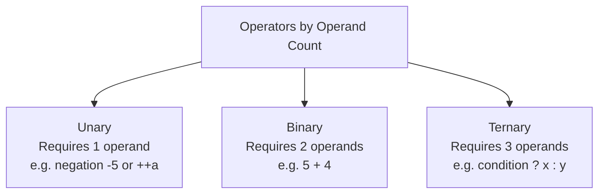
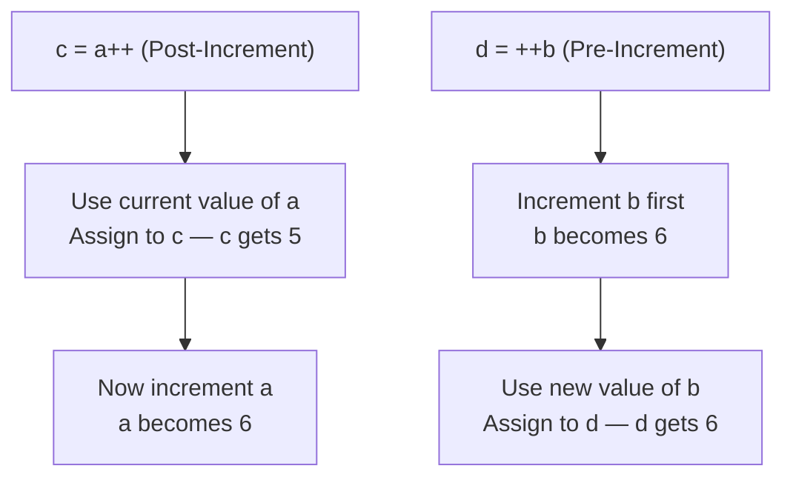

---
tags:
---


## tags: [c-programming, lecture] lecture: 6 topic: User Input and Operators (Part 1) prerequisites: Variables, Data Types, printf

# Lecture 6 — User Input and Operators (Part 1)

## Taking Input From User With a Program

### Understanding User Input

Every program written so far has worked with values baked directly into the source code at compile time. Real-world applications, however, must respond to data that cannot be known in advance. [[#^user-input|User input]] is the mechanism by which a running program pauses, collects a value typed at the keyboard, and stores it in a variable for later processing.

Consider a voting eligibility checker: the program cannot determine whether voting is permitted without first knowing the user's age. The program must ask, wait for a response, receive the typed value, and only then proceed. This pause-and-wait cycle is called an **interrupt in processing** — normal sequential execution halts until the user supplies the required data and presses Enter.

> [!info] What Happens During the Interrupt When the program reaches an input instruction, the [[Lecture 2#^cpu|CPU]] yields control to the operating system, which manages the waiting state efficiently. Other system processes continue running. Only after the user presses Enter does the OS resume the program with the new value available in memory.



### The `scanf` Function

C provides the [[Lecture 2#^scanf|scanf]] function (declared in `<stdio.h>`) to read formatted data from the keyboard. Its format string uses the same [[Lecture 5#^format-specifier|format specifiers]] as [[Lecture 2#^printf|printf]] — for example `%d` for integers — but there is one critical difference: instead of passing a variable's _value_, you must pass its _address_ using the [[#^address-of|address-of operator]] `&`.

When you write `&age`, you are handing scanf the exact memory location where the incoming value should be written. Without `&`, scanf would only receive a copy and the original variable would remain unchanged.

The slides present the following code:

```c
#include <stdio.h>
void main()
{
    int age;
    printf("Enter your age: ");
    scanf("%d", &age);
    printf("Your age is = %d", age);
}
```

> [!warning] Non-Standard Code The slide uses `void main()` which is not standard C. Per the C standard (C89/C99/C11), the correct signature is `int main()`, which returns an integer exit code to the operating system. All corrected examples in these notes use `int main()` with `return 0;`.

Here is the corrected, fully annotated version:

```c
#include <stdio.h>

int main() {
    int age;

    printf("Enter your age: ");
    scanf("%d", &age);
    printf("Your age is = %d\n", age);

    return 0;
}
```

> [!tip] Including Standard Libraries
> - `#include <stdio.h>` imports the Standard Input/Output header so `printf` and `scanf` are available
> - This directive belongs in the [[Lecture 2#^linking-section|Linking Section]] — the very first functional line after documentation comments
> - Without it, the [[Lecture 1#^compiler|compiler]] will not recognise any I/O function calls

> [!tip] Getting User Input
> - `printf("Enter your age: ")` displays a prompt — no `\n` keeps the cursor on the same line as the user's typing
> - `scanf("%d", &age)` reads one integer from the keyboard and stores it at the memory address of `age`
> - The `&` (address-of [[#^operator|operator]]) is required because `scanf` needs to know where in memory to write the value

> [!tip] Displaying the Result
> - `printf("Your age is = %d\n", age)` prints the value that `scanf` placed into `age`
> - `%d` tells `printf` to interpret the bytes at `age`'s address as a signed integer
> - `return 0;` signals to the operating system that the program finished successfully

|Line|Code|Explanation|
|---|---|---|
|1|`#include <stdio.h>`|Includes the standard I/O header so printf and scanf are available|
|3|`int main()`|Standard program entry point — the OS calls this first|
|4|`int age;`|Declares an integer variable; its value is undefined until scanf writes to it|
|6|`printf("Enter your age: ");`|Displays the prompt; no `\n` keeps the cursor on the same line as the user's typing|
|7|`scanf("%d", &age);`|Reads one integer from the keyboard and stores it at the memory address of `age`|
|8|`printf("Your age is = %d\n", age);`|Prints the value that scanf placed into `age`|
|10|`return 0;`|Returns 0 to the OS, indicating the program finished without error|

> [!tip] How `&age` Works in Memory Every variable occupies a specific address in RAM. If `age` is allocated at address `5083`, then `&age` evaluates to the number `5083`. Passing that address to scanf lets it write the user's input directly to that memory cell — which is why `age` holds the correct value after scanf returns. This is your first exposure to memory addressing, a concept central to pointers later in the course.

> [!warning] Live Demo — Check Video This section was a live demonstration and was not captured in the slides. Refer back to the lecture video for the walkthrough.

The following sample reinforces the pattern by reading two separate values and computing their sum:

```c
#include <stdio.h>

int main() {
    int num1, num2, sum;

    printf("Enter first number: ");
    scanf("%d", &num1);

    printf("Enter second number: ");
    scanf("%d", &num2);

    sum = num1 + num2;
    printf("Sum = %d\n", sum);

    return 0;
}
```

> [!tip] Declaring Variables
> - `int num1, num2, sum;` declares three integer variables in a single statement
> - `num1` and `num2` will hold the user's input values; `sum` will hold the computed result
> - All three contain garbage values until they are assigned meaningful data

> [!tip] Getting Two Inputs Sequentially
> - Each input is preceded by its own `printf` prompt so the user knows what to type
> - Each `scanf` call reads one integer and stores it at the corresponding variable's address
> - The program pauses at each `scanf` and resumes only after the user presses Enter

> [!tip] Computing and Displaying the Sum
> - `sum = num1 + num2` adds both user-supplied values together using the `+` [[#^arithmetic-operators|arithmetic operator]]
> - `printf("Sum = %d\n", sum)` displays the computed result
> - The pattern of prompt → input → compute → display is fundamental to interactive C programs

|Line|Code|Explanation|
|---|---|---|
|4|`int num1, num2, sum;`|Three integer variables declared in one statement|
|6–7|prompt + `scanf`|Ask for the first number and read it into `num1`|
|9–10|prompt + `scanf`|Ask for the second number and read it into `num2`|
|12|`sum = num1 + num2;`|Adds the two input values and stores the result|
|13|`printf("Sum = %d\n", sum);`|Prints the computed sum|

---

## Understanding Operators With a Program (Part 1)

### What is an Operator?

An operator is a symbol that instructs the compiler to perform a specific computation on one or more values. The values it acts on are called [[#^operand|operands]], and the combination yields a result. In the expression `2 + 3 = 5`, the `+` symbol is the operator, `2` and `3` are the operands, and `5` is the result of the operation.

Operators are classified by the number of operands they require:



A [[#^unary-operator|unary operator]] needs exactly one operand (for example, negating a number or incrementing it). A [[#^binary-operator|binary operator]] needs two (most arithmetic and comparison operations), and a [[#^ternary-operator|ternary operator]] needs three. This lecture covers three families of operators — arithmetic, relational, and increment/decrement — all of which are primarily binary or unary.

> [!info] More Operator Families Ahead Lecture 6 introduces arithmetic, relational, and increment/decrement operators. Logical operators, bitwise operators, and the assignment family will be covered in later lectures as programs grow more complex.

### Arithmetic Operators

[[#^arithmetic-operators|Arithmetic operators]] perform standard mathematical calculations on numeric values. C provides five:

|Operator|Name|Example|Result|
|---|---|---|---|
|`+`|Addition|`2 + 3`|`5`|
|`-`|Subtraction|`5 - 2`|`3`|
|`*`|Multiplication|`4 * 3`|`12`|
|`/`|Division|`4 / 2`|`2`|
|`%`|Modulo|`4 % 2`|`0`|

The [[#^modulo-operator|modulo operator]] `%` returns the _remainder_ after integer division, not the quotient. For example, `17 / 4` gives the quotient `4` (four goes into seventeen exactly four times), while `17 % 4` gives the remainder `1` — because 4 × 4 = 16 and 17 − 16 = 1.

> [!bug] Integer Division Silently Truncates When both operands of `/` are integers, C performs integer division and discards the fractional part entirely. `17 / 4` evaluates to `4`, not `4.25`. No warning is issued. To preserve the decimal result, at least one operand must be a floating-point value: `17.0 / 4` gives `4.25`.

> [!warning] Live Demo — Check Video This section was a live demonstration and was not captured in the slides. Refer back to the lecture video for the walkthrough.

The following program demonstrates all five arithmetic operators using two values entered by the user:

```c
#include <stdio.h>

int main() {
    int a, b;

    printf("Enter two integers: ");
    scanf("%d %d", &a, &b);

    printf("Addition       : %d\n", a + b);
    printf("Subtraction    : %d\n", a - b);
    printf("Multiplication : %d\n", a * b);
    printf("Division       : %d\n", a / b);
    printf("Modulo         : %d\n", a % b);

    return 0;
}
```

> [!tip] Getting Two Integers in One Call
> - `scanf("%d %d", &a, &b)` reads both integers in a single call — the space in the format string matches any whitespace between the two numbers
> - Both `&a` and `&b` pass the addresses of the variables so `scanf` can write directly to their memory locations
> - This is more concise than using two separate `scanf` calls

> [!tip] Applying All Five Arithmetic Operators
> - Each `printf` applies one arithmetic operator (`+`, `-`, `*`, `/`, `%`) and immediately prints the result
> - The expressions `a + b`, `a - b`, etc. are evaluated inline — no temporary variable is needed
> - Integer division with `/` truncates toward zero, while `%` gives the remainder after that division

|Line|Code|Explanation|
|---|---|---|
|4|`int a, b;`|Two integer operands — values come from the user|
|7|`scanf("%d %d", &a, &b);`|Reads two integers at once; the space in the format string matches any whitespace between the two numbers|
|9–13|`printf` statements|Each line applies one arithmetic operator and immediately prints the result|

### Relational Operators

[[#^relational-operators|Relational operators]] compare two values and produce a boolean result: `1` for true, `0` for false. They form the foundation of every conditional and loop in C — making decisions requires comparing values.

|Operator|Meaning|True Example|False Example|
|---|---|---|---|
|`<`|Less than|`2 < 3` → 1|`3 < 2` → 0|
|`>`|Greater than|`3 > 2` → 1|`2 > 3` → 0|
|`<=`|Less than or equal to|`5 <= 5` → 1|`6 <= 3` → 0|
|`>=`|Greater than or equal to|`3 >= 2` → 1|`6 >= 10` → 0|
|`==`|Exactly equal to|`10 == 10` → 1|`8 == 7` → 0|
|`!=`|Not equal to|`8 != 6` → 1|`5 != 5` → 0|

> [!danger] Never Confuse `=` with `==` A single `=` is the _assignment_ operator — it stores a value into a variable. A double `==` is the _equality comparison_ — it checks whether two values are identical and returns 1 or 0. Writing `if (a = 5)` when you meant `if (a == 5)` is one of the most common bugs in C: the assignment always evaluates to `5`, which is non-zero and therefore treated as true. The compiler does not warn about this by default, so the program runs — just incorrectly.

> [!warning] Live Demo — Check Video This section was a live demonstration and was not captured in the slides. Refer back to the lecture video for the walkthrough.

This sample reads two integers and prints the outcome of every relational comparison:

```c
#include <stdio.h>

int main() {
    int x, y;

    printf("Enter two integers: ");
    scanf("%d %d", &x, &y);

    printf("%d < %d  = %d\n", x, y, x < y);
    printf("%d > %d  = %d\n", x, y, x > y);
    printf("%d <= %d = %d\n", x, y, x <= y);
    printf("%d >= %d = %d\n", x, y, x >= y);
    printf("%d == %d = %d\n", x, y, x == y);
    printf("%d != %d = %d\n", x, y, x != y);

    return 0;
}
```

> [!tip] Declaring Variables and Getting Input
> - `int x, y;` declares two integer variables for comparison
> - `scanf("%d %d", &x, &y)` reads both values in a single call
> - The variables must be initialised via `scanf` before any comparison can produce a meaningful result

> [!tip] Evaluating Relational Expressions
> - Each relational expression (`x < y`, `x > y`, etc.) evaluates to `1` for true or `0` for false
> - `%d` prints that boolean result as an integer — there is no dedicated boolean format specifier in C
> - These operators form the foundation of every `if` statement and loop condition in C

|Line|Code|Explanation|
|---|---|---|
|4|`int x, y;`|Two integer variables to be compared|
|7|`scanf("%d %d", &x, &y);`|Reads both integers in a single scanf call|
|9–14|relational printf lines|Each relational expression evaluates to 1 or 0; `%d` prints that result as an integer|

### Increment and Decrement Operators

The [[#^increment-op|increment operator]] `++` adds exactly 1 to a variable. The [[#^decrement-op|decrement operator]] `--` subtracts exactly 1. Both are convenient shorthand — `a++` is equivalent to writing `a = a + 1`, and `a--` is equivalent to `a = a - 1`.

What makes these operators nuanced is that they can appear either _before_ or _after_ the variable name. This placement determines _when_ the change takes effect relative to the surrounding expression.

[[#^pre-increment|Pre-increment]] (`++a`): the variable is incremented first, and then its new value is used in the expression. [[#^post-increment|Post-increment]] (`a++`): the variable's current value is used in the expression first, and then the variable is incremented afterward.

The following code illustrates the difference clearly:

```c
#include <stdio.h>

int main() {
    int a = 5, b = 5;
    int c, d;

    c = a++;
    d = ++b;

    printf("%d %d\n", c, d);

    return 0;
}
```

> [!tip] Setting Up Two Identical Starting Values
> - Both `a` and `b` start at 5 so the difference between post and pre-increment is clearly visible
> - `c` and `d` will capture the results of the two different increment forms
> - After these operations, `a` and `b` will both be 6, but `c` and `d` will differ

> [!tip] Post-Increment vs Pre-Increment
> - `c = a++` is post-increment: `c` receives `a`'s current value (5), then `a` becomes 6
> - `d = ++b` is pre-increment: `b` increments to 6 first, then `d` receives the new value (6)
> - The output `5 6` demonstrates the timing difference — post gives the old value, pre gives the new one

|Line|Code|Explanation|
|---|---|---|
|4|`int a = 5, b = 5;`|Both variables initialized to 5|
|5|`int c, d;`|Uninitialized — will hold the values captured by the assignment expressions|
|7|`c = a++;`|Post-increment: `c = 5` (old value of `a`), then `a` becomes 6|
|8|`d = ++b;`|Pre-increment: `b` becomes 6 first, then `d = 6` (new value of `b`)|
|10|`printf("%d %d\n", c, d);`|Prints `5` and `6` — the difference between post and pre is visible here|



> [!tip] Standalone Increment: Pre and Post Are Identical When `++` or `--` appears as a standalone statement — not embedded inside an assignment or condition — the placement makes no difference. Both `a++;` and `++a;` simply change `a` by 1. The distinction only matters when the expression's value is also being captured or used at the same moment.

> [!warning] Live Demo — Check Video This section was a live demonstration and was not captured in the slides. Refer back to the lecture video for the walkthrough.

The lecture demonstrated the following program, which confirms that standalone pre and post increment always produce the same result:

```c
#include <stdio.h>

int main() {
    int a = 10, b = 10;

    a++;
    ++b;

    printf("%d %d\n", a, b);

    return 0;
}
```

> [!tip] Standalone Increment Demonstration
> - `a++` (post-increment) and `++b` (pre-increment) both simply add 1 when used as standalone statements
> - The output `11 11` confirms there is no difference when the result is not captured in an expression
> - The pre/post distinction only matters when the expression's value is also being assigned or used

|Line|Code|Explanation|
|---|---|---|
|4|`int a = 10, b = 10;`|Both variables initialized to 10|
|6|`a++;`|Standalone post-increment; result is not assigned anywhere, so `a` simply becomes 11|
|7|`++b;`|Standalone pre-increment; same effect — `b` becomes 11|
|9|`printf("%d %d\n", a, b);`|Both print 11, confirming pre and post behave identically as standalone statements|

---

## Key Terms

|Term|Definition|
|---|---|
| user input | Data provided by a person at runtime through the keyboard, stored into a variable using `scanf` | ^user-input
| scanf | Standard library function that reads formatted data from the keyboard; requires variable addresses using the `&` operator |
| format specifier | A placeholder in a `printf` or `scanf` format string that describes the expected data type, e.g. `%d` for integers |
| address-of operator | The `&` symbol; placed before a variable name it produces that variable's memory address | ^address-of
| operator | A symbol that instructs the compiler to perform a specific operation on one or more operands | ^operator
| operand | A value or variable that an operator acts upon | ^operand
| unary operator | An operator that requires exactly one operand, e.g. negation `-5` or increment `++a` | ^unary-operator
| binary operator | An operator that requires exactly two operands, e.g. `a + b` | ^binary-operator
| ternary operator | An operator that requires three operands; in C this is the conditional `? :` operator | ^ternary-operator
| arithmetic operators | The five operators for mathematical calculation: `+` (addition), `-` (subtraction), `*` (multiplication), `/` (division), `%` (modulo) | ^arithmetic-operators
| modulo operator | The `%` operator; returns the integer remainder after dividing two integers, e.g. `17 % 4` is `1` | ^modulo-operator
| relational operators | Operators that compare two values and return `1` for true or `0` for false: `<`, `>`, `<=`, `>=`, `==`, `!=` | ^relational-operators
| increment operator | The `++` operator; adds 1 to the operand; placement determines pre or post behaviour | ^increment-op
| decrement operator | The `--` operator; subtracts 1 from the operand; placement determines pre or post behaviour | ^decrement-op
| pre-increment | The `++a` form: the variable is incremented before its value is used in the surrounding expression | ^pre-increment
| post-increment | The `a++` form: the variable's current value is used in the expression first, then the variable is incremented | ^post-increment

> [!example]- Try It Yourself **Exercise 1 — Multi-Field Input** Write a program that reads a person's age and their monthly salary (as integers) using two separate `scanf` calls, each preceded by a descriptive prompt. Then print: "At age [age], your annual salary is [salary × 12]." Compute the annual salary using the `*` operator inside the `printf` format argument.
> 
> **Exercise 2 — Modulo Explorer** Write a program that reads two integers from the user and prints both the integer division result (`/`) and the remainder (`%`). After running it, verify the remainder by hand with long division: does the result match what `%` gave you? Try inputs like 17 and 4, then 25 and 7.
> 
> **Exercise 3 — Pre vs Post Prediction** Before compiling anything, predict the output of these four statements: `int x = 10;`, `int y = x++;`, `int z = ++x;`, `printf("%d %d %d", x, y, z);`. Write down your predicted values for `x`, `y`, and `z`. Then compile and run to check. Pay attention to the fact that `x` is incremented twice — once by the post-increment and once by the pre-increment.

---

**Lecture 6 Recap**

- `scanf` reads formatted keyboard input; the address-of operator `&` is required so scanf can write the value directly into the variable's memory location rather than a copy.
- Program execution pauses at every `scanf` call — this interrupt in processing resumes only after the user presses Enter.
- An operator acts on operands to produce a result; operators are classified as unary (1 operand), binary (2 operands), or ternary (3 operands).
- The five arithmetic operators are `+`, `-`, `*`, `/`, and `%`; integer division with `/` truncates toward zero, while `%` gives the remainder.
- Relational operators compare two values and evaluate to `1` (true) or `0` (false); confusing assignment `=` with equality `==` is a silent and common bug.
- `++` increments and `--` decrements by exactly 1; pre-forms update the variable before the expression uses it, post-forms update it after; as standalone statements both forms behave identically.