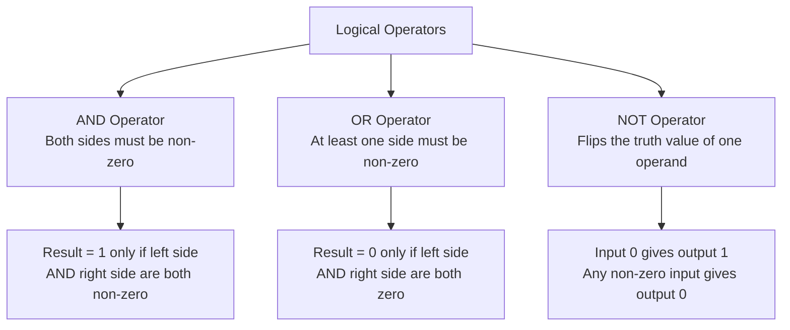
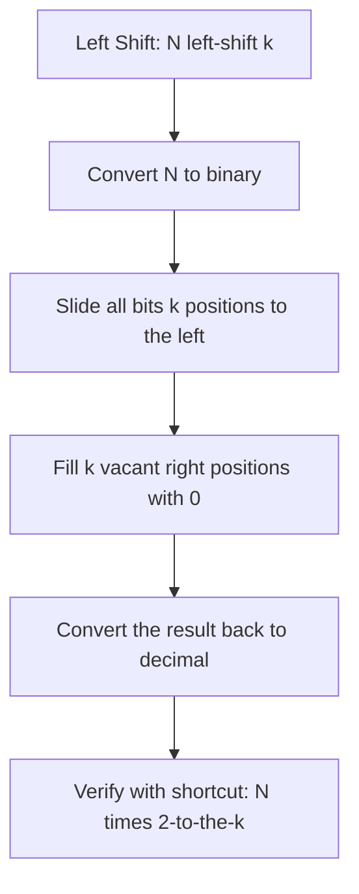
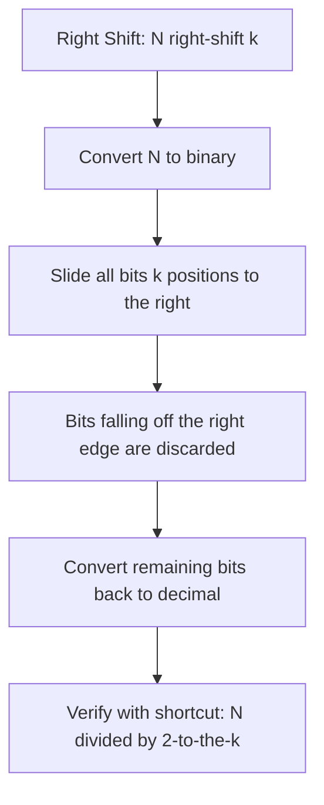
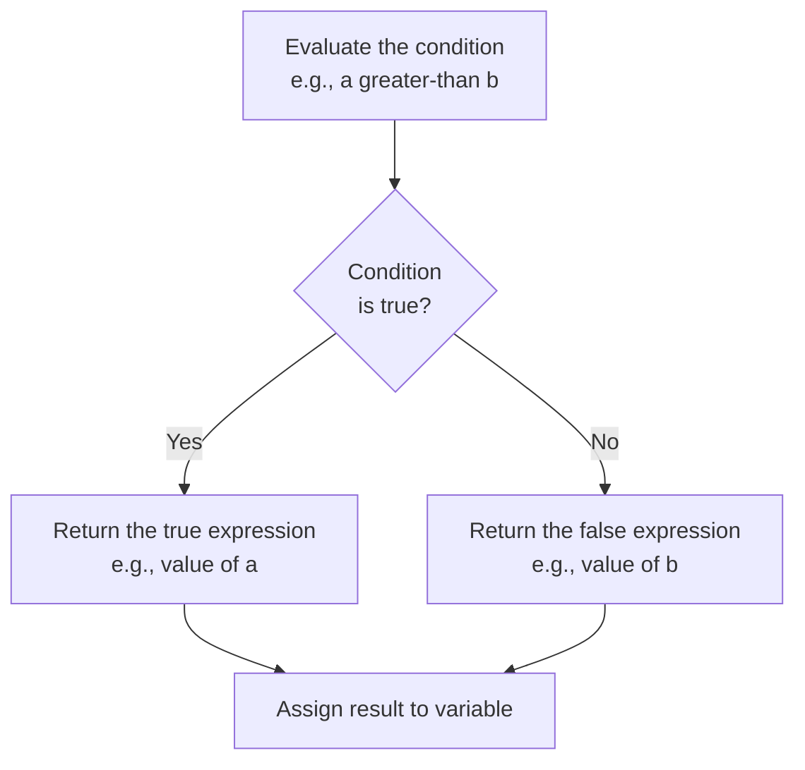

## tags: [c-programming, lecture] lecture: 7 topic: Understanding Operators with Programs (Part 2) prerequisites: Operators (Lecture 6)

# Understanding Operators with Programs (Part 2)

Lecture 7 is the second installment in the operators series. Part 1 introduced the theory behind [[Lecture 6#^arithmetic-operators|arithmetic operators]], [[Lecture 6#^relational-operators|relational operators]], and [[Lecture 6#^increment-op|increment]] and [[Lecture 6#^decrement-op|decrement]] operators. This session opens by putting those three categories into working programs, then expands the operator landscape with four new categories: [[#^logical-operators|logical operators]], [[#^bitwise-operators|bitwise operators]], [[#^compound-assignment|compound assignment operators]], and the [[Lecture 6#^ternary-operator|ternary operator]].

## Arithmetic Operators — Program Demonstration

> [!warning] Live Demo — Check Video This section was a live demonstration and was not captured in the slides. Refer back to the lecture video for the walkthrough.

Translating arithmetic operator theory into a running program surfaces one practical trap: C performs integer division when both operands are `int`, silently dropping any remainder. This means `20 / 7` yields `2`, not approximately `2.857`.

```c
#include <stdio.h>

int main() {
    int a = 20, b = 7;

    printf("a + b  = %d\n", a + b);
    printf("a - b  = %d\n", a - b);
    printf("a * b  = %d\n", a * b);
    printf("a / b  = %d\n", a / b);
    printf("a %% b = %d\n", a % b);

    return 0;
}
```

> [!tip] Setting Up the Operands
> - Both `a` and `b` are declared as `int` — this matters critically for the division test
> - When both operands are integers, C performs integer division and discards the fractional part
> - The values 20 and 7 are chosen specifically to demonstrate this truncation effect

> [!tip] Demonstrating All Five Arithmetic Operators
> - Addition, subtraction, and multiplication work exactly as expected: 27, 13, and 140
> - `a / b` gives `2` rather than `2.857` because integer division discards the remainder
> - `a % b` gives `6` — the remainder after 20 ÷ 7, which is the part that `/` throws away

|Line|Code|Explanation|
|---|---|---|
|1|`#include <stdio.h>`|Pulls in the standard I/O library so `printf` is available|
|4|`int a = 20, b = 7;`|Both are integers; this matters critically for the division test|
|6–8|Addition, subtraction, multiplication|Standard arithmetic — no surprises|
|9|`a / b`|Integer division: 20 ÷ 7 = 2 with a leftover 6, but only the 2 appears|
|10|`a % b`|Modulo returns only the leftover remainder: 6|
|12|`return 0;`|Tells the operating system the program exited successfully|

> [!tip] Getting a Decimal Result from Division Cast at least one operand to `float` before dividing: `(float)a / b` gives `2.857`. Alternatively, declare `a` or `b` as `float` from the start.

## Relational Operators — Program Demonstration

> [!warning] Live Demo — Check Video This section was a live demonstration and was not captured in the slides. Refer back to the lecture video for the walkthrough.

Relational operators compare two values and always return exactly `1` (true) or `0` (false). There is no separate boolean type in classic C — these integer results feed directly into conditions, loops, and logical expressions.

```c
#include <stdio.h>

int main() {
    int a = 10, b = 20;

    printf("a == b : %d\n", a == b);
    printf("a != b : %d\n", a != b);
    printf("a >  b : %d\n", a > b);
    printf("a <  b : %d\n", a < b);
    printf("a >= b : %d\n", a >= b);
    printf("a <= b : %d\n", a <= b);

    return 0;
}
```

> [!tip] Testing All Six Relational Operators
> - `a` is set to 10 and `b` to 20, making many comparisons clearly false
> - Each expression evaluates to `1` (true) or `0` (false) and is printed with `%d`
> - `a == b` returns 0 because 10 ≠ 20; `a < b` returns 1 because 10 < 20

|Line|Code|Explanation|
|---|---|---|
|4|`int a = 10, b = 20;`|`a` is smaller, making many of these comparisons clearly false|
|6|`a == b`|Equality test; since 10 ≠ 20 this returns 0|
|7|`a != b`|Inequality test; returns 1 because they do differ|
|8–9|`a > b` / `a < b`|Only `a < b` is true; returns 1|
|10–11|`a >= b` / `a <= b`|Inclusive comparisons; `a <= b` is true because 10 ≤ 20|

> [!bug] The Classic `=` vs `==` Mistake Inside a condition, writing `a = b` assigns `b` to `a` and the condition evaluates to the newly assigned value — almost always not the intended behaviour. Use `==` for comparison and `=` only for assignment.

## Increment and Decrement Operators — Program Demonstration

> [!warning] Live Demo — Check Video This section was a live demonstration and was not captured in the slides. Refer back to the lecture video for the walkthrough.

The key distinction is between the **prefix** form (`++a`) and the **postfix** form (`a++`). Prefix increments the variable first, then uses the new value. Postfix uses the current value first, then increments afterward.

```c
#include <stdio.h>

int main() {
    int a = 5;

    printf("a     = %d\n", a);
    printf("a++   = %d\n", a++);
    printf("a     = %d\n", a);
    printf("++a   = %d\n", ++a);
    printf("a--   = %d\n", a--);
    printf("--a   = %d\n", --a);

    return 0;
}
```

> [!tip] Tracing Pre and Post Increment/Decrement
> - `a++` prints the current value (5) first, then increments `a` to 6 — this is post-increment
> - `++a` increments `a` to 7 first, then prints the new value (7) — this is pre-increment
> - The same logic applies to `a--` and `--a`, but subtracting 1 instead of adding

|Line|Code|Explanation|
|---|---|---|
|4|`int a = 5;`|Baseline value for the entire demonstration|
|7|`a++`|Post-increment: returns 5 to `printf`, then `a` becomes 6|
|8|Second `a` print|Confirms `a` is now 6 after the post-increment|
|9|`++a`|Pre-increment: `a` becomes 7 first, then 7 is printed|
|10|`a--`|Post-decrement: prints 7, then `a` becomes 6|
|11|`--a`|Pre-decrement: `a` becomes 5 first, then 5 is printed|

> [!success] When Prefix and Postfix Behave Identically If the result of the increment/decrement is not used in the same expression — e.g., a standalone `a++;` line — prefix and postfix produce identical results. The difference only matters when the expression's value is consumed immediately in a `printf`, assignment, or condition.

## Logical Operators

Logical operators combine or invert boolean conditions and are the foundation of every decision-making construct in C. Because C has no dedicated boolean type in its classic form, the language treats `0` as false and any non-zero value as true. The three operators are the [[#^and-operator|AND (`&&`)]], [[#^or-operator|OR (`||`)]], and [[#^not-operator|NOT (`!`)]].

**AND (`&&`)** requires both operands to be non-zero for the result to be `1`. If either operand is zero, the whole expression evaluates to `0`.

**OR (`||`)** needs only one non-zero operand to produce `1`. Both operands must be zero for the result to be `0`.

**NOT (`!`)** is a [[Lecture 6#^unary-operator|unary operator]] that inverts the truth value of a single [[Lecture 6#^operand|operand]] — `!0` gives `1`, and applying `!` to any non-zero value gives `0`.

The slide works through several examples to cement these rules:

|Expression|Result|Reason|
|---|---|---|
|`23 && 10`|1|Both non-zero → true|
|`24 && 0`|0|Second operand is zero → false|
|`0 && 3`|0|First operand is zero → false (short-circuits)|
|`44 && 13`|1|Both non-zero → true|
|`23 \| 10`|1|Both non-zero → true|
|`24 \| 0`|1|First operand is non-zero → true|
|`0 \| 3`|1|Second operand is non-zero → true|
|`0 \| 0`|0|Both zero → false|
|`!0`|1|NOT of zero flips to true|
|`!1`|0|NOT of non-zero flips to false|



> [!info] Short-Circuit Evaluation C evaluates `&&` and `||` from left to right and stops the moment the outcome is certain. For `A && B`, if `A` is zero, `B` is never evaluated. For `A || B`, if `A` is non-zero, `B` is skipped entirely. This is called short-circuit evaluation and matters when the right-hand operand is a function call with side effects.

### Program to Understand Logical Operators

> [!warning] Live Demo — Check Video This section was a live demonstration and was not captured in the slides. Refer back to the lecture video for the walkthrough.

```c
#include <stdio.h>

int main() {
    int a = 23, b = 10, c = 0;

    printf("a && b  = %d\n", a && b);
    printf("a && c  = %d\n", a && c);
    printf("a || c  = %d\n", a || c);
    printf("c || c  = %d\n", c || c);
    printf("!c      = %d\n", !c);
    printf("!a      = %d\n", !a);

    return 0;
}
```

> [!tip] Testing AND, OR, and NOT
> - `c = 0` acts as a "false" value in C, while `a` and `b` are non-zero and therefore "true"
> - `a && b` returns 1 because both are non-zero; `a && c` returns 0 because `c` is zero
> - `!c` is NOT-false which gives 1; `!a` is NOT-true which gives 0

> [!tip] Short-Circuit Behaviour
> - In `a && c`, C evaluates `a` first (non-zero, so it continues), then evaluates `c` (zero, so result is 0)
> - In `a || c`, C evaluates `a` first (non-zero), and immediately returns 1 without evaluating `c`
> - This short-circuiting matters when the right operand has side effects like function calls

|Line|Code|Explanation|
|---|---|---|
|1|`#include <stdio.h>`|Standard I/O header for `printf`|
|4|`int a=23, b=10, c=0;`|`c` is set to zero to represent a false-valued operand|
|6|`a && b`|23 AND 10 — both non-zero, result is 1|
|7|`a && c`|23 AND 0 — `c` is false, short-circuits; result is 0|
|8|`a \| c`|23 OR 0 — `a` is true, short-circuits; result is 1|
|9|`c \| c`|0 OR 0 — both false; result is 0|
|10|`!c`|NOT 0 → 1|
|11|`!a`|NOT 23 → 0|

## Bitwise Operators

While logical operators treat every non-zero value as simply "true," [[#^bitwise-operators|bitwise operators]] work at the level of individual [[Lecture 3#^binary|binary]] digits within an integer. They are indispensable in embedded systems, device drivers, and any context where individual flag bits must be tested, set, or cleared. C provides six: [[#^bitwise-and|bitwise AND (`&`)]], [[#^bitwise-or|bitwise OR (`|`)]], [[#^bitwise-xor|bitwise XOR (`^`)]], [[#^bitwise-not|bitwise NOT (`~`)]], [[#^left-shift|left shift (`<<`)]], and [[#^right-shift|right shift (`>>`)]] .

> [!info] Converting Decimal to Binary — Quick Refresher Repeatedly divide the number by 2 and record each remainder. Reading the remainders from bottom to top gives the binary representation. For example, 12 → 6(r0) → 3(r0) → 1(r1) → 0(r1), reading upward: **1100**.

### Bitwise AND

**Bitwise AND** (`&`) compares corresponding bits of two integers. A result bit is `1` only when both input bits are `1`; in every other case the result bit is `0`.

> [!example] Worked Example: 12 & 6 12 in binary: 1100 6 in binary: 0110
> 
> Bit-by-bit comparison: 0100. Only position 2 (decimal value 4) has a `1` in both numbers.
> 
> Result: **4**

### Bitwise OR

**Bitwise OR** (`|`) sets a result bit to `1` whenever either — or both — of the corresponding input bits is `1`.

> [!example] Worked Example: 8 | 5 8 in binary: 1000 5 in binary: 0101
> 
> Bit-by-bit OR: 1101. Converting back: 8 + 4 + 0 + 1.
> 
> Result: **13**

### Bitwise XOR (Exclusive OR)

**Bitwise XOR** (`^`) produces `1` in each bit position where the two corresponding bits are different, and `0` where they are the same. The slide's rule of thumb: "XOR — if an odd number of 1s appear in a position, the result is 1; otherwise 0."

> [!example] Worked Example: 1011 ^ 0110 Comparing bit by bit: position 3 (1 vs 0 → 1), position 2 (0 vs 1 → 1), position 1 (1 vs 1 → 0, same), position 0 (1 vs 0 → 1).
> 
> Result bits: 1101 → 8 + 4 + 0 + 1 = **13**

### Bitwise NOT (Complement)

**Bitwise NOT** (`~`) flips every single bit in the operand — all `0`s become `1`s and all `1`s become `0`s.

> [!warning] Two's Complement Surprise On modern systems using two's complement representation, `~a` is equal to `-(a + 1)`. For example, `~12` produces `-13`, not some unsigned bit pattern. This surprises most beginners. The behaviour is platform-width dependent but consistent on virtually all modern hardware.

### Left Shift Operator

The left shift (`<<`) operator slides all bits of a value to the left by a specified number of positions. Every vacant position on the right is filled with `0`.

> [!example] Worked Example: 13 << 2 13 in binary: 001101
> 
> After shifting left by 2: 110100
> 
> Converting 110100 to decimal: 32 + 16 + 0 + 4 + 0 + 0 = **52**

**Shortcut:** `N << k` is mathematically equivalent to `N × 2^k`. For `13 << 2`: 13 × 2² = 13 × 4 = **52** ✓



### Right Shift Operator

The right shift (`>>`) operator moves all bits to the right by a specified number of positions. Bits that fall off the right edge are discarded.

> [!example] Worked Example: 13 >> 2 13 in binary: 1101
> 
> After shifting right by 2: 0011
> 
> Converting 0011 to decimal: 2 + 1 = **3**

**Shortcut:** `N >> k` is equivalent to `N ÷ 2^k` using integer division (truncated toward zero). For `13 >> 2`: 13 ÷ 4 = **3** ✓

> [!tip] Fast Power-of-2 Arithmetic Left shifts multiply by a power of 2 without a multiplication instruction; right shifts divide by a power of 2 without a division instruction. These are classic micro-optimisations in systems and embedded programming.



### Program to Understand Bitwise Operators

> [!warning] Live Demo — Check Video This section was a live demonstration and was not captured in the slides. Refer back to the lecture video for the walkthrough.

```c
#include <stdio.h>

int main() {
    int a = 12, b = 6;

    printf("a & b   = %d\n", a & b);
    printf("a | b   = %d\n", a | b);
    printf("a ^ b   = %d\n", a ^ b);
    printf("a << 2  = %d\n", a << 2);
    printf("a >> 2  = %d\n", a >> 2);
    printf("~a      = %d\n", ~a);

    return 0;
}
```

> [!tip] Setting Up Binary-Friendly Values
> - `a = 12` is `1100` in binary and `b = 6` is `0110` — these map cleanly to 4-bit patterns
> - Choosing values with clearly different bit patterns makes the bitwise results easy to verify by hand
> - Convert both to binary before tracing each operation to understand the results

> [!tip] Applying All Six Bitwise Operators
> - `a & b` gives 4 (0100) — only the bits where both are 1 survive
> - `a | b` gives 14 (1110) — bits where either is 1 are set
> - `a ^ b` gives 10 (1010) — bits where they differ are set
> - `a << 2` multiplies by 4 (48), `a >> 2` divides by 4 (3), and `~a` flips all bits (-13)

|Line|Code|Explanation|
|---|---|---|
|1|`#include <stdio.h>`|Standard I/O header|
|4|`int a = 12, b = 6;`|12 is 1100 in binary; 6 is 0110|
|6|`a & b`|1100 AND 0110 = 0100 → decimal 4|
|7|`a \| b`|1100 OR 0110 = 1110 → decimal 14|
|8|`a ^ b`|1100 XOR 0110 = 1010 → decimal 10|
|9|`a << 2`|Equivalent to 12 × 4 = 48|
|10|`a >> 2`|Equivalent to 12 ÷ 4 = 3|
|11|`~a`|All bits of 12 flipped; yields −13 on two's complement systems|

## Assignment Operators

C's basic assignment operator (`=`) copies a value into a variable. [[#^compound-assignment|Compound assignment operators]] merge an arithmetic operation with the assignment into a single expression. Every compound form `op=` is shorthand for `variable = variable op value`. The full set is `=`, `+=`, `-=`, `*=`, `/=`, and `%=`.

> [!example] Shorthand Equivalences Given `int a = 5;`:
> 
> - `a += 7;` is the same as `a = a + 7;` → a becomes 12
> - `a -= 4;` is the same as `a = a - 4;`
> - `a *= 2;` is the same as `a = a * 2;`
> - `a /= 5;` is the same as `a = a / 5;` (integer division)
> - `a %= 3;` is the same as `a = a % 3;` (remainder only)

```c
#include <stdio.h>

int main() {
    int a = 5;

    printf("Initial   = %d\n", a);

    a += 7;
    printf("After +=7 = %d\n", a);

    a *= 2;
    printf("After *=2 = %d\n", a);

    a -= 4;
    printf("After -=4 = %d\n", a);

    a /= 5;
    printf("After /=5 = %d\n", a);

    a %= 3;
    printf("After %%=3 = %d\n", a);

    return 0;
}
```

> [!tip] Chaining Compound Assignments
> - Each compound operator modifies `a` in place: `a += 7` changes `a` from 5 to 12, then `a *= 2` changes it from 12 to 24
> - The chain demonstrates all five compound operators: `+=`, `*=`, `-=`, `/=`, `%=`
> - Each is shorthand for writing the variable on both sides of the assignment — `a += 7` is `a = a + 7`

> [!tip] Why Compound Assignment Matters
> - Beyond saving keystrokes, compound operators eliminate the risk of accidentally using two different variable names
> - `%%` in the format string prints a literal `%` character — a single `%` would be interpreted as a format specifier
> - Integer division in `/=` truncates the result, just as with the regular `/` operator

|Line|Code|Explanation|
|---|---|---|
|4|`int a = 5;`|Starting point for the chain of compound assignments|
|8|`a += 7`|Expands to `a = 5 + 7`; `a` is now 12|
|11|`a *= 2`|Expands to `a = 12 * 2`; `a` is now 24|
|14|`a -= 4`|Expands to `a = 24 - 4`; `a` is now 20|
|17|`a /= 5`|Expands to `a = 20 / 5`; `a` is now 4|
|20|`a %= 3`|Expands to `a = 4 % 3`; `a` is now 1|

> [!success] Why Use Compound Assignment? Beyond saving keystrokes, compound operators eliminate the risk of accidentally using two different variable names on either side of the expression — a subtle but real source of bugs in production code.

## Ternary Operator

Operators in C can be classified by how many **operands** they act upon. A unary operator works on a single operand — examples include negation (`-a`), address-of (`&a`), logical NOT (`!a`), and increment (`++a`). A binary operator acts on two operands — examples include `a + b`, `a && b`, and `a & b`. The ternary operator (`?:`) is C's only three-operand operator.

Its syntax follows this pattern:

```
condition ? value_if_true : value_if_false
```

The [[Lecture 9#^condition|condition]] is evaluated first. If it is non-zero (true), the expression returns `value_if_true`; otherwise it returns `value_if_false`. The slide demonstrates finding the maximum of two numbers:

```c
#include <stdio.h>

int main() {
    int a = 10, b = 15;
    int max;

    max = a > b ? a : b;

    printf("Maximum = %d\n", max);

    return 0;
}
```

> [!tip] Understanding the Ternary Expression
> - `a > b ? a : b` evaluates the condition `10 > 15`, which is false (0)
> - Since the condition is false, the third operand `b` (15) is returned and assigned to `max`
> - The ternary operator is an expression — it produces a value — unlike `if-else` which is a statement

> [!tip] When to Use the Ternary Operator
> - Use it for simple, one-line conditional assignments where `if-else` would be unnecessarily verbose
> - The ternary can appear inside `printf`, variable initialisation, or any expression context where `if-else` cannot go
> - Avoid nesting ternaries deeply — prefer explicit `if-else` chains when logic has more than two branches

|Line|Code|Explanation|
|---|---|---|
|4|`int a = 10, b = 15;`|`a` is the smaller value in this example|
|6|`int max;`|Declares the result variable|
|8|`a > b ? a : b`|Condition `10 > 15` is false, so the third operand `b` (15) is returned|
|10|`printf(...)`|Outputs 15|



> [!tip] Ternary vs if-else The ternary operator is an expression — it produces a value — rather than a statement. This allows it to appear inside `printf`, variable initialization, or any other expression context where a regular `if-else` block cannot go.

> [!question] Nesting Ternary Operators C allows nesting: `a > b ? a : (b > c ? b : c)` finds the maximum of three values. While technically valid, deeply nested ternaries become difficult to read quickly. Prefer explicit `if-else` chains whenever the logic has more than two branches.

## Key Terms

|Term|Definition|
|---|---|
| Logical operators | Operators that combine or invert boolean conditions; always return 0 (false) or 1 (true) | ^logical-operators
| AND operator | The `&&` operator; returns 1 only when both operands are non-zero | ^and-operator
| OR operator | The `\|` operator; returns 1 when at least one operand is non-zero | ^or-operator
| NOT operator | The `!` unary operator; inverts the truth value of its single operand | ^not-operator
| Bitwise operators | Operators that manipulate individual bits of integer values directly | ^bitwise-operators
| Bitwise AND | The `&` operator; result bit is 1 only where both operand bits are 1 | ^bitwise-and
| Bitwise OR | The `\|` operator; result bit is 1 where either operand bit is 1 | ^bitwise-or
| Bitwise XOR | The `^` operator (Exclusive OR); result bit is 1 only where the two bits differ | ^bitwise-xor
| Bitwise NOT | The `~` operator; flips every bit; on two's complement systems `~n` equals `-(n+1)` | ^bitwise-not
| Left shift | The `<<` operator; shifts bits left by k positions, equivalent to multiplying by 2^k | ^left-shift
| Right shift | The `>>` operator; shifts bits right by k positions, equivalent to dividing by 2^k | ^right-shift
| Compound assignment | Shorthand operators such as `+=`, `-=`, `*=`, `/=`, `%=` that combine an operation with assignment | ^compound-assignment
| Ternary operator | The `?:` operator; evaluates a condition and returns one of two expressions; the only three-operand operator in C |
| Unary operator | An operator that acts on a single operand (e.g., `-a`, `!a`, `++a`) |
| Binary operator | An operator that acts on two operands (e.g., `a + b`, `a & b`) |

> [!example]- Try It Yourself **Exercise 1 — Logical Gate Simulator** Declare two integers `x` and `y` with values of your choice. Print the result of every logical operator combination (`&&`, `||`, `!x`, `!y`) and write a comment on each line explaining why the result is 0 or 1.
> 
> **Exercise 2 — Bit Extraction** Given `int n = 45;` (binary: 101101), use bitwise AND and the right-shift operator to extract and print each individual bit from position 0 to 5. Hint: `(n >> i) & 1` isolates the bit at position `i`.
> 
> **Exercise 3 — Predict Before You Run** Without compiling, trace through this sequence and predict the final output, then verify by running it: `int a = 16; a >>= 2; a += 3; a *= 2; printf("%d\n", a);`
> 
> **Exercise 4 — Ternary Without if-else** Write a program that reads an integer from the user and prints "Negative", "Zero", or "Positive" using only the ternary operator. No `if`, no `else`.

---

**Lecture 7 Recap**

- Logical operators (`&&`, `||`, `!`) work on truth values; zero is false and any non-zero integer is true.
- AND requires both operands to be non-zero; OR needs just one; NOT inverts a single operand's truth value.
- C short-circuits `&&` and `||` — evaluation stops the moment the outcome is determined.
- Bitwise operators work bit-by-bit on the binary representation of integers, unlike logical operators which treat entire values as true or false.
- Bitwise AND (`&`) gives 1 only where both bits are 1; bitwise OR (`|`) gives 1 where either bit is 1; XOR (`^`) gives 1 only where the bits differ.
- Bitwise NOT (`~`) flips all bits and on two's complement systems produces `-(n+1)`, not a simple unsigned flip.
- Left shift (`<<`) multiplies by 2^k; right shift (`>>`) divides by 2^k using integer division — both are common performance shortcuts.
- Compound assignment operators (`+=`, `-=`, `*=`, `/=`, `%=`) compress `variable = variable op value` into a single expression.
- The ternary operator (`?:`) is C's only three-operand construct, providing a compact inline conditional that returns a value.