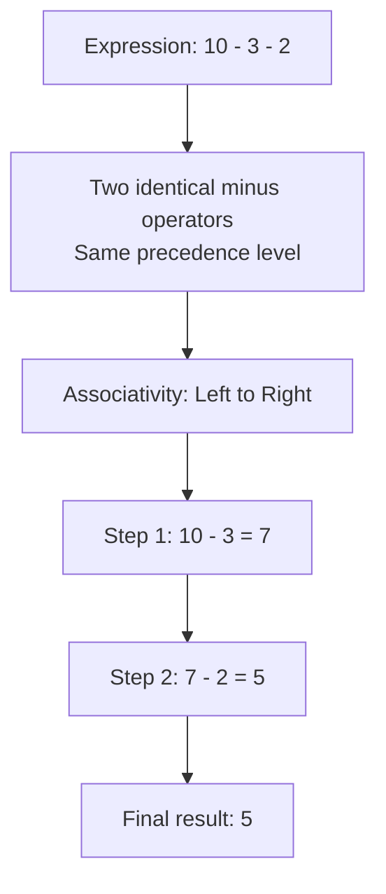
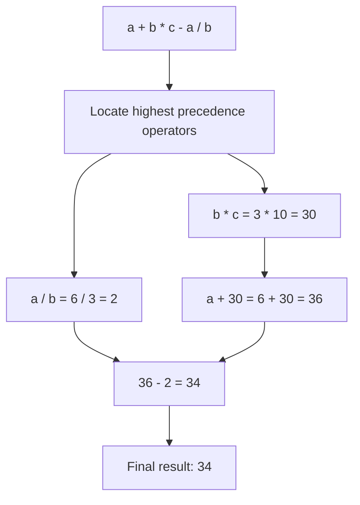
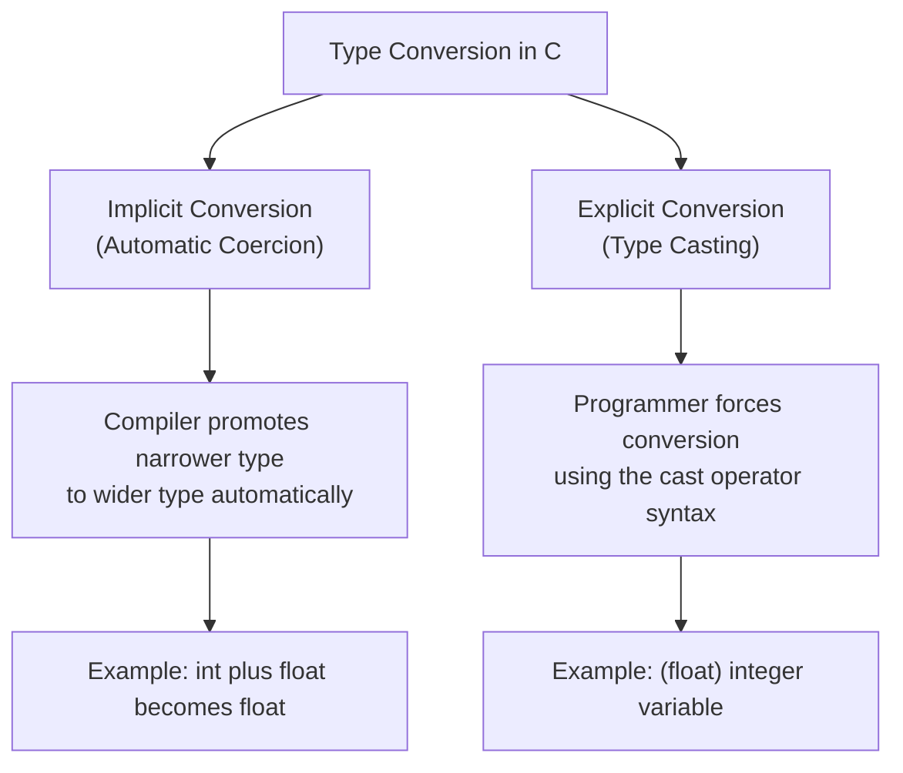
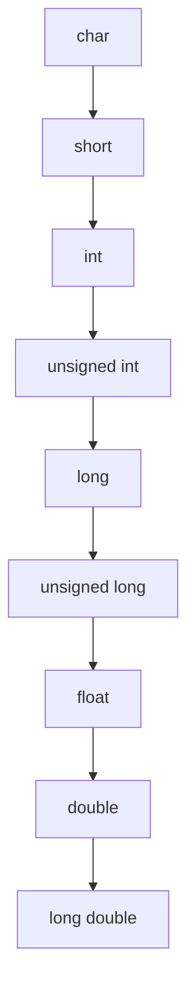
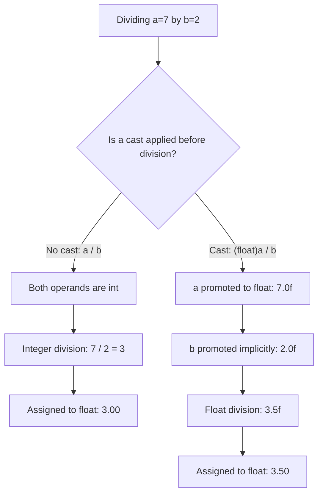

## tags: [c-programming, lecture] lecture: 8 topic: Operator Precedence, Associativity, and Type Conversion prerequisites: Lecture 7

# Lecture 8 — Operator Precedence, Associativity & Type Conversion

## Agenda

Three interconnected topics make up this lecture, each of which shapes how C reads and evaluates expressions:

- [[#^operator-precedence|Precedence]] and [[#^operator-associativity|associativity]] of operators
- Solving various expressions in code
- [[#^type-conversion|Type conversion]] — implicit and explicit forms

---

## Operator Precedence & Associativity

> [!warning] Live Demo — Check Video This section was a live demonstration and was not captured in the slides. Refer back to the lecture video for the walkthrough.

### What Is Operator Precedence?

**Operator precedence** determines which [[Lecture 6#^operator|operator]] is evaluated first when an expression contains multiple operators. Just as standard mathematics evaluates multiplication before addition, C follows a well-defined hierarchy for every operator in the language. Without this hierarchy, expressions would be ambiguous and unpredictable.

Consider this expression:

```c
int result = 2 + 3 * 4;
```

> [!tip] Precedence in Action
> - Because `*` outranks `+` in the precedence table, C evaluates `3 * 4` first (yielding 12) and then adds 2
> - The result is **14**, not 20 — the same rule as standard mathematics
> - Use parentheses `()` to override precedence whenever your intent might be ambiguous

The table below lists common C operators ordered from highest precedence (level 1) to lowest (level 15):

|Level|Operators|Category|Associativity|
|---|---|---|---|
|1|`()` `[]` `->` `.`|Postfix / member access|Left to Right|
|2|`++` `--` `+` `-` `!` `~` `(type)` `*` `&` `sizeof`|Unary|Right to Left|
|3|`*` `/` `%`|Multiplicative|Left to Right|
|4|`+` `-`|Additive|Left to Right|
|5|`<<` `>>`|Bitwise shift|Left to Right|
|6|`<` `<=` `>` `>=`|Relational|Left to Right|
|7|`==` `!=`|Equality|Left to Right|
|8|`&`|Bitwise AND|Left to Right|
|9|`^`|Bitwise XOR|Left to Right|
|10|`\|`|Bitwise OR|Left to Right|
|11|`&&`|Logical AND|Left to Right|
|12|`\|`|Logical OR|Left to Right|
|13|`?:`|Ternary conditional|Right to Left|
|14|`=` `+=` `-=` `*=` `/=` `%=` `\|=` `^=` etc.|Assignment|Right to Left|
|15|`,`|Comma|Left to Right|

### What Is Operator Associativity?

**Operator associativity** resolves ties — it applies when two or more operators of _equal_ precedence compete in the same expression. It dictates whether evaluation proceeds left-to-right or right-to-left.

- **Left-to-right**: Most arithmetic and comparison operators associate this way. The expression `a - b - c` is computed as `(a - b) - c`.
- **Right-to-left**: Assignment and [[Lecture 6#^unary-operator|unary]] operators associate this way. The expression `a = b = 5` is processed as `a = (b = 5)` — `b` receives 5 first, then `a` receives that value.



> [!tip] Parentheses Always Win Parentheses sit at level 1 of the precedence table and override every other rule. Adding them wherever clarity is needed costs nothing and makes your intent unambiguous to both the [[Lecture 1#^compiler|compiler]] and any future reader of the code.

### Sample Program — Precedence and Associativity in Action

```c
#include <stdio.h>

int main() {
    int a = 10, b = 4, c = 2;

    int r1 = a + b * c;

    int r2 = a - b - c;

    int x, y;
    x = y = 7;

    printf("r1 = %d\n", r1);
    printf("r2 = %d\n", r2);
    printf("x = %d, y = %d\n", x, y);

    return 0;
}
```

> [!tip] Precedence — Multiplication Before Addition
> - `a + b * c` evaluates `b * c` first (4 × 2 = 8) because `*` has higher precedence than `+`
> - Then `a + 8` gives 18, not `(a + b) * c` which would be 28
> - This mirrors standard mathematical order of operations

> [!tip] Associativity — Resolving Equal-Precedence Ties
> - `a - b - c` evaluates left-to-right: `(10 - 4) - 2 = 4`, not `10 - (4 - 2) = 8`
> - `x = y = 7` evaluates right-to-left: `y = 7` first, then `x = y` — both end up as 7
> - Arithmetic operators are left-associative; assignment operators are right-associative

|Line|Code|Explanation|
|---|---|---|
|1|`#include <stdio.h>`|Includes the standard I/O header; required for [[Lecture 2#^printf|printf]]|
|4|`int a = 10, b = 4, c = 2;`|Three integers declared in a single statement using the comma operator|
|7|`int r1 = a + b * c;`|`*` has higher precedence than `+`, so `b * c` is evaluated first|
|10|`int r2 = a - b - c;`|`-` is left-associative; `(a - b)` is computed before subtracting `c`|
|12–13|`x = y = 7;`|Assignment is right-associative; `y = 7` executes first, then `x = y`|
|15–17|`printf(...)`|`%d` is the format specifier for printing integers|
|19|`return 0;`|Returns zero to tell the OS the program completed without error|

---

## Solving Various Expressions in Coding

> [!warning] Live Demo — Check Video This section was a live demonstration and was not captured in the slides. Refer back to the lecture video for the walkthrough.

Applying precedence and associativity to real expressions is a skill that develops with practice. The reliable approach is to scan the expression for the highest-precedence operators first, evaluate them, substitute the result in place, and repeat downward through the precedence hierarchy until a single value remains.

The program below exercises this process across several common expression patterns:

```c
#include <stdio.h>

int main() {
    int a = 6, b = 3, c = 10;

    int e1 = a + b * c - a / b;

    int e2 = (a > b) && (c != b);

    int d = 5;
    d += a * b;

    int e3 = a++ + b;

    printf("e1 = %d\n", e1);
    printf("e2 = %d\n", e2);
    printf("d  = %d\n", d);
    printf("e3 = %d\n", e3);
    printf("a  = %d\n", a);

    return 0;
}
```

> [!tip] Evaluating a Complex Arithmetic Expression
> - In `a + b * c - a / b`, the `*` and `/` operators are resolved first (left-to-right among equal precedence)
> - `b * c` gives 30, `a / b` gives 2 (integer division), then `6 + 30 - 2 = 34`
> - Always identify the highest-precedence operators first, evaluate them, and work downward

> [!tip] Mixing Relational and Logical Operators
> - In `(a > b) && (c != b)`, the parenthesised comparisons are evaluated first: both yield 1 (true)
> - Then `1 && 1` gives 1 — the overall expression is true
> - Parentheses make the intent explicit and prevent precedence surprises

> [!tip] Compound Assignment with Precedence
> - In `d += a * b`, multiplication has higher precedence than `+=`, so `a * b = 18` is computed first
> - Then `d = d + 18 = 5 + 18 = 23` — the compound operator applies last
> - `a++ + b` uses [[Lecture 6#^post-increment|post-increment]]: `a`'s current value (6) is used in the addition, then `a` becomes 7

|Line|Code|Explanation|
|---|---|---|
|7|`int e1 = a + b * c - a / b;`|`b * c` and `a / b` are resolved first (left-to-right among `*`/`/`); then `+` and `-` are applied|
|10|`int e2 = (a > b) && (c != b);`|Each parenthesised comparison yields 1 (true); `&&` then combines them|
|12–13|`d += a * b;`|`*` runs before `+=`; the product is added to `d`|
|15|`int e3 = a++ + b;`|Post-increment: `a`'s current value (6) is used first, then `a` becomes 7|



> [!bug] Post-Increment vs Pre-Increment `a++` uses `a`'s current value first and increments afterward. `++a` increments first and uses the updated value. Mixing them up in compound expressions is one of the most common sources of subtle, hard-to-spot bugs in C.

---

## Understanding Type Conversion with Its Types

**[[#^type-conversion|Type conversion]]** is the process of transforming a value from one [[Lecture 4#^data-type|data type]] to another. C supports two categories: **[[#^implicit-conversion|implicit conversion]]**, performed automatically by the compiler, and [[#^explicit-conversion|explicit conversion]], triggered manually by the programmer using the cast operator. Both forms appear constantly in real programs.



### Implicit Type Conversion

> [!warning] Live Demo — Check Video This section was a live demonstration and was not captured in the slides. Refer back to the lecture video for the walkthrough.

**Implicit type conversion** — also called _automatic type promotion_ or _coercion_ — takes place without any programmer action. When an arithmetic expression mixes two numeric types, C automatically promotes the narrower type to the wider type so no data is lost during the computation.

The [[#^promotion-hierarchy|promotion hierarchy]] runs from narrowest to widest:



> [!info] Promotion Is Always Upward The compiler promotes in one direction only — toward the wider type. When you add an `int` to a `double`, the `int` is silently converted to `double` before the addition occurs. No fractional data is introduced or lost in an upward promotion.

```c
#include <stdio.h>

int main() {
    int   i = 7;
    float f = 2.5f;

    float result = i + f;

    char  ch = 'A';
    int   ascii_val = ch;

    printf("result    = %.2f\n", result);
    printf("ascii_val = %d\n",   ascii_val);

    return 0;
}
```

> [!tip] Automatic Widening in Mixed Expressions
> - `i + f` mixes an `int` and a `float` — C automatically promotes `i` to `float` before the addition
> - The result is `7.0f + 2.5f = 9.5f` — no data is lost in an upward promotion
> - The same principle applies to all mixed-type arithmetic: the narrower type is always widened

> [!tip] Character-to-Integer Promotion
> - `char ch = 'A'` stores the ASCII code 65 in a single byte
> - Assigning `ch` to an `int` variable widens it automatically — `ascii_val` holds the integer 65
> - Because `char` promotes to `int` implicitly, you can do arithmetic directly on character values: `'A' + 1` yields 66 (`'B'`)

|Line|Code|Explanation|
|---|---|---|
|4–5|`int i = 7; float f = 2.5f;`|Two variables of different numeric types|
|8|`float result = i + f;`|`i` is promoted to `float` automatically; then `7.0f + 2.5f = 9.5f`|
|10–11|`int ascii_val = ch;`|`char` is widened to `int`; the stored value is the ASCII code 65|
|13–14|`printf(...)`|`%.2f` formats the float to two decimal places; `%d` for the integer|

> [!tip] Character Arithmetic Because `char` promotes to `int` implicitly, you can do arithmetic directly on character values. `'A' + 1` yields the integer 66, which corresponds to `'B'`. This is intentional by design in C.

### Explicit Type Conversion

> [!warning] Live Demo — Check Video This section was a live demonstration and was not captured in the slides. Refer back to the lecture video for the walkthrough.

[[#^type-casting|Type casting]] gives the programmer direct control over how a value is interpreted, by specifying the target type explicitly. The syntax is:

```c
(target_type) expression
```

> [!tip] Cast Syntax
> - Place the target type name inside parentheses directly before the expression you want to convert
> - `(float)a` converts the integer `a` to a float value before the surrounding expression is evaluated
> - Casting is necessary when [[#^implicit-conversion|implicit promotion]] alone cannot produce the desired result

Casting is necessary when implicit promotion alone cannot produce the desired result — for example, when floating-point division is required between two integer variables.

> [!danger] Casting Truncates — It Does Not Round Casting a `float` or `double` to `int` silently **drops every digit after the decimal point**. `(int)3.99` produces `3`, not `4`. Casting a wide integer type to a narrower one (such as `long` to `char`) risks overflow. Always verify the target type can safely hold the value being converted.

```c
#include <stdio.h>

int main() {
    int a = 7, b = 2;

    float bad  = a / b;

    float good = (float)a / b;

    float pi = 3.14159f;
    int   truncated = (int)pi;

    printf("bad       = %.2f\n", bad);
    printf("good      = %.2f\n", good);
    printf("truncated = %d\n",   truncated);

    return 0;
}
```

> [!tip] The [[#^integer-division|Integer Division]] Trap
> - `float bad = a / b` divides two integers first (7 / 2 = 3), then stores 3 as 3.0f — precision is lost
> - `float good = (float)a / b` casts `a` to float first, so `b` is also promoted and float division gives 3.5f
> - Always cast _before_ the division, not after — `(float)(a / b)` still gives 3.0

> [!tip] [[#^truncation|Truncation]] When Casting Down
> - `(int)pi` drops the `.14159` — the result is `3`, not `4` (no rounding occurs)
> - This is consistent behaviour: casting from a wider to a narrower type always discards the extra precision
> - Be especially careful when casting negative floats — `(int)-3.7` gives `-3`, not `-4`

|Line|Code|Explanation|
|---|---|---|
|7|`float bad = a / b;`|Both are `int`; integer division yields 3; only then is 3 stored as `3.0f`|
|10|`float good = (float)a / b;`|Casting `a` promotes it to `float` first; `b` is then implicitly promoted; result is `3.5f`|
|13|`int truncated = (int)pi;`|The decimal part `.14159` is discarded; result is `3`|
|15–17|`printf(...)`|`%.2f` shows two decimal places for floats; `%d` for the integer|



> [!success] Cast the Operand — Not the Result Writing `(float)(a / b)` applies the cast _after_ integer division has already occurred — you still get `3.0`, not `3.5`. To get the correct result, cast _before_ the division: `(float)a / b` forces float arithmetic from the start.

### Program — Type Conversion Comparison

> [!warning] Live Demo — Check Video This section was a live demonstration and was not captured in the slides. Refer back to the lecture video for the walkthrough.

The following program places implicit and explicit conversion side-by-side so their differences are immediately visible in the output:

```c
#include <stdio.h>

int main() {
    int    x = 10;
    double d = 3.7;
    double implicit_res = x + d;

    double y = 9.99;
    int    explicit_res = (int)y;

    int p = 5, q = 2;
    float  div_result = (float)p / q;

    printf("Implicit:  10 + 3.7  = %.2f\n", implicit_res);
    printf("Explicit:  (int)9.99 = %d\n",   explicit_res);
    printf("Cast div:  5 / 2     = %.2f\n", div_result);

    return 0;
}
```

> [!tip] Implicit vs Explicit Side-by-Side
> - `x + d` mixes `int` and `double` — x is automatically promoted to `double`, giving 13.7
> - `(int)y` explicitly casts 9.99 to `int`, dropping the `.99` — result is 9, not 10
> - `(float)p / q` forces float division, giving 2.5 instead of the integer-truncated 2

> [!tip] When to Use Each Form
> - Use implicit conversion when mixing types in arithmetic — the compiler handles it safely
> - Use explicit casting when you need to override the natural type, especially to fix integer division
> - Always cast the operand _before_ the operation, not the result after

|Line|Code|Explanation|
|---|---|---|
|8|`double implicit_res = x + d;`|`x` (int) is automatically widened to `double` before the addition|
|12|`int explicit_res = (int)y;`|`(int)` cast drops the `.99`; result is `9` — no rounding|
|16|`float div_result = (float)p / q;`|Casting `p` before division avoids integer division truncation|
|19–21|`printf(...)`|`%.2f` for floating-point values; `%d` for the integer result|

> [!question] What Happens at the Boundaries? What would `(int)-3.7` produce? What about `(char)300`? Exploring edge cases — negative numbers, overflow, boundary values — deepens your intuition for how type conversion behaves in practice. Try a few in a small test program.

---

## Key Terms

|Term|Definition|
|---|---|
| Operator Precedence | The language rule that determines which operator is evaluated first in an expression containing operators of different types | ^operator-precedence
| Operator Associativity | The language rule that determines evaluation order (left-to-right or right-to-left) when two or more operators of the same precedence appear in the same expression | ^operator-associativity
| Type Conversion | The process of transforming a value from one data type to another, either automatically by the compiler or deliberately by the programmer | ^type-conversion
| Implicit Type Conversion | Automatic type promotion performed by the C compiler when an expression mixes operands of different numeric types; narrower types are always widened to the broader type | ^implicit-conversion
| Explicit Type Conversion | Programmer-controlled type conversion using the cast operator `(type)`; forces a specific type interpretation of the given value | ^explicit-conversion
| Type Casting | Synonym for explicit type conversion; uses the syntax `(target_type) expression` to override the natural type of a value | ^type-casting
| Integer Division | Division between two integer operands where the fractional part of the result is discarded (truncated), not rounded | ^integer-division
| Promotion Hierarchy | The ordered chain of numeric types from narrowest (`char`) to widest (`long double`) that governs which direction implicit type promotion travels | ^promotion-hierarchy
| Post-increment | The unary `++` operator placed after a variable; the variable's current value is used in the expression and the increment is applied only after the expression is fully evaluated |
| Truncation | The removal of the fractional component when a floating-point value is converted to or stored in an integer type; no rounding occurs | ^truncation

> [!example]- Try It Yourself **Exercise 1 — Trace Expression Evaluation** Before compiling, apply the precedence table manually to predict what each line prints. Write your answers, then run the code to verify.
> 
> ```c
> int a = 8, b = 3, c = 2;
> printf("%d\n", a + b * c);
> printf("%d\n", a / b + c);
> printf("%d\n", a - b - c);
> ```
> 
> **Exercise 2 — Fix the Precision Bug** The code below should print `2.50` but prints `2.00`. Add a single cast in exactly the right place to fix it without changing any declared values.
> 
> ```c
> int   x = 5, y = 2;
> float result = x / y;
> printf("%.2f\n", result);
> ```
> 
> **Exercise 3 — Observe Implicit Promotion** Declare a `char` variable and assign it the letter `'M'`. Then assign it to an `int` variable and print both using `%c` (character form) and `%d` (integer form). Confirm that the integer version holds the value 77 — the ASCII code for `'M'` — and that the `char` version still prints the letter itself.

---

**Lecture 8 Recap**

- Operator precedence defines a strict evaluation hierarchy; higher-precedence operators bind their operands before lower-precedence ones get a chance — multiplication and division always run before addition and subtraction.
- Operator associativity breaks ties between equal-precedence operators; most arithmetic operators are left-to-right, while assignment is right-to-left.
- Parentheses sit at the top of the precedence table and override all other rules; use them freely in complex expressions to guarantee correctness and readability.
- Implicit type conversion automatically promotes narrower types to wider ones when operands of different types are mixed; no data is lost in an upward promotion.
- Explicit type conversion (casting) forces a specific type; casting a floating-point value to integer truncates the decimal — it does not round.
- A pervasive bug: dividing two integers and expecting a decimal result. At least one operand must be cast to `float` or `double` _before_ the division to avoid integer truncation.