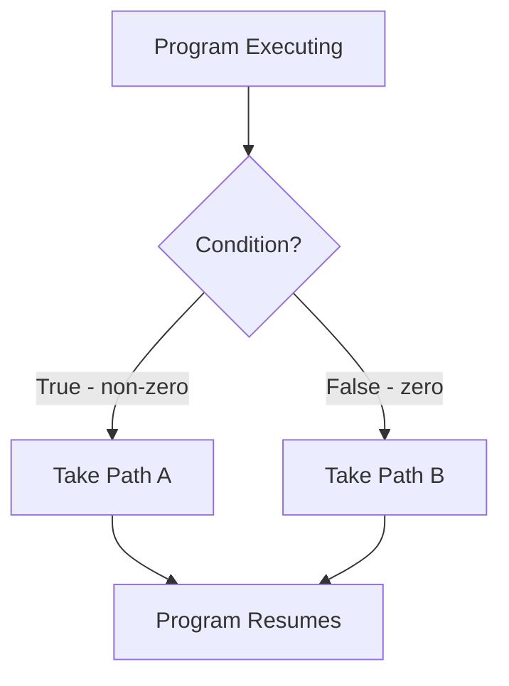
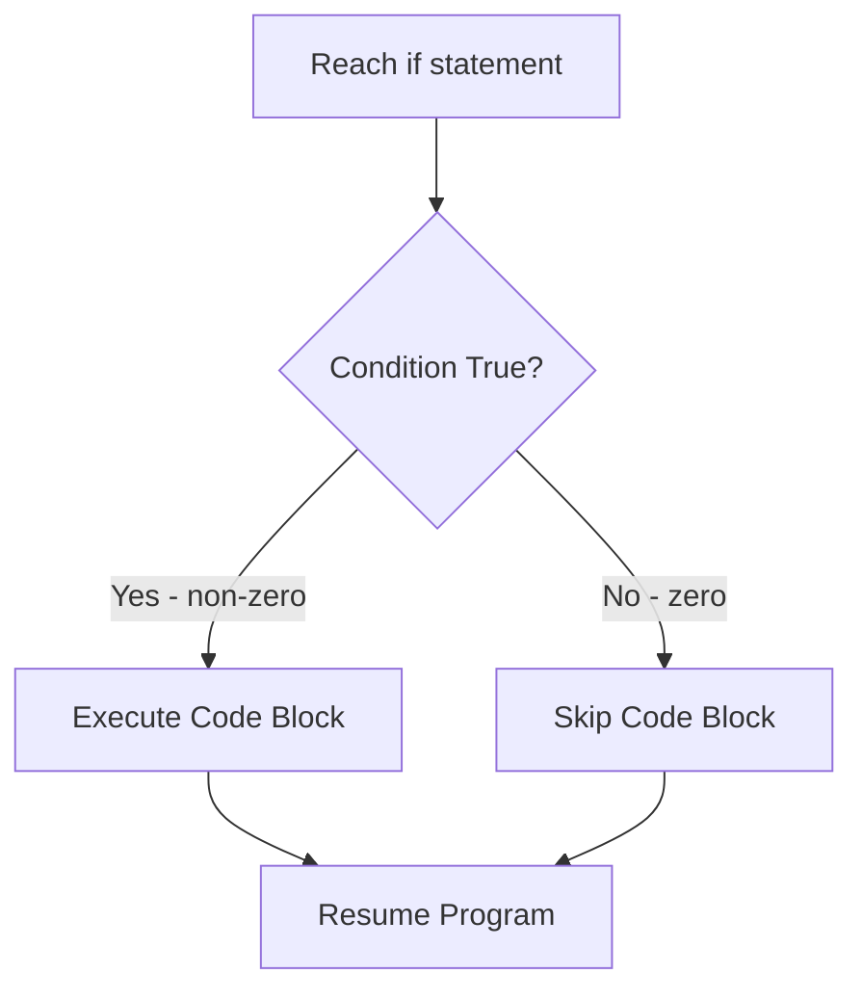
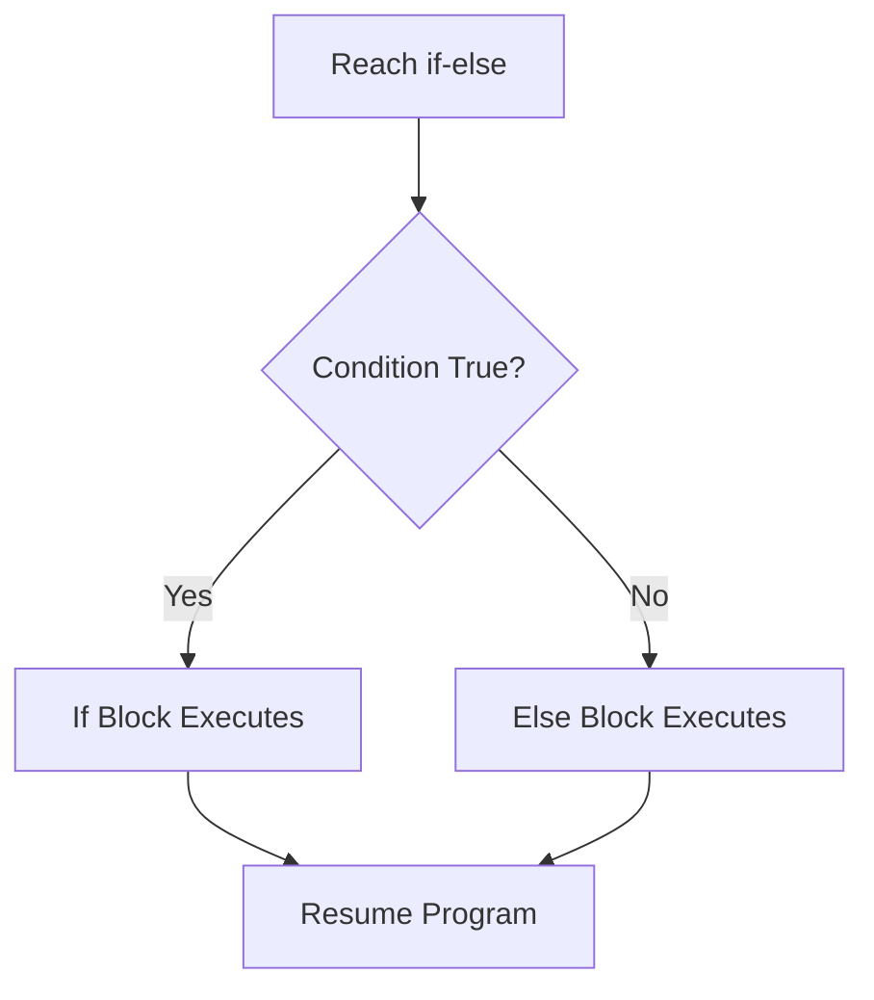
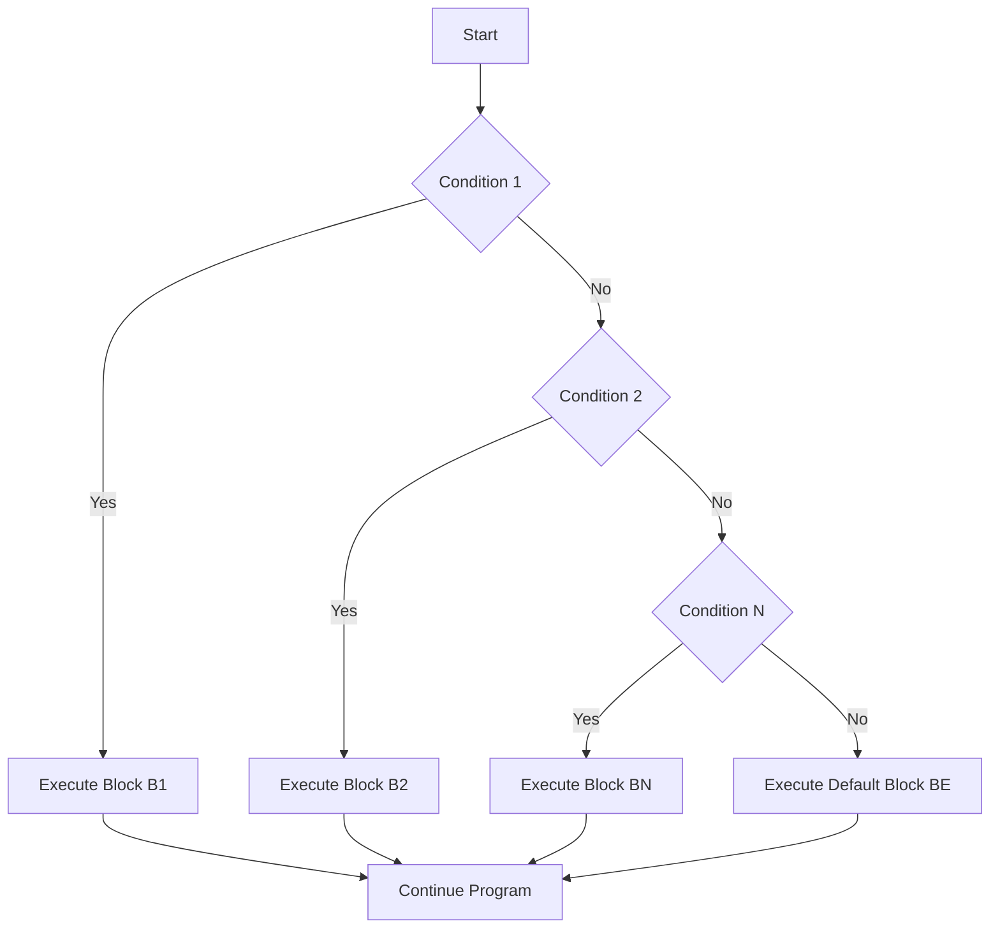

--

## tags: [c-programming, lecture] lecture: 9 topic: Decision Making in C prerequisites: Variables, Data Types, and Basic I/O

# Lecture 9 — Decision Making in C

## Concept of Decision Making

In everyday life, decisions arise constantly — which road to take, whether to carry an umbrella, which option to choose at a menu. A **decision** in programming follows exactly the same principle: the program reaches a point where it must choose one of several possible paths based on some [[#^condition|condition]]. Without this ability, a program would blindly execute the same sequence of instructions every single time, regardless of any input or context.

> [!info] What is Decision Making? Decision making in programming is the ability of a program to evaluate a **condition** and selectively execute different blocks of code depending on whether that condition is true or false. It becomes necessary whenever more than one option or execution path is available.

The road-fork is a perfect mental model: imagine you are driving and you reach a junction. Whether you turn left or right depends on where you want to go. A program works the same way — it evaluates a condition at a junction and picks a branch accordingly.



C provides three main constructs for decision making: the [[#^if-statement|if statement]], the [[#^if-else-statement|if-else statement]], and the [[#^if-else-ladder|if-else if-else ladder]]. Each one suits a different level of branching complexity.

---

## Understanding If Statement

The **if statement** is the most fundamental decision-making tool in C. It wraps a block of code inside a conditional gate: the block executes only when the given condition evaluates to true (any non-zero value). If the condition is false (zero), the entire block is skipped without executing a single line inside it, and the program continues with whatever comes after the closing brace.

### Syntax

```c
if (condition)
{
    // Block of code
    // Executes ONLY when condition is non-zero (true)
}
```

The parentheses around the condition are mandatory. The braces `{}` define the scope of the block. Everything inside them is controlled by the if.



### Worked Example — Checking a Positive Number

```c
#include <stdio.h>

void main()
{
    int N;
    printf("Enter N:");
    scanf("%d", &N);
    if (N > 0)
    {
        printf("N is greater than 0");
    }
}
```

> [!warning] Non-Standard Code The slide uses `void main()` which is not standard C. The correct signature per the C standard is `int main()`, which returns an integer exit code to the operating system. `void main()` is non-portable and may produce compiler warnings or fail on strict compilers. All code in these slides uses this form — treat every occurrence as `int main()` in your own programs.

> [!tip] Including Standard Libraries and Getting Input
> - `#include <stdio.h>` imports the Standard Input/Output header so [[Lecture 2#^printf|printf]] and [[Lecture 2#^scanf|scanf]] are available
> - `scanf("%d", &N)` reads one integer from the keyboard and stores it at the memory address of `N`
> - The [[Lecture 6#^address-of|`&`]] (address-of [[Lecture 6#^operator|operator]]) is required because `scanf` needs to know where in memory to write the value

> [!tip] Evaluating the If Condition
> - `if (N > 0)` uses a [[Lecture 6#^relational-operators|relational operator]] to test whether `N` is strictly greater than zero
> - If the condition evaluates to non-zero (true), the block inside `{}` executes
> - If `N` is zero or negative, the entire block is skipped and the program exits silently

|Line|Code|Explanation|
|---|---|---|
|1|`#include <stdio.h>`|Includes the standard I/O library; required for `printf` and `scanf`|
|3|`void main()`|Non-standard entry point — use `int main()` instead|
|5|`int N;`|Allocates an integer variable N in RAM|
|6|`printf("Enter N:");`|Prints a prompt asking the user to type a number|
|7|`scanf("%d", &N);`|Reads one integer from the keyboard and stores it at N's memory address|
|8|`if (N > 0)`|Condition check: evaluates the relational expression `N > 0`|
|10|`printf("N is greater than 0");`|Executes only when line 8's condition is true|

> [!tip] Relational Operators The `>` symbol is a **relational operator** — it compares two values and produces 1 (true) or 0 (false). The full set includes `>` (greater than), `<` (less than), `>=` (greater than or equal), `<=` (less than or equal), `==` (equal to), and `!=` (not equal to).

> [!bug] Omitting the Braces When an if block contains only a single statement, braces are technically optional and the [[Lecture 1#^compiler|compiler]] will accept it. However, omitting them is a very common source of bugs — if you later add a second line intending it to be inside the if, it will actually execute unconditionally. Always use braces, even for single-statement blocks.

---

## Understanding If-Else Statement

The **if-else statement** extends the plain if by providing a guaranteed alternative path. With a plain if, nothing happens when the condition is false. With if-else, exactly one of two blocks always runs — the _if block_ when the condition is true, and the _else block_ when it is false. There is no situation where both execute, and no situation where neither executes.

### Syntax

```c
if (condition)
{
    // True block — runs when condition is non-zero
}
else
{
    // False block — runs when condition is zero
}
```

The [[#^else-keyword|else]] keyword must directly follow the closing brace of the if block, with no condition of its own. It catches every case the if did not.



### Worked Example — Even or Odd

The [[Lecture 6#^modulo-operator|modulo operator]] `%` computes the integer remainder after division. A number is even when dividing it by 2 leaves no remainder (remainder equals 0); otherwise the number is odd.

```c
#include <stdio.h>

void main()
{
    int N;
    printf("Enter N:");
    scanf("%d", &N);
    if (N % 2 == 0)
    {
        printf("Even");
    }
    else
    {
        printf("Odd");
    }
}
```

> [!warning] Non-Standard Code `void main()` appears here again. In standard C, use `int main()` with a `return 0;` at the end. See the note in the previous section.

> [!tip] Testing for Even or Odd
> - `N % 2` computes the remainder when `N` is divided by 2 — the result is either 0 or 1
> - `== 0` checks if the remainder is zero, meaning `N` is evenly divisible by 2
> - If the condition is true, `"Even"` prints; otherwise the `else` branch prints `"Odd"`

> [!tip] The Else Branch as a Guaranteed Fallback
> - The `else` block runs whenever the `if` condition is false — there is no situation where neither block executes
> - This guarantee makes if-else ideal for binary decisions like even/odd, pass/fail, or positive/negative
> - Exactly one of the two blocks always executes — never both, never neither

|Line|Code|Explanation|
|---|---|---|
|1|`#include <stdio.h>`|Pulls in printf and scanf|
|3|`void main()`|Non-standard; prefer `int main()`|
|5|`int N;`|Declares integer variable N|
|6|`printf("Enter N:");`|Shows a prompt on screen|
|7|`scanf("%d", &N);`|Reads user input and stores it in N|
|8|`if (N % 2 == 0)`|Computes N mod 2; tests if result equals 0|
|10|`printf("Even");`|Runs only when the condition on line 8 is true|
|12|`else`|Opens the false branch|
|14|`printf("Odd");`|Runs only when the condition on line 8 is false|

> [!example] How the Modulo Operator Works The `%` operator returns what is left over after integer division:
> 
> - 14 % 5 → 5 fits into 14 twice (10), leaving remainder **4**
> - 14 % 2 → 2 fits into 14 exactly 7 times, leaving remainder **0** → even
> - 7 % 2 → 2 fits into 7 three times (6), leaving remainder **1** → odd
> - 50 % 2 → remainder 0 → even; 5 % 2 → remainder 1 → odd

> [!success] Assignment vs Equality — A Critical Distinction Inside a condition, `==` tests whether two values are equal and returns 0 or 1. A single `=` is the _assignment_ operator — it stores a value and does not compare. Writing `if (N % 2 = 0)` instead of `if (N % 2 == 0)` is one of the most common beginner mistakes in C and either causes a compiler error or silently produces wrong results.

---

## Understanding If-Else if-Else Ladder

When a problem has more than two mutually exclusive outcomes, neither a plain if nor a single if-else is sufficient. The **if-else if-else ladder** solves this by chaining multiple conditions in a sequence. The program evaluates each condition from top to bottom and executes only the block belonging to the first condition that is true. Once a match is found, all remaining branches are skipped. If no condition matches, the final `else` block provides a guaranteed default.

### Syntax

```c
if (condition1)
{
    // Block B1 — runs when condition1 is true
}
else if (condition2)
{
    // Block B2 — runs when condition1 is false AND condition2 is true
}
else if (condition3)
{
    // Block B3 — runs when conditions 1 and 2 are false AND condition3 is true
}
else
{
    // Default block BE — runs only when ALL conditions above are false
}
```

The evaluation is strictly top-to-bottom and stops at the first true condition. Exactly one block runs per execution — never more, never zero (assuming the default else is present).



### Worked Example — Day of the Week

```c
#include <stdio.h>

void main()
{
    int day;
    printf("Enter day:");
    scanf("%d", &day);
    if (day == 1)   printf("Sunday");
    else if (day == 2) printf("Monday");
    else if (day == 3) printf("Tuesday");
    else if (day == 4) printf("Wednesday");
    else if (day == 5) printf("Thursday");
    else if (day == 6) printf("Friday");
    else if (day == 7) printf("Saturday");
    else printf("Please enter day between 1 to 7");
}
```

> [!warning] Non-Standard Code `void main()` is used again here. Additionally, the slide writes each branch as a single-line if-else without braces. While syntactically valid in C, it is safer and more maintainable to always include `{}` around each branch — a habit that prevents subtle bugs when the code is extended later.

> [!tip] Top-to-Bottom Evaluation
> - The program tests `day == 1` first, then `day == 2`, then `day == 3`, and so on
> - As soon as one condition is true, its `printf` executes and all remaining branches are skipped
> - If `day` is outside the range 1–7, only the final `else` branch runs, printing an error message

> [!tip] Why Use a Ladder Instead of Separate If Statements
> - With separate `if` statements, every condition would be evaluated even after one has already matched
> - With a ladder, evaluation stops at the first true condition — this is both faster and semantically clearer
> - For mutually exclusive outcomes (a number can only be one day), a ladder correctly represents the logic

|Line|Code|Explanation|
|---|---|---|
|1|`#include <stdio.h>`|Standard I/O library|
|3|`void main()`|Non-standard entry point|
|5|`int day;`|Integer variable to hold the day number|
|6|`printf("Enter day:");`|Prompts the user to type a number|
|7|`scanf("%d", &day);`|Reads the integer and stores it in `day`|
|8|`if (day == 1)`|First condition: tests if day equals 1|
|8|`printf("Sunday");`|Executes only if the condition on the same line is true|
|9–14|`else if (day == N)`|Each branch tests one specific value of day from 2 through 7|
|15|`else printf(...)`|Default handler for any value outside 1–7|

> [!danger] Omitting the Default Else In a ladder, leaving out the final `else` means that when a user enters an invalid value such as 0, 8, or 99, the program produces no output at all — silently doing nothing. Always include a default `else` to handle unexpected input and give users meaningful feedback.

> [!question] Why Use a Ladder Instead of Separate if Statements? You could write seven independent `if` statements rather than a ladder, and the code would compile. The problem is efficiency and correctness. With separate ifs, every condition gets evaluated even after one has already matched. With a ladder, evaluation stops the moment a true condition is found. For mutually exclusive outcomes (a number can only be one day at a time), a ladder is both faster and semantically clearer about the programmer's intent.

---

## Key Terms

|Term|Definition|
|---|---|
| Decision Making | The ability of a program to evaluate a condition and selectively execute one of several possible code paths based on whether the condition is true or false | ^decision-making
| if statement | A control structure that evaluates a condition and executes its enclosed block only when that condition is non-zero (true); skips the block entirely when the condition is zero (false) | ^if-statement
| if-else statement | A control structure guaranteeing that exactly one of two blocks always executes — the if block when the condition is true, and the else block when it is false | ^if-else-statement
| if-else if-else ladder | A chained series of conditions evaluated strictly top-to-bottom; the block belonging to the first true condition executes and all remaining branches are skipped; a default else handles the case where no condition matches | ^if-else-ladder
| condition | An expression placed inside the parentheses of an if statement; any non-zero value is treated as true and causes the block to execute; zero is treated as false and causes the block to be skipped | ^condition
| Modulo Operator | The `%` operator that returns the integer remainder after division (e.g., 7 % 2 evaluates to 1); commonly used to test divisibility, such as checking whether a number is even or odd |
| Relational Operator | A comparison operator (`>`, `<`, `>=`, `<=`, `==`, `!=`) that compares two values and produces 1 (true) or 0 (false); used to form conditions in if statements |
| else | The C keyword that introduces the false branch of an if-else construct; it has no condition of its own and executes only when all preceding if and else if conditions were false | ^else-keyword

> [!example]- Try It Yourself **Exercise 1 — Positive, Negative, or Zero** Write a program that reads an integer N from the user and prints "Positive" if N is greater than zero, "Negative" if N is less than zero, or "Zero" if N equals zero. Use an if-else if-else ladder.
> 
> **Exercise 2 — Largest of Two Numbers** Write a program that reads two integers A and B, then uses an if-else statement to print the larger of the two. Think about what should happen when A and B are equal.
> 
> **Exercise 3 — Grade Calculator (Homework)** Read a student's percentage as a `float` variable. Use an if-else if-else ladder to print their letter grade according to this scale: 90% and above → A, 80% and above → B, 70% and above → C, 60% and above → D, 40% up to below 60% → E, below 40% → F. This is the homework exercise from the lecture's final slide.

---

**Lecture 9 Recap**

- Decision making gives a program the ability to choose between execution paths based on a condition evaluated at runtime.
- A condition is any expression; non-zero means true (execute the block) and zero means false (skip the block).
- The `if` statement executes its block only when the condition is true and silently skips it when false.
- The `if-else` statement guarantees that exactly one of two blocks always runs — never both, never neither.
- The `if-else if-else` ladder handles multiple mutually exclusive outcomes; evaluation is top-to-bottom and stops at the first true condition; the final `else` serves as the default fallback.
- The modulo operator `%` returns the remainder of integer division and is the standard tool for even/odd testing and divisibility checks.
- Always use `==` for equality comparisons inside conditions; using the assignment operator `=` by mistake is a common and hard-to-spot bug.
- Omitting the default `else` in a ladder means invalid input silently produces no output — always include it.
- All code examples in this lecture use `void main()`, which is non-standard; the correct C standard form is `int main()`.